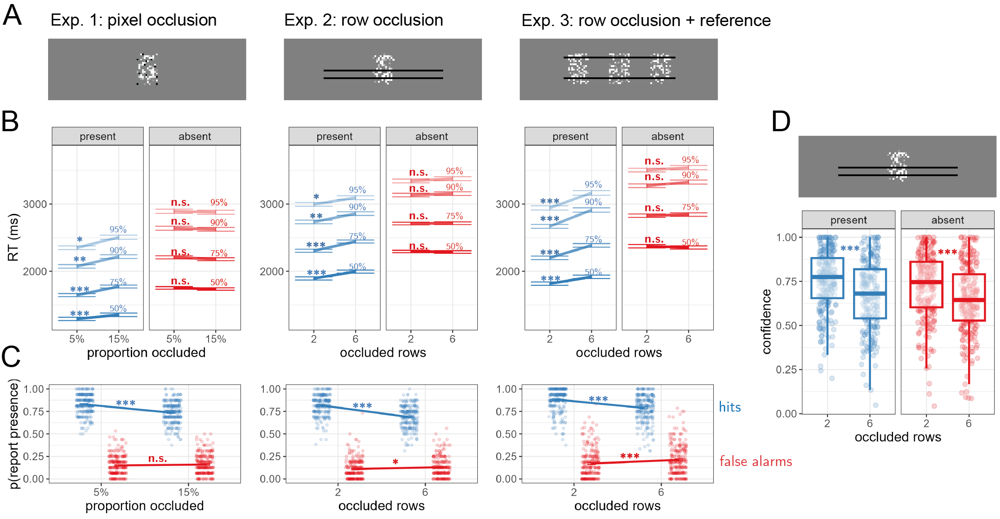

# Introduction

After checking Taylor Swift's Wikipedia page, we are confident that she hasn't announced her retirement from music. If she had, it would have been mentioned on her page. We also checked Russian cellist Natalia Gutman's page and didn't see any mention of a similar announcement, but we are not so sure she hasn't made one since her Wikipedia page only gets updated irregularly. The absence of evidence on Wikipedia is enough to make a solid inference in the case of Swift but not in the case of Gutman because we know that information about Swift spreads more efficiently on the internet.

This paper discusses how we make inferences based on the absence of evidence in visual perception. Such inferences about the negation of a hypothesis ($H$) depend on our belief in the probability that we would observe evidence ($E$) if $H$ were true ($p(E|H)$) [@walton1992nonfallacious; @walton2010arguments; @oaksford2004bayesian]. In other words, we believe that something is not true (for example, that Taylor Swift hasn't announced her retirement from music) when we believe that "if it were true, we would have heard about it by now" [@goldberg2011if].

Here we examine whether people apply a similar reasoning in the domain of visual perception. Simply not perceiving something does not necessarily mean it is not there; we also need to be certain that we would have perceived it if it were present. As a result, detection decisions in the absence of a stimulus, their biases, timing, and confidence, provides a window into the effects of *counterfactual visibility*--the imagined visibility of stimuli that are not in fact present--on perceptual decisions. For example, expecting that an object would take long to find in a scene, participants may search for longer before giving up and inferring its absence [@mazor2021inference; @mazor2022efficient]. Similarly, when stimuli are expected to be clear and visible, weak perceptual impressions are more consistent with stimulus absence compared to when visibility is expected to be low, such as when observing a scene in a fog [@gorea2000failure].

To contrast cases in which perception is fast versus slow, clear versus not, we had participants perform a visual detection task under different levels of stimulus occlusion. As expected, occlusion had sizable effects on detection when a stimulus was present, robustly degrading perceptual sensitivity, slowing down responses, and bringing down subjective confidence ratings. In contrast, the effects of occlusion in the absence of a target were limited to a reduction in subjective confidence and perceptual specificity, without any group effects on the timing detection decisions themselves. Additional data from a random subset of participants revealed that this group-level null result is driven by population heterogeneity in the effects of counterfactual visibility on perceptual decision boundaries. 

```{r setup, include = FALSE}

library('groundhog')
groundhog.library(
  c(
    'papaja',
    'reticulate',
    'tidyverse',
    'broom',
    'cowplot',
    'MESS', # for AUCs
    'lsr', # for effect sizes
    'pwr', # for power calculations
    'brms', # for mixed effects modeling
    'BayesFactor',# for Bayesian t test
    'jsonlite', #parsing data from sort_trial
    'afex' #for anova
  ), "2022-12-01"
)
r_refs("r-references.bib")
knitr::opts_chunk$set(warning=F,echo=F,message=F,cache=T)

```


# Results

```{r load-and-process}
source("../analysis/loadAndPreprocessData.R")
```


## Experiment 1: pixel occlusion

`r E1.raw_df$subj_id%>%unique()%>%length()` participants performed a near-threshold detection task, in which they made decisions about the presence or absence of a target letter (A or S, on different blocks) in a noisy, dynamic stimulus (see Fig. \@ref(fig:design)B). On different trials, either 5 or 15 percent of the stimulus pixels were occluded by a static layer of randomly positioned black pixels. Participants' task was to "ignore the black stuff, focus on the noise that is under it, and determine whether the letter appeared in it or not". Based on our [pre-registered exclusion criteria](https://osf.io/e6x82), we excluded `r E1.to_exclude%>%length()` participants, leaving `r E1.df$subj_id%>%unique()%>%length()` for the main analysis.

```{r design, echo=FALSE, fig.cap="Rationale and experimental design for Experiments 1-3. A) occluding more of a target letter decreases its visibility (black markers). Occlusion has no effect on target visibility when the target is absent, but it affects *counterfactual visibility* (white markers): the expected visibility of the target, had it been present. B) example frames from target-present (blue) and target-absent (red) trials. C) trial structure in Exp. 2. D) occlusion conditions in the three experiments. In Exp. 1, on different trials we occluded a random subset of 5% or 15% of the pixels in the stimulus. In Exp. 2 and 3, on different trials we occluded a random subset of 2 or 6 pixel rows. In Exp. 3, the task-relevant stimulus was falnkered by two reference stimuli that, known to the subject, always had the target letter in them. Participants performed two 32-trial blocks in which the target was the letter S and two blocks in which the target was the letter A. The order of the two letters was randomised between participants. *The occluder preview screen only appeared in Exp. 2 and 3. **Confidence ratings were given only in Exp. 2, blocks 3 and 4", out.width = '75%'}
knitr::include_graphics("figures/design_occlusion_noisy_stim.png")
```

```{r SDT, echo=FALSE, cache=TRUE}

E1.descriptives_by_occlusion<- E1.df %>%
  filter(test_part=='test1' | test_part=='test2') %>%
  mutate(resp = response==presence_key)%>%
  group_by(subj_id,hide_proportion) %>%
  summarise(accuracy=mean(correct),
            resp_bias=mean(resp),
            RT=median(RT),
            hit_rate = (sum(correct & present)+0.5)/(sum(present)+1),
            fa_rate = (sum(!correct & !present)+0.5)/(sum(!present)+1),
            d = qnorm(hit_rate)-qnorm(fa_rate),
            c = -0.5*(qnorm(hit_rate)+qnorm(fa_rate)))

E1.hit_rate_by_occlusion<- E1.descriptives_by_occlusion %>%
 dplyr::select(subj_id,hide_proportion,hit_rate) %>%
  spread(hide_proportion,hit_rate,sep='')%>%
  mutate(diff=hide_proportion0.05-hide_proportion0.15)

E1.fa_rate_by_occlusion<- E1.descriptives_by_occlusion %>%
 dplyr::select(subj_id,hide_proportion,fa_rate) %>%
  spread(hide_proportion,fa_rate,sep='')%>%
  mutate(diff=hide_proportion0.05-hide_proportion0.15)

E1.d_by_occlusion<- E1.descriptives_by_occlusion %>%
 dplyr::select(subj_id,hide_proportion,d) %>%
  spread(hide_proportion,d,sep='')%>%
  mutate(diff=hide_proportion0.05-hide_proportion0.15)

E1.c_by_occlusion<- E1.descriptives_by_occlusion %>%
 dplyr::select(subj_id,hide_proportion,c) %>%
  spread(hide_proportion,c,sep='')%>%
  mutate(diff=hide_proportion0.05-hide_proportion0.15)


E2.descriptives_by_occlusion<- E2.df %>%
  filter(test_part=='test1' | test_part=='test2') %>%
  mutate(resp = response==presence_key)%>%
  group_by(subj_id,hide_proportion) %>%
  summarise(accuracy=mean(correct),
            resp_bias=mean(resp),
            RT=median(RT),
            hit_rate = (sum(correct & present)+0.5)/(sum(present)+1),
            fa_rate = (sum(!correct & !present)+0.5)/(sum(!present)+1),
            d = qnorm(hit_rate)-qnorm(fa_rate),
            c = -0.5*(qnorm(hit_rate)+qnorm(fa_rate)))


E2.hit_rate_by_occlusion<- E2.descriptives_by_occlusion %>%
 dplyr::select(subj_id,hide_proportion,hit_rate) %>%
  spread(hide_proportion,hit_rate,sep='')%>%
  mutate(diff=hide_proportion0.1-hide_proportion0.35)

E2.fa_rate_by_occlusion<- E2.descriptives_by_occlusion %>%
 dplyr::select(subj_id,hide_proportion,fa_rate) %>%
  spread(hide_proportion,fa_rate,sep='')%>%
  mutate(diff=hide_proportion0.1-hide_proportion0.35)

E2.d_by_occlusion<- E2.descriptives_by_occlusion %>%
 dplyr::select(subj_id,hide_proportion,d) %>%
  spread(hide_proportion,d,sep='')%>%
  mutate(diff=hide_proportion0.1-hide_proportion0.35)

E2.c_by_occlusion<- E2.descriptives_by_occlusion %>%
 dplyr::select(subj_id,hide_proportion,c) %>%
  spread(hide_proportion,c,sep='')%>%
  mutate(diff=hide_proportion0.1-hide_proportion0.35)


E3.descriptives_by_occlusion<- E3.df %>%
  filter(test_part=='test1' | test_part=='test2') %>%
  mutate(resp = response==presence_key)%>%
  group_by(subj_id,hide_proportion) %>%
  summarise(accuracy=mean(correct),
            resp_bias=mean(resp),
            RT=median(RT),
            hit_rate = (sum(correct & present)+0.5)/(sum(present)+1),
            fa_rate = (sum(!correct & !present)+0.5)/(sum(!present)+1),
            d = qnorm(hit_rate)-qnorm(fa_rate),
            c = -0.5*(qnorm(hit_rate)+qnorm(fa_rate)))

E3.hit_rate_by_occlusion<- E3.descriptives_by_occlusion %>%
 dplyr::select(subj_id,hide_proportion,hit_rate) %>%
  spread(hide_proportion,hit_rate,sep='')%>%
  mutate(diff=hide_proportion0.1-hide_proportion0.35)

E3.fa_rate_by_occlusion<- E3.descriptives_by_occlusion %>%
 dplyr::select(subj_id,hide_proportion,fa_rate) %>%
  spread(hide_proportion,fa_rate,sep='')%>%
  mutate(diff=hide_proportion0.1-hide_proportion0.35)

E3.d_by_occlusion<- E3.descriptives_by_occlusion %>%
 dplyr::select(subj_id,hide_proportion,d) %>%
  spread(hide_proportion,d,sep='')%>%
  mutate(diff=hide_proportion0.1-hide_proportion0.35)

E3.c_by_occlusion<- E3.descriptives_by_occlusion %>%
 dplyr::select(subj_id,hide_proportion,c) %>%
  spread(hide_proportion,c,sep='')%>%
  mutate(diff=hide_proportion0.1-hide_proportion0.35)
```

```{r H1, echo=FALSE, cache=TRUE}

E1.RT_by_resp <- E1.df %>%
  filter((test_part=='test1' | test_part=='test2') & RT>100) %>%
  group_by(subj_id,resp) %>%
  summarise(RT=median(RT))%>%
  spread(resp,RT,sep='')%>%
  mutate(diff=respTRUE-respFALSE)

E2.RT_by_resp <- E2.df %>%
  filter((test_part=='test1' | test_part=='test2') & RT>100) %>%
  group_by(subj_id,resp) %>%
  summarise(RT=median(RT))%>%
  spread(resp,RT,sep='')%>%
  mutate(diff=respTRUE-respFALSE)

E3.RT_by_resp <- E3.df %>%
  filter((test_part=='test1' | test_part=='test2') & RT>100) %>%
  group_by(subj_id,resp) %>%
  summarise(RT=median(RT))%>%
  spread(resp,RT,sep='')%>%
  mutate(diff=respTRUE-respFALSE)
```

```{r H2, echo=FALSE, cache=TRUE}


E1.RT_by_occlusion_in_presence <- E1.df %>%
  filter((test_part=='test1' | test_part=='test2') & RT>100 & resp) %>%
  group_by(subj_id,hide_proportion) %>%
  summarise(RT=median(RT))%>%
  spread(hide_proportion,RT,sep='')%>%
  mutate(diff=hide_proportion0.05-hide_proportion0.15);

E1.RT_by_occlusion_in_presence_correct_only <- E1.df %>%
  filter((test_part=='test1' | test_part=='test2') & RT>100 & resp & correct) %>%
  group_by(subj_id,hide_proportion) %>%
  summarise(RT=median(RT))%>%
  spread(hide_proportion,RT,sep='')%>%
  mutate(diff=hide_proportion0.05-hide_proportion0.15);

E2.RT_by_occlusion_in_presence <- E2.df %>%
  filter((test_part=='test1' | test_part=='test2') & RT>100 & resp) %>%
  group_by(subj_id,hide_proportion) %>%
  summarise(RT=median(RT))%>%
  spread(hide_proportion,RT,sep='')%>%
  mutate(diff=hide_proportion0.1-hide_proportion0.35);

E2.RT_by_occlusion_in_presence_correct_only <- E2.df %>%
  filter((test_part=='test1' | test_part=='test2') & RT>100 & resp & correct) %>%
  group_by(subj_id,hide_proportion) %>%
  summarise(RT=median(RT))%>%
  spread(hide_proportion,RT,sep='')%>%
  mutate(diff=hide_proportion0.1-hide_proportion0.35);

E3.RT_by_occlusion_in_presence <- E3.df %>%
  filter((test_part=='test1' | test_part=='test2') & RT>100 & RT<5000  &resp) %>%
  group_by(subj_id,hide_proportion) %>%
  summarise(RT=median(RT))%>%
  spread(hide_proportion,RT,sep='')%>%
  mutate(diff=hide_proportion0.1-hide_proportion0.35);

E3.RT_by_occlusion_in_presence_correct_only <- E3.df %>%
  filter((test_part=='test1' | test_part=='test2') & RT>100 & RT<5000  &resp & correct) %>%
  group_by(subj_id,hide_proportion) %>%
  summarise(RT=median(RT))%>%
  spread(hide_proportion,RT,sep='')%>%
  mutate(diff=hide_proportion0.1-hide_proportion0.35);
```

Mean accuracy in the main experiment was `r E1.overall_descriptives%>%pull(accuracy)%>%mean()` (SD=`r E1.overall_descriptives%>%pull(accuracy)%>%sd()`). Consistent with the response time profile of detection tasks [@mazor2021inference; @mazor2022efficient; @mazor2023paradoxical], response times were significantly shorter in decisions about presence compared to absence (pre-registered Hypothesis 1: `r printnum(E1.RT_by_resp%>%pull(respTRUE)%>%mean()/1000)` vs `r printnum(E1.RT_by_resp%>%pull(respFALSE)%>%mean()/1000)` seconds; `r apa_print(E1.RT_by_resp%>%pull(diff)%>%t.test())$statistic`). This is expected if decisions about absence are reached only when the agent can be confident that presence would have been detected [@mazor2021stage]. 

As a first measure on the effects of stimulus occlusion on target detection, we examined the difference in hit rate: the probability of correctly reporting stimulus presence when a stimulus is present. As expected, hit rate was reduced by occlusion (`r apa_print(E1.hit_rate_by_occlusion$diff%>%t.test())$statistic`; see Fig. \@ref(fig:main-results)C, blue lines), with a mean hit rate of `r printnum(E1.hit_rate_by_occlusion$hide_proportion0.05%>%mean())` (SD= `r printnum(E1.hit_rate_by_occlusion$hide_proportion0.05%>%sd())`) when 5% of the pixels were occluded, versus `r printnum(E1.hit_rate_by_occlusion$hide_proportion0.15%>%mean())` (SD= `r printnum(E1.hit_rate_by_occlusion$hide_proportion0.15%>%sd())`) when 15% of the pixels were occluded. Unsurprisingly, occluding more of the target made it more difficult to spot.

Next, we asked whether stimulus occlusion made participants slower to detect the target letter. As expected, correct target-present decisions were slowed down by pixel occlusion (pre-registered Hypothesis 2: `r printnum(E1.RT_by_occlusion_in_presence_correct_only%>%pull(hide_proportion0.05)%>%mean()/1000)` seconds for 5% occlusion vs `r printnum(E1.RT_by_occlusion_in_presence_correct_only%>%pull(hide_proportion0.15)%>%mean()/1000)` seconds for 15% occlusion; `r apa_print(E1.RT_by_occlusion_in_presence_correct_only%>%pull(diff)%>%t.test())$statistic`; see Fig. \@ref(fig:main-results)B, blue lines). This effect remained significant when incorporating incorrect trials into the analysis (`r printnum(E1.RT_by_occlusion_in_presence%>%pull(hide_proportion0.05)%>%mean()/1000)` vs `r printnum(E1.RT_by_occlusion_in_presence%>%pull(hide_proportion0.15)%>%mean()/1000)` seconds; `r apa_print(E1.RT_by_occlusion_in_presence%>%pull(diff)%>%t.test())$statistic`).

```{r H3, echo=FALSE, cache=TRUE}
E1.RT_by_occlusion_in_absence <- E1.df %>%
  filter((test_part=='test1' | test_part=='test2') & RT>100 & !resp) %>%
  group_by(subj_id,hide_proportion) %>%
  summarise(RT=median(RT))%>%
  spread(hide_proportion,RT,sep='')%>%
  mutate(diff=hide_proportion0.05-hide_proportion0.15);

E1.RT_by_occlusion_in_absence_correct_only <- E1.df %>%
  filter((test_part=='test1' | test_part=='test2') & RT>100 & !resp & correct) %>%
  group_by(subj_id,hide_proportion) %>%
  summarise(RT=median(RT))%>%
  spread(hide_proportion,RT,sep='')%>%
  mutate(diff=hide_proportion0.05-hide_proportion0.15);

E2.RT_by_occlusion_in_absence <- E2.df %>%
  filter((test_part=='test1' | test_part=='test2') & RT>100 & !resp) %>%
  group_by(subj_id,hide_proportion) %>%
  summarise(RT=median(RT))%>%
  spread(hide_proportion,RT,sep='')%>%
  mutate(diff=hide_proportion0.1-hide_proportion0.35);

E2.RT_by_occlusion_in_absence_correct_only <- E2.df %>%
  filter((test_part=='test1' | test_part=='test2') & RT>100 & !resp & correct) %>%
  group_by(subj_id,hide_proportion) %>%
  summarise(RT=median(RT))%>%
  spread(hide_proportion,RT,sep='')%>%
  mutate(diff=hide_proportion0.1-hide_proportion0.35);

E3.RT_by_occlusion_in_absence <- E3.df %>%
  filter((test_part=='test1' | test_part=='test2') & RT>100 & RT<5000  &!resp) %>%
  group_by(subj_id,hide_proportion) %>%
  summarise(RT=median(RT))%>%
  spread(hide_proportion,RT,sep='')%>%
  mutate(diff=hide_proportion0.1-hide_proportion0.35);

E3.RT_by_occlusion_in_absence_correct_only <- E3.df %>%
  filter((test_part=='test1' | test_part=='test2') & RT>100 & RT<5000  &!resp & correct) %>%
  group_by(subj_id,hide_proportion) %>%
  summarise(RT=median(RT))%>%
  spread(hide_proportion,RT,sep='')%>%
  mutate(diff=hide_proportion0.1-hide_proportion0.35);
```

```{r H4, echo=FALSE, cache=TRUE}

E1.RT_by_occlusion_and_response <- merge(
  E1.RT_by_occlusion_in_presence,
  E1.RT_by_occlusion_in_absence,
  by= 'subj_id',
  suffixes = c('presence','absence')) %>%
  mutate(interaction = diffpresence-diffabsence);

E1.RT_by_occlusion_and_response_correct_only <- merge(
  E1.RT_by_occlusion_in_presence_correct_only,
  E1.RT_by_occlusion_in_absence_correct_only,
  by= 'subj_id',
  suffixes = c('presence','absence')) %>%
  mutate(interaction = diffpresence-diffabsence);

E2.RT_by_occlusion_and_response <- merge(
  E2.RT_by_occlusion_in_presence,
  E2.RT_by_occlusion_in_absence,
  by= 'subj_id',
  suffixes = c('presence','absence')) %>%
  mutate(interaction = diffpresence-diffabsence);

E2.RT_by_occlusion_and_response_correct_only <- merge(
  E2.RT_by_occlusion_in_presence_correct_only,
  E2.RT_by_occlusion_in_absence_correct_only,
  by= 'subj_id',
  suffixes = c('presence','absence')) %>%
  mutate(interaction = diffpresence-diffabsence);

E3.RT_by_occlusion_and_response <- merge(
  E3.RT_by_occlusion_in_presence,
  E3.RT_by_occlusion_in_absence,
  by= 'subj_id',
  suffixes = c('presence','absence')) %>%
  mutate(interaction = diffpresence-diffabsence);

E3.RT_by_occlusion_and_response_correct_only <- merge(
  E3.RT_by_occlusion_in_presence_correct_only,
  E3.RT_by_occlusion_in_absence_correct_only,
  by= 'subj_id',
  suffixes = c('presence','absence')) %>%
  mutate(interaction = diffpresence-diffabsence);
```

Having established that occlusion affected stimulus visibility, making responses both slower and less accurate when a target was present, we next examined the effects of occlusion on detection responses in the absence of a target. If participants were effectively incorporating counterfactual visibility into their criterion placement, we would expect to see an increase in the proportion of false alarms (the proportion of incorrect target-present reports out of all target-absent trials) when more of the target was occluded. This is due to the fact that $p(absence|visibility)$ is a function not only of $p(evidence|absence)$, a quantity that is hardly affected by occlusion (evidence for the presence of a target is expected to be low when a target is absent, regardless of how much of the stimulus is occluded), but also of $p(evidence|presence)$, which *is* affected by occlusion (little evidence is more consistent with target presence when more of the stimulus is occluded; see Fig. \@ref(fig:design)A). In contrast with this Bayesian reasoning, false-alarm rate was unaffected by occlusion (`r apa_print(E1.fa_rate_by_occlusion$diff%>%t.test())$statistic`; see Fig. \@ref(fig:main-results)C, red lines), with a mean false-alarm rate of `r printnum(E1.fa_rate_by_occlusion$hide_proportion0.05%>%mean())` (SD= `r printnum(E1.fa_rate_by_occlusion$hide_proportion0.05%>%sd())`) when 5% of the pixels were occluded, versus `r printnum(E1.fa_rate_by_occlusion$hide_proportion0.15%>%mean())` (SD= `r printnum(E1.hit_rate_by_occlusion$hide_proportion0.15%>%sd())`) when 15% of the pixels were occluded. 

Furthermore, and in contrast to decisions about presence, the timing of decisions about absence was unaffected by the occlusion manipulation (pre-registered Hypothesis 3: `r printnum(E1.RT_by_occlusion_in_absence_correct_only%>%pull(hide_proportion0.05)%>%mean()/1000)` seconds for 5% occlusion vs `r printnum(E1.RT_by_occlusion_in_absence_correct_only%>%pull(hide_proportion0.15)%>%mean()/1000)` seconds for 15% occlusion; `r apa_print(E1.RT_by_occlusion_in_absence_correct_only%>%pull(diff)%>%t.test())$statistic`; see Fig. \@ref(fig:main-results)B, red lines). The effect of occlusion on response time was stronger in decisions about target presence compared to decisions about target absence (pre-registered Hypothesis 4: `r apa_print(E1.RT_by_occlusion_and_response_correct_only%>%pull(interaction)%>%t.test())$statistic`), also when incorporating incorrect responses into the anlaysis (`r apa_print(E1.RT_by_occlusion_and_response%>%pull(interaction)%>%t.test())$statistic`).

(ref:main-results) Main results from Experiments 1-3. A) example screens from the three experiments. B) mean subject-wise estimate of the 50%, 75%, 90% and 95% RT quantiles, as a function of occlusion and target presence. Correct responses only. Error bars represent the standard error of occlusion effects, removing inter-subject variability. C) hit (blue) and false-alarm rates (red) as a function of occlusion for the three experiments. Error bars represent the standard error of occlusion effects. D) confidence ratings as a function of occlusion and target presence in Exp. 2.   Box edges and central lines represent the 25, 50, and 75 quantiles. Whiskers cover data points within four inter-quartile ranges around the median. \*: p\<0.05, \*\*: p\<0.01, \*\*\*: p\<0.001

```{r main-results, echo=FALSE, fig.cap="(ref:main-results)"}

```

Finally, and as expected from the asymmetric effects of occlusion on hit-rate and false-alarms, signal detection sensitivity was significantly reduced by occlusion (pre-registered Hypothesis 5: `r apa_print(E1.descriptives_by_occlusion %>%select(subj_id,hide_proportion,d)%>%spread(hide_proportion,d,sep='')%>%mutate(diff=hide_proportion0.05-hide_proportion0.15)%>%pull(diff)%>%t.test)$statistic`), and so was the signal detection criterion $c$ (pre-registered Hypothesis 6: `r apa_print(E1.descriptives_by_occlusion %>%select(subj_id,hide_proportion,c)%>%spread(hide_proportion,c,sep='')%>%mutate(diff=hide_proportion0.05-hide_proportion0.15)%>%pull(diff)%>%t.test)$statistic`). Together, revealing more of the stimulus rendered participants both more likely and faster to detect a letter when it was there, but it did not make them more likely, or faster, to notice its absence when it was missing. While visibility affected participants' detection responses, counterfactual visibility did not. 

## Experiment 2: row occlusion

In Experiment 1, we found that occlusion affected detection decisions only when a target was present, indicating that only visibility (how much of the target participants actually saw) but not counterfactual visibility (how much of the target participants expected to see but didn't), affected detection decisions. Importantly, in order to incorporate counterfactual visibility into their perception and inference, participants had to distinguish between not seeing the target due to its absence and due to its occlusion. While occluders in Exp. 1 were marked by a different color (black), and by their fixed position relative to the dynamic stimulus, it is possible that participants failed to factor the display into a noisy stimulus behind an array of occluders, and instead perceived them as one stimulus. 

In Exp. 2, we made the occluders more clearly separate by displaying them on the screen first, with the stimulus appearing behind them after 500 ms. Occluding entire rows instead of single pixels further allowed us to extend the occluders to both sides of the stimulus, making the separation from the main stimulus even clearer (see Fig. \@ref(fig:design)C). `r E2.raw_df$subj_id%>%unique()%>%length()` participants were recruited for Exp. 2. Based on our [pre-registered exclusion criteria](https://osf.io/5yr9e), we excluded `r E2.to_exclude%>%length()` participants, leaving `r E2.df$subj_id%>%unique()%>%length()` for the main analysis.

Mean accuracy in the main experiment was `r E2.overall_descriptives%>%pull(accuracy)%>%mean()%>%printnum()` (SD=`r E2.overall_descriptives%>%pull(accuracy)%>%sd()%>%printnum()`). As in Exp. 1, response times were significantly shorter in decisions about presence compared to absence (pre-registered hypothesis 1: `r printnum(E2.RT_by_resp%>%pull(respTRUE)%>%mean()/1000)` vs `r printnum(E2.RT_by_resp%>%pull(respFALSE)%>%mean()/1000)` seconds; `r apa_print(E2.RT_by_resp%>%pull(diff)%>%t.test())$statistic`). Here too, occlusion had the expected negative effects on hit rate (`r printnum(E2.hit_rate_by_occlusion$hide_proportion0.1%>%mean())` versus `r printnum(E2.hit_rate_by_occlusion$hide_proportion0.35%>%mean())` for 2 or 6 occluded rows, respectively; `r apa_print(E2.hit_rate_by_occlusion$diff%>%t.test())$statistic`) and the expected slowing down of accurate target-present responses  (pre-registered hypothesis 2: `r printnum(E2.RT_by_occlusion_in_presence_correct_only$hide_proportion0.1%>%mean()/1000)` vs `r printnum(E2.RT_by_occlusion_in_presence_correct_only$hide_proportion0.35%>%mean()/1000)` seconds for 2 or 6 occluded rows;  `r apa_print(E2.RT_by_occlusion_in_presence_correct_only%>%pull(diff)%>%t.test())$statistic`). 

We next asked whether a clearer separation between the stimulus and the occluders facilitated incorporation of counterfactual visibility into decisions in the absence of a target. Contrary to Exp. 1, in Exp. 2 an effect of occlusion on false-alarm rate did reach statistical significance (`r printnum(E2.fa_rate_by_occlusion$hide_proportion0.1%>%mean())` versus `r printnum(E2.fa_rate_by_occlusion$hide_proportion0.35%>%mean())` for 2 or 6 occluded rows, respectively; `r apa_print(E2.fa_rate_by_occlusion$diff%>%t.test())$statistic`): participants were more likely to accept they might have missed the target when more of the stimulus was occluded.  In contrast, and in agreement with Exp. 1, here too the timing of decisions about target absence was unaffected by the occlusion manipulation (pre-registered hypothesis 3: `r printnum(E2.RT_by_occlusion_in_absence_correct_only$hide_proportion0.1%>%mean()/1000)` vs `r printnum(E2.RT_by_occlusion_in_absence_correct_only$hide_proportion0.35%>%mean()/1000)` seconds for 2 or 6 occluded rows;  `r apa_print(E2.RT_by_occlusion_in_absence_correct_only%>%pull(diff)%>%t.test())$statistic`). The effect of occlusion on response times was significantly stronger in target-present compared to target-absent responses (pre-registered Hypothesis 4: `r apa_print(E2.RT_by_occlusion_and_response_correct_only%>%pull(interaction)%>%t.test())$statistic`), also when incorporating incorrect responses into the anlaysis (`r apa_print(E2.RT_by_occlusion_and_response%>%pull(interaction)%>%t.test())$statistic`). 

As in Exp. 1, signal detection sensitivity was significantly reduced by occlusion (pre-registered Hypothesis 5: `r apa_print(E2.descriptives_by_occlusion %>%select(subj_id,hide_proportion,d)%>%spread(hide_proportion,d,sep='')%>%mutate(diff=hide_proportion0.1-hide_proportion0.35)%>%pull(diff)%>%t.test)$statistic`), and so was the signal detection criterion $c$ (pre-registered Hypothesis 6: `r apa_print(E2.descriptives_by_occlusion %>%select(subj_id,hide_proportion,c)%>%spread(hide_proportion,c,sep='')%>%mutate(diff=hide_proportion0.1-hide_proportion0.35)%>%pull(diff)%>%t.test)$statistic`)

```{r H7, echo=FALSE, cache=TRUE}

E2.confidence_by_resp <- E2.df %>%
  filter((test_part=='test1' | test_part=='test2')) %>%
  group_by(subj_id,resp) %>%
  summarise(confidence=mean(confidence, na.rm=T))%>%
  spread(resp,confidence,sep='')%>%
  mutate(diff=respTRUE-respFALSE)

E2.confidence_by_resp_correct_only <- E2.df %>%
  filter((test_part=='test1' | test_part=='test2') & correct) %>%
  group_by(subj_id,resp) %>%
  summarise(confidence=mean(confidence, na.rm=T))%>%
  spread(resp,confidence,sep='')%>%
  mutate(diff=respTRUE-respFALSE)
```

```{r H8, echo=FALSE, cache=TRUE}

E2.confidence_by_occlusion_in_presence <- E2.df %>%
  filter((test_part=='test1' | test_part=='test2') & RT>100 & RT<5000 & resp) %>%
  group_by(subj_id,hide_proportion) %>%
  summarise(confidence=mean(confidence, na.rm=T))%>%
  spread(hide_proportion,confidence,sep='')%>%
  mutate(diff=hide_proportion0.1-hide_proportion0.35);

E2.confidence_by_occlusion_in_presence_correct_only <- E2.df %>%
  filter((test_part=='test1' | test_part=='test2') & RT>100 & RT<5000 & resp & correct) %>%
  group_by(subj_id,hide_proportion) %>%
  summarise(confidence=mean(confidence, na.rm=T))%>%
  spread(hide_proportion,confidence,sep='')%>%
  mutate(diff=hide_proportion0.1-hide_proportion0.35);

```

```{r H9, echo=FALSE, cache=TRUE}

E2.confidence_by_occlusion_in_absence <- E2.df %>%
  filter((test_part=='test1' | test_part=='test2') & RT>100 & RT<5000 & !resp) %>%
  group_by(subj_id,hide_proportion) %>%
  summarise(confidence=mean(confidence, na.rm=T))%>%
  spread(hide_proportion,confidence,sep='')%>%
  mutate(diff=hide_proportion0.1-hide_proportion0.35);

E2.confidence_by_occlusion_in_absence_correct_only <- E2.df %>%
  filter((test_part=='test1' | test_part=='test2') & RT>100 & RT<5000  &!resp & correct) %>%
  group_by(subj_id,hide_proportion) %>%
  summarise(confidence=mean(confidence, na.rm=T))%>%
  spread(hide_proportion,confidence,sep='')%>%
  mutate(diff=hide_proportion0.1-hide_proportion0.35);

```

```{r H10, echo=FALSE, cache=TRUE}

E2.confidence_by_occlusion_and_response <- merge(
  E2.confidence_by_occlusion_in_presence,
  E2.confidence_by_occlusion_in_absence,
  by= 'subj_id',
  suffixes = c('presence','absence')) %>%
  mutate(interaction = diffpresence-diffabsence);

E2.confidence_by_occlusion_and_response_correct_only <- merge(
  E2.confidence_by_occlusion_in_presence_correct_only,
  E2.confidence_by_occlusion_in_absence_correct_only,
  by= 'subj_id',
  suffixes = c('presence','absence')) %>%
  mutate(interaction = diffpresence-diffabsence);
```

Finally, in order to measure metacognitive insight into the effects of occlusion on perception, participants reported their subjective level of confidence in their perceptual decisions in blocks 3 and 4 of the task. Consistent with the confidence profile of detection tasks [@mazor2021inference; @mazor2022efficient; @mazor2023paradoxical], confidence was higher in decisions about presence compared to absence (pre-registered hypothesis 7: `r apa_print(E2.confidence_by_resp_correct_only%>%pull(diff)%>%t.test())$statistic`). As expected, confidence in presence was lower when more of the display was occluded (pre-registered hypothesis 8: `r printnum(E2.confidence_by_occlusion_in_presence_correct_only$hide_proportion0.35%>%mean())` vs. `r printnum(E2.confidence_by_occlusion_in_presence_correct_only$hide_proportion0.1%>%mean())` on a 0-1 scale; `r apa_print(E2.confidence_by_occlusion_in_presence_correct_only$diff%>%t.test())$statistic`). Critically, the same was true of confidence in absence (pre-registered hypothesis 9: `r printnum(E2.confidence_by_occlusion_in_absence_correct_only$hide_proportion0.35%>%mean())` vs. `r printnum(E2.confidence_by_occlusion_in_absence_correct_only$hide_proportion0.1%>%mean())`; `r apa_print(E2.confidence_by_occlusion_in_absence_correct_only$diff%>%t.test())$statistic`), with no significant interaction between occlusion and target presence on confidence (pre-registered hypothesis 10: `r apa_print(E2.confidence_by_occlusion_and_response_correct_only%>%pull(interaction)%>%t.test())$statistic`; see Fig. \@ref(fig:main-results)D). Together, unlike reaction times, which were solely affected by visibility, subjective confidence ratings were affected by both visibility and counterfactual visibility: the expected sensory input, had a target been present. 

## Experiment 3: providing visual access to the counterfactual

Unlike Exp. 1, in Exp. 2 counterfactual visibility did have an effect on perceptual decisions: participants were more likely to guess that a stimulus was present when they thought they might have missed it, resulting in an increase in the false-alarm rate in high occlusion trials (see Fig. \@ref(fig:main-results)C, middle panel). However, similar to Exp. 1, only visibility, but not counterfactual visibility, had an effect on response times. This absence of an effect of occlusion on response times is surprising: in principle, participants could use their time more efficiently by waiting for longer before inferring absence when detecting the target would have taken longer (high occlusion trials), and quitting earlier when detecting the target would have been more immediate (low occlusion trials).  One explanation for this suboptimality could be that subjects fail to mentally simulate the effect of the occlusion manipulation on the speed with which a hypothetical target would have been perceived. To test this, we made this effect immediately available to participants, by presenting two reference stimuli alongside the main stimulus. These stimuli were occluded by the same line occluders, but, known to participants, they always had the target letter in them (see Fig. \@ref(fig:design)D, right panel). Besides the addition of these reference stimuli, the task in Exp. 3 remained the same: decide whether the central stimulus includes the target letter, or not. 

`r E3.raw_df$subj_id%>%unique()%>%length()` participants were recruited for Exp. 3. Based on our [pre-registered exclusion criteria](https://osf.io/mfd2w), we excluded `r E3.to_exclude%>%length()` participants, leaving `r E3.df$subj_id%>%unique()%>%length()` for the main analysis.

Mean accuracy in the main experiment was `r E3.overall_descriptives%>%pull(accuracy)%>%mean()%>%printnum()` (SD=`r E3.overall_descriptives%>%pull(accuracy)%>%sd()%>%printnum()`). As in Exp. 1 and 2, response times were significantly shorter in decisions about presence compared to absence (pre-registered hypothesis 1: `r printnum(E3.RT_by_resp%>%pull(respTRUE)%>%mean()/1000)` vs `r printnum(E3.RT_by_resp%>%pull(respFALSE)%>%mean()/1000)` seconds; `r apa_print(E3.RT_by_resp%>%pull(diff)%>%t.test())$statistic`). Occlusion had the expected negative effects on hit rate (`r printnum(E3.hit_rate_by_occlusion$hide_proportion0.1%>%mean())` versus `r printnum(E3.hit_rate_by_occlusion$hide_proportion0.35%>%mean())` for 2 or 6 occluded rows, respectively; `r apa_print(E3.hit_rate_by_occlusion$diff%>%t.test())$statistic`) and the expected slowing down of accurate target-present responses  (pre-registered hypothesis 2: `r printnum(E3.RT_by_occlusion_in_presence_correct_only$hide_proportion0.1%>%mean()/1000)` vs `r printnum(E3.RT_by_occlusion_in_presence_correct_only$hide_proportion0.35%>%mean()/1000)` seconds for 2 or 6 occluded rows;  `r apa_print(E3.RT_by_occlusion_in_presence_correct_only%>%pull(diff)%>%t.test())$statistic`). 

Turning to target-absent trials, we measured the effect of the occlusion manipulation on false-alarms. Similar to Exp. 2, participants committed more false alarms when more of the stimulus was occluded (`r printnum(E3.fa_rate_by_occlusion$hide_proportion0.1%>%mean())` versus `r printnum(E3.fa_rate_by_occlusion$hide_proportion0.35%>%mean())` for 2 or 6 occluded rows, respectively; `r apa_print(E3.fa_rate_by_occlusion$diff%>%t.test())$statistic`). However, and in and agreement with Exp. 1 and 2, the timing of decisions about target absence remained unaffected by the occlusion manipulation (pre-registered hypothesis 3: `r printnum(E3.RT_by_occlusion_in_absence_correct_only$hide_proportion0.1%>%mean()/1000)` vs `r printnum(E3.RT_by_occlusion_in_absence_correct_only$hide_proportion0.35%>%mean()/1000)` seconds for 2 or 6 occluded rows;  `r apa_print(E3.RT_by_occlusion_in_absence_correct_only%>%pull(diff)%>%t.test())$statistic`). The effect of occlusion on response times was significantly stronger in target-present compared to target-absent responses (pre-registered Hypothesis 4: `r apa_print(E3.RT_by_occlusion_and_response_correct_only%>%pull(interaction)%>%t.test())$statistic`), also when incorporating incorrect responses into the anlaysis (`r apa_print(E3.RT_by_occlusion_and_response%>%pull(interaction)%>%t.test())$statistic`). 

As in Exp. 1, signal detection sensitivity was significantly reduced by occlusion (pre-registered Hypothesis 5: `r apa_print(E3.descriptives_by_occlusion %>%select(subj_id,hide_proportion,d)%>%spread(hide_proportion,d,sep='')%>%mutate(diff=hide_proportion0.1-hide_proportion0.35)%>%pull(diff)%>%t.test)$statistic`), and so was the signal detection criterion $c$ (pre-registered Hypothesis 6: `r apa_print(E3.descriptives_by_occlusion %>%select(subj_id,hide_proportion,c)%>%spread(hide_proportion,c,sep='')%>%mutate(diff=hide_proportion0.1-hide_proportion0.35)%>%pull(diff)%>%t.test)$statistic`)

## Additional data collection: revealing individual differences

A consistent finding in Exp. 1-3 was that occlusion affected response times in target-present trials only. The absence of a group-level effect for target-absent trials may mean that individuals set their decision boundary, or the time they are willing to spend accumulating evidence before giving up and making a 'no' response, irrespective of expected stimulus visibility. Alternatively, this group null result may indicate that different participants are affected by counterfactual visibility in different ways. For example, some participants may decide to accumulate perceptual evidence for longer when more of the stimulus is occluded, expecting a target to take longer to be detected when it is there, whereas other participants may decide to quit early when more of the stimulus is occluded, reasoning that the expected rate of evidence accumulation is too low to warrant the extra time. Critically, only the in second possibility does counterfactual visibility contribute to the timing of inferences about target absence.

To arbitrate between the two possibilities we made use of a non-parametric test of within-subject effect reliability [@yaron2023individual]. The *sign-consistency test* is used to determine how consistent an individual's responses are across different trials. It does this by randomly splitting their trials into two subsets, and then checking whether both subsets demonstrate the same type of outcome: either positive or negative (see Fig. \@ref(fig:sc-results)A). In our case here, we measured the proportion of random splits for which both subsets show the same qualitative effect of stimulus occlusion on reaction times, separately in target-present and target-absent responses. The measure of sign-consistency is the proportion of these random splits where the same outcome is observed in both subsets. The mean sign consistency is then compared against a bootstrapped null distribution, to obtain a group-level p-value. Critically, unlike a standard t-test, sign-consistency can be high and significant even if some participants show positive effects and other participants show negative effects, as long as single individuals are consistent within themselves.

Since the power of the sign-consistency test is affected much more by the number of trials per participant than by the number of participants [@yaron2023individual, appendix B], we decided to collect 896 trials from a subset of participants who took part in Exp. 2 and 3 (see Fig. \@ref(fig:sc-results)B). We contacted all participants who had accuracy of 70% or higher, and did not require more than one iteration over the instructions before passing the comprehension check. The first 10 participants from each study to accept our invitation were invited to take part in 5 20-minute experiments, which they could complete in their own free time. Over the course of these sessions we collected 896 trials per participant, with the exception of two participants in Exp. 3 for which we have 672 and 864 trials.

(ref:sc-results) A) An illustration of the sign-consistency test, for a hypothetical participant. Sign consistency is the proportion of random splits, out of 500, for which both trial subsets show the same qualitative effect. Individual sign-consistency scores are then averaged and compared against a non-parametric null-distribution to obtain a p-value. B) Occlusion effect distributions in Exp. 2 and 3. In order to obtain sufficient statistical power, we collected hundreds of trials from a random subset of 10 participants (marked with vertical lines). C) Sign consistency results. Within each panel, we present median RT as a function of occlusion level for each participant on the left. Color saturation indicates sign-consistency. On the right, we present individual sign-consistency scores as circles, alongside the group-average sign consistency score (horizontal line), overlaid on top of the non-parametric null distribution. In both experiments, group-level sign-consistency was significantly above chance for the effect of occlusion on response-time in target-absent trials. \*: p\<0.05, \*\*: p\<0.01, \*\*\*: p\<0.001

```{r sc-results, echo=FALSE, fig.cap="(ref:sc-results)"}
knitr::include_graphics("figures/occlusionSC.png")
```

```{r sc, message=F, warning=F, echo=F, include=F}

set.seed(1)

E2a.tp.directional <- E2a.df %>%
  filter((test_part=='test1' | test_part=='test2') & RT>100 & RT<5000) %>%
  filter(present==1 & correct==1) %>%
  dplyr::select(subj_id,hide_proportion,RT) %>%
  drop_na()%>%
  signcon::test_directional_effect(idv='subj_id',dv='RT',iv='hide_proportion', summary_function = median)

E2a.ta.directional <- E2a.df %>%
  filter((test_part=='test1' | test_part=='test2') & RT>100 & RT<5000) %>%
  filter(present==0 & correct==1) %>%
  dplyr::select(subj_id,hide_proportion,RT) %>%
  drop_na()%>%
  signcon::test_directional_effect(idv='subj_id',dv='RT',iv='hide_proportion', summary_function = median)

E2a.tp.sign_consistency <- E2a.df %>%
  filter((test_part=='test1' | test_part=='test2') & RT>100 & RT<5000) %>%
  filter(present==1 & correct==1) %>%
  dplyr::select(subj_id,hide_proportion,RT) %>%
  drop_na()%>%
  signcon::test_sign_consistency(idv='subj_id',dv='RT',iv='hide_proportion', summary_function = median)

E2a.ta.sign_consistency <- E2a.df %>%
  filter((test_part=='test1' | test_part=='test2') & RT>100 & RT<5000) %>%
  filter(present==0 & correct==1) %>%
  dplyr::select(subj_id,hide_proportion,RT) %>%
  drop_na()%>%
  signcon::test_sign_consistency(idv='subj_id',dv='RT',iv='hide_proportion', summary_function = median)


E3a.tp.directional <- E3a.df %>%
  filter((test_part=='test1' | test_part=='test2') & RT>100 & RT<5000) %>%
  filter(present==1 & correct==1) %>%
  dplyr::select(subj_id,hide_proportion,RT) %>%
  drop_na()%>%
  signcon::test_directional_effect(idv='subj_id',dv='RT',iv='hide_proportion', summary_function = median)

E3a.ta.directional <- E3a.df %>%
  filter((test_part=='test1' | test_part=='test2') & RT>100 & RT<5000) %>%
  filter(present==0 & correct==1) %>%
  dplyr::select(subj_id,hide_proportion,RT) %>%
  drop_na()%>%
  signcon::test_directional_effect(idv='subj_id',dv='RT',iv='hide_proportion', summary_function = median)

E3a.tp.sign_consistency <- E3a.df %>%
  filter((test_part=='test1' | test_part=='test2') & RT>100 & RT<5000) %>%
  filter(present==1 & correct==1) %>%
  dplyr::select(subj_id,hide_proportion,RT) %>%
  drop_na()%>%
  signcon::test_sign_consistency(idv='subj_id',dv='RT',iv='hide_proportion', summary_function = median)

E3a.ta.sign_consistency <- E3a.df %>%
  filter((test_part=='test1' | test_part=='test2') & RT>100 & RT<5000) %>%
  filter(present==0 & correct==1) %>%
  dplyr::select(subj_id,hide_proportion,RT) %>%
  drop_na()%>%
  signcon::test_sign_consistency(idv='subj_id',dv='RT',iv='hide_proportion', summary_function = median)
```

Strikingly, in both experiments we find clear evidence for above-chance sign-consistency in the effects of occlusion on reaction times in target-absent trials (Exp. 2: sign consistency=`r printnum(E2a.ta.sign_consistency$statistic)`, $p$`r apa_p(E2a.ta.sign_consistency$p,add_equals=T)`; Exp. 3: sign consistency=`r printnum(E3a.ta.sign_consistency$statistic)`, $p$`r apa_p(E3a.ta.sign_consistency$p,add_equals=T)`; see Fig. \@ref(fig:sc-results)C). Moreover, target-absent sign-consistency scores were not significantly different from, and numerically higher than, target-present sign-consistency scores  (Exp. 2: sign consistency=`r printnum(E2a.tp.sign_consistency$statistic)`, $p$`r apa_p(E2a.tp.sign_consistency$p,add_equals=T)`; Exp. 3: sign consistency=`r printnum(E3a.tp.sign_consistency$statistic)`, $p$`r apa_p(E3a.tp.sign_consistency$p,add_equals=T)`). An effect of counterfactual visibility on target-absent response times was not absent, it was masked by qualitative differences between individual participants.

# Methods

We report how we determined our sample size, all data exclusions (if any), all manipulations, and all measures in the study. Experiments 1, 2, and 3 correspond to Experiments 3, 4, and 6 of a project looking at the effects of different manipulations on inference about absence. Experiments 1, 2, and 5 used a context manipulation, and will be reported separately. 

## Participants

The research complied with all relevant ethical regulations, and was approved by the Research Ethics Committee of Birkbeck, University of London (study ID number 1812000). In all experiments, participants were recruited via Prolific, and gave informed consent prior to their participation. To be eligible to take part, their Prolific approval rate had to be 95% or higher, their reported first language English, and their age between 18 and 60. Our pre-registered plan was to collect data until we reach 250, 210 and 250 participants for Exp. 1, 2, and 3, respectively. Due to an error in the pre-processing script, we ended up collecting data from `r E2.df$subj_id%>%unique()%>%length()` included participants (after applying our pre-registered exclusion criteria) in Exp. 2. We decided to keep the additional participants, noting that their inclusion does not change the pattern of the results. The experiments took about 12 minutes to complete, and participants were paid according to an hourly wage of £7.50.

## Procedure

Participants detected the presence or absence of a target letter (S or A, in different blocks) in a patch of dynamic grayscale noise presented at 15 frames per second. In each frame, noise was generated by randomly sampling grayscale values from a target image $I$. Specifically, for each pixel $S_{ij}$, we displayed the grayscale value for the corresponding pixel in the original image $I_{ij}$ with some probability $p$, and the grayscale value of a randomly chosen pixel $I_{i'j'}$ with probability $1-p$. On target-absent trials, $p$ was set to $0$, such that grayscale values of all pixels were randomly shuffled, with replacement. On target-present trials, the probability $p$ was set to a positive number between 0 and 1. In Exp. 1 and 2, $p$ was calibrated online to achieve performance levels of around 80%, following a 1-up-3-down procedure, starting at $v=0.35$ and following a multiplicative set size of $0.9$, which moved closer to 1 following each change direction in the calibration process. In Exp. 3, $p$ was set to 0.3 throughout the entire experiment. Responses were delivered using the F and G keyboard keys (counterbalancing response mapping across subjects).

After reading the instructions, participants completed four practice trials. In case their accuracy in these four practice trials fell below 3/4, they were reminded of task instructions and given additional practice trials, until reaching the desired accuracy level. Otherwise, they continued to the main part of the experiment. Here, their task was exactly the same, but the noise patch was partly occluded. In Exp. 1, occluders were randomly positioned static black pixels, which covered 5% or 15% of the stimulus on different trials. In Exp. 2 and 3, occluders were randomly positioned rows of black pixels (2 or 6 rows, on different trials) which extended beyond the stimulus. In order to make clear that the occluders are not part of the main stimulus, occluder rows in Exp. 2 and 3 preceded the main stimulus by 500 ms. Finally, in Exp. 3, two similar "reference" stimuli were presented on both sides of the central stimulus. In these reference stimuli, the target letter was always presented with $p=0.3$ regardless of the presence of a letter in the central stimulus. Participants were explained that they should respond based on the central stimulus only, and continued to the main part of the experiment only once they had passed a comprehension check.

The main part of the experiment comprised four blocks of 16 trials. For approximately half of the participants, in blocks 1 and 2 the target letter was S and in blocks 3 and 4 it was A. The order of letters was reversed for the other half. In blocks 3 and 4 of Exp. 2, participants used their mouse to rate their confidence on a vertical analog scale immediately after deciding whether the letter was present or absent. To move on to the third block, participants had to respond correctly on at least 3 out of 4 trials, and to correctly answer a multiple-option comprehension question about the use of the confidence scale.

```{r subjective-reports}
E2.subjective <- E2.df %>% filter(substr(response,3,18)=='which_was_harder') %>% group_by(response)%>%summarise(n=n()) %>%
    mutate(response = case_when(
        str_detect(response, fixed("No!")) ~ "no",
        str_detect(response, "more") ~ "more",
        str_detect(response, "less") ~ "less",
        TRUE ~ response
    ))%>%spread(response,n)
```

Finally, at the end of Exp. 2, participants were asked to report whether occlusion affected how difficult it was to detect the letter. `r E2.subjective$more` participants reported that occluding more of the stimulus made detecting the target letter harder, `r E2.subjective$less` reported it made detecting the target letter easier, and the remaining `r E2.subjective$no` reported it had no effect on difficulty. 

\newpage

# References

```{=tex}
\begingroup
\setlength{\parindent}{-0.5in}
\setlength{\leftskip}{0.5in}
```
::: {#refs custom-style="Bibliography"}
:::

```{=tex}
\endgroup
```
