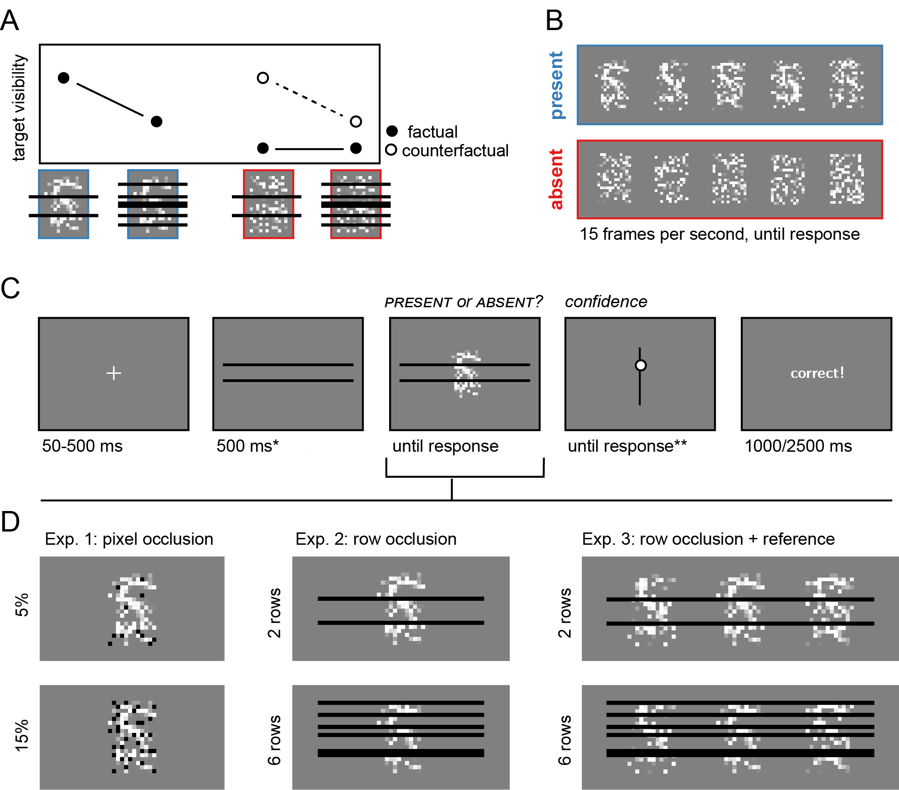
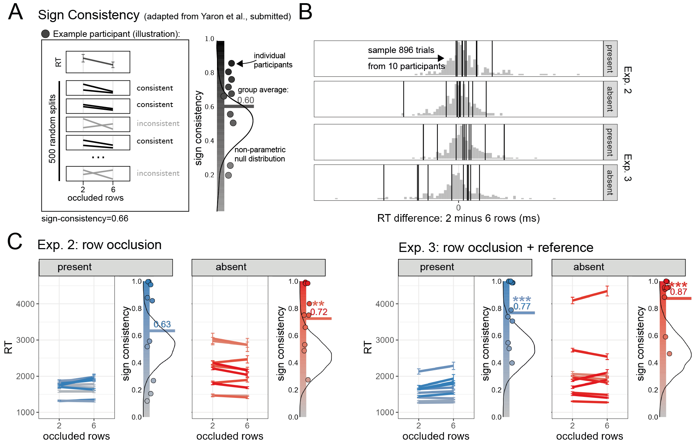

# Introduction

After checking Taylor Swift’s Wikipedia page, we are confident that she hasn’t announced her retirement from music. If she had, it would have been mentioned on her page. We also checked cellist Natalia Gutman’s page and didn’t see any mention of a similar announcement, but we are not so sure she hasn’t made one since her Wikipedia page only gets updated irregularly. The absence of evidence on Wikipedia is enough to make a solid inference in the case of Swift but not in the case of Gutman because we know that information about Swift spreads more efficiently on the internet. We believe that something is not true when we believe that “if it were true, we would have heard about it” [@goldberg2011if].

More generally, for a decision to be rational, it should depend not only on observation, but also on our beliefs regarding the likelihood of the observation in hand given competing hypotheses about the world. This is especially true when the observation in question is that no evidence is available, as the absence of evidence can reflect the absence of a signal, or a failure of to obtain evidence for it, leaving a critical role for the decision maker's internal model of how likely evidence is to become available when a signal is present [@walton1992nonfallacious; @walton2010arguments; @oaksford2004bayesian].

Here we ask whether people apply a similar reasoning in the domain of visual perception, such that perceptual decisions in the absence of a stimulus are a function not only of what we see (*perceptual evidence*) and what we expect to see (*prior*), but also of our beliefs about the probability that a stimulus would be seen, if present (*likelihood*). We consider three accounts of perceptual detection, which entail different roles for beliefs about the likelihood function in making decisions, particularly about the absence of stimuli. First, it may be that the absence of stimuli can be directly perceived just like their presence, rendering it possible to make detection decisions not by considering the probability of perceptual evidence, or its absence, under target presence or absence, but by directly contrasting evidence for presence with evidence for absence in a purely feed-forward manner. For example, it has been suggested that sensory neurons typically have corresponding “anti-neurons” with opposite selectivity [@gold2001; @gold2002; @newsome1989], and that in the case of detection, such anti-neurons may selectively discharge in response to target absence [@gold2001].

A second alternative is that decisions about absence are made relative to an internal criterion which is set based on beliefs about the probability of stimuli, the payoff structure, and recent history, but not the expected likelihood of evidence. Such a criterion can be set in sensory units ["respond *present* for anything above this level of brightness", @treisman1984] or temporal units ["respond *absent* if the target hasn't been detected within this much time", @chun1996], without any reference to probabilities or likelihoods. In support of this view, participants often fail to adjust their decision heuristic based on expected stimulus visibility, both when visibility is cued [@gorea2000failure] and when it is manipulated via attention [@rahnev2011] or stimulus centrality on the retina [@solovey2015]. Finally, detection decisions may be based on an asymmetric evidence structure, providing direct evidence for presence only, with support for target absence becoming available via the the rational incorporation of beliefs about *counterfactual visibility*, or the likelihood of evidence to become available when a target is present.

<!-- We contrast this possibility with two alternatives. First, it may be that the absence of stimuli can be directly perceived just like their presence. For example, it has been suggested that sensory neurons typically have corresponding “anti-neurons” with opposite selectivity [@gold2001; @gold2002; @newsome1989], rendering it possible to make perceptual inferences in a purely feed-forward manner, by extracting the difference in activation between neurons and their anti-neurons as perceptual evidence. @gold2001 suggest that in the case of perceptual detection, anti-neurons may selectively discharge in response to target absence, making it possible for agents to infer stimulus absence not when a stimulus would have been detected, but when stimulus absence is detected by neurons that are sensitive to the physical correlates of absent-ness. -->

<!-- A second alternative is that decisions are made relative to an internal criterion which is set based on beliefs about the probability of stimuli, the payoff structure, and recent history, but not the expected likelihood of evidence ($p(E=1|H)$, or *visibility*).  Together, it is unclear whether beliefs about counterfactual visibility ever contribute to perceptual decisions outside visual search, and if they do, in what ways. -->

To ascertain between these three possibilities we conducted three experiments where detection decisions about presence and absence were made under different levels of stimulus occlusion. Our task design allowed us to experimentally dissociate actual visibility (measured as occlusion level and fluctuations in the noise structure of visual stimuli) from beliefs about visibility (measured as occlusion level only), independently measuring the effects of each on perceptual decisions and confidence in presence and absence. We then contrast the three above accounts of the inferential processes that may underlie behaviour in this task, and in perceptual detection more generally. We show that behavioural asymmetries in perceptual detection naturally emerge in an ideal observer model when only presence, but not absence, is positively represented in sensory channels. Using the same ideal-observer model, we show that detection decisions in the absence of a stimulus, their biases, timing, and confidence, are critically dependent on counterfactual visibility: beliefs about the expected visibility of stimuli that are not physically present. Finally, we provide evidence for reliable population heterogeneity in the incorporation of counterfactual visibility into perceptual decisions. Our findings are broadly consistent with the final conceptualization of a role of counterfactual visibility in perceptual decisions.

```{r setup, include = FALSE}

library('groundhog')
groundhog.library(
  c(
    'papaja',
    'reticulate',
    'tidyverse',
    'broom',
    'cowplot',
    'MESS', # for AUCs
    'lsr', # for effect sizes
    'pwr', # for power calculations
    'brms', # for mixed effects modeling
    'BayesFactor',# for Bayesian t test
    'jsonlite', #parsing data from sort_trial
    'afex', #for anova
    'pracma', # for AUCs
    'cocor', # for correlation comparisons
    'formattable', # for table formatting
    'modelsummary' # for modelplot
  ), "2023-12-01"
)

library('signcon') # ran remotes::install_github('mufcItay/signcon') on 27/07/2023; commit 4bc947e

r_refs("r-references.bib")
knitr::opts_chunk$set(warning=F,echo=F,message=F,cache=T)

```

# Results

## Task: visual detection under partial occlusion

```{r load-and-process}
source("../analysis/loadAndPreprocessData.R")
source("../analysis/loadAndPreprocessParametersAndSimulatedData.R")
source("../analysis/loadAndPreprocessParametersAndSimulatedDataFullInsight.R")
source("../analysis/loadAndPreprocessParametersAndSimulatedDataNoInsight.R")
source("../analysis/loadAndPreprocessParametersAndSimulatedDataVariableTrials.R")

```

```{r SDT, echo=FALSE, cache=TRUE}

E1.overall_descriptives<- E1.df %>%
  filter(test_part=='test1' | test_part=='test2') %>%
  mutate(resp = response==presence_key)%>%
  group_by(subj_id) %>%
  summarise(accuracy=mean(correct),
            resp_bias=mean(resp),
            RT=median(RT),
            hit_rate = (sum(correct & present)+0.5)/(sum(present)+1),
            fa_rate = (sum(!correct & !present)+0.5)/(sum(!present)+1),
            d = qnorm(hit_rate)-qnorm(fa_rate),
            c = -0.5*(qnorm(hit_rate)+qnorm(fa_rate)))

E1.descriptives_by_occlusion<- E1.df %>%
  filter(test_part=='test1' | test_part=='test2') %>%
  mutate(resp = response==presence_key)%>%
  group_by(subj_id,hide_proportion) %>%
  summarise(accuracy=mean(correct),
            resp_bias=mean(resp),
            RT=median(RT),
            hit_rate = (sum(correct & present)+0.5)/(sum(present)+1),
            fa_rate = (sum(!correct & !present)+0.5)/(sum(!present)+1),
            d = qnorm(hit_rate)-qnorm(fa_rate),
            c = -0.5*(qnorm(hit_rate)+qnorm(fa_rate)))


E1.hit_rate_by_occlusion<- E1.descriptives_by_occlusion %>%
 dplyr::select(subj_id,hide_proportion,hit_rate) %>%
  spread(hide_proportion,hit_rate,sep='')%>%
  mutate(diff=hide_proportion0.05-hide_proportion0.15)

E1.fa_rate_by_occlusion<- E1.descriptives_by_occlusion %>%
 dplyr::select(subj_id,hide_proportion,fa_rate) %>%
  spread(hide_proportion,fa_rate,sep='')%>%
  mutate(diff=hide_proportion0.05-hide_proportion0.15)

E1.d_by_occlusion<- E1.descriptives_by_occlusion %>%
 dplyr::select(subj_id,hide_proportion,d) %>%
  spread(hide_proportion,d,sep='')%>%
  mutate(diff=hide_proportion0.05-hide_proportion0.15)

E1.c_by_occlusion<- E1.descriptives_by_occlusion %>%
 dplyr::select(subj_id,hide_proportion,c) %>%
  spread(hide_proportion,c,sep='')%>%
  mutate(diff=hide_proportion0.05-hide_proportion0.15)

E2.overall_descriptives<- E2.df %>%
  filter(test_part=='test1' | test_part=='test2') %>%
  mutate(resp = response==presence_key)%>%
  group_by(subj_id) %>%
  summarise(accuracy=mean(correct),
            resp_bias=mean(resp),
            RT=median(RT),
            hit_rate = (sum(correct & present)+0.5)/(sum(present)+1),
            fa_rate = (sum(!correct & !present)+0.5)/(sum(!present)+1),
            d = qnorm(hit_rate)-qnorm(fa_rate),
            c = -0.5*(qnorm(hit_rate)+qnorm(fa_rate)))


E2.descriptives_by_occlusion<- E2.df %>%
  filter(test_part=='test1' | test_part=='test2') %>%
  mutate(resp = response==presence_key)%>%
  group_by(subj_id,hide_proportion) %>%
  summarise(accuracy=mean(correct),
            resp_bias=mean(resp),
            RT=median(RT),
            hit_rate = (sum(correct & present)+0.5)/(sum(present)+1),
            fa_rate = (sum(!correct & !present)+0.5)/(sum(!present)+1),
            d = qnorm(hit_rate)-qnorm(fa_rate),
            c = -0.5*(qnorm(hit_rate)+qnorm(fa_rate)))


E2.hit_rate_by_occlusion<- E2.descriptives_by_occlusion %>%
 dplyr::select(subj_id,hide_proportion,hit_rate) %>%
  spread(hide_proportion,hit_rate,sep='')%>%
  mutate(diff=hide_proportion0.1-hide_proportion0.35)

E2.fa_rate_by_occlusion<- E2.descriptives_by_occlusion %>%
 dplyr::select(subj_id,hide_proportion,fa_rate) %>%
  spread(hide_proportion,fa_rate,sep='')%>%
  mutate(diff=hide_proportion0.1-hide_proportion0.35)

E2.d_by_occlusion<- E2.descriptives_by_occlusion %>%
 dplyr::select(subj_id,hide_proportion,d) %>%
  spread(hide_proportion,d,sep='')%>%
  mutate(diff=hide_proportion0.1-hide_proportion0.35)

E2.c_by_occlusion<- E2.descriptives_by_occlusion %>%
 dplyr::select(subj_id,hide_proportion,c) %>%
  spread(hide_proportion,c,sep='')%>%
  mutate(diff=hide_proportion0.1-hide_proportion0.35)

E3.overall_descriptives<- E3.df %>%
  filter(test_part=='test1' | test_part=='test2') %>%
  mutate(resp = response==presence_key)%>%
  group_by(subj_id) %>%
  summarise(accuracy=mean(correct),
            resp_bias=mean(resp),
            RT=median(RT),
            hit_rate = (sum(correct & present)+0.5)/(sum(present)+1),
            fa_rate = (sum(!correct & !present)+0.5)/(sum(!present)+1),
            d = qnorm(hit_rate)-qnorm(fa_rate),
            c = -0.5*(qnorm(hit_rate)+qnorm(fa_rate)))

E3.descriptives_by_occlusion<- E3.df %>%
  filter(test_part=='test1' | test_part=='test2') %>%
  mutate(resp = response==presence_key)%>%
  group_by(subj_id,hide_proportion) %>%
  summarise(accuracy=mean(correct),
            resp_bias=mean(resp),
            RT=median(RT),
            hit_rate = (sum(correct & present)+0.5)/(sum(present)+1),
            fa_rate = (sum(!correct & !present)+0.5)/(sum(!present)+1),
            d = qnorm(hit_rate)-qnorm(fa_rate),
            c = -0.5*(qnorm(hit_rate)+qnorm(fa_rate)))

E3.hit_rate_by_occlusion<- E3.descriptives_by_occlusion %>%
 dplyr::select(subj_id,hide_proportion,hit_rate) %>%
  spread(hide_proportion,hit_rate,sep='')%>%
  mutate(diff=hide_proportion0.1-hide_proportion0.35)

E3.fa_rate_by_occlusion<- E3.descriptives_by_occlusion %>%
 dplyr::select(subj_id,hide_proportion,fa_rate) %>%
  spread(hide_proportion,fa_rate,sep='')%>%
  mutate(diff=hide_proportion0.1-hide_proportion0.35)

E3.d_by_occlusion<- E3.descriptives_by_occlusion %>%
 dplyr::select(subj_id,hide_proportion,d) %>%
  spread(hide_proportion,d,sep='')%>%
  mutate(diff=hide_proportion0.1-hide_proportion0.35)

E3.c_by_occlusion<- E3.descriptives_by_occlusion %>%
 dplyr::select(subj_id,hide_proportion,c) %>%
  spread(hide_proportion,c,sep='')%>%
  mutate(diff=hide_proportion0.1-hide_proportion0.35)
```

In three pre-registered online experiments, participants performed a near-threshold detection task in which they made decisions about the presence or absence of a target letter (A or S, in different blocks) in a noisy, dynamic stimulus (Fig. \@ref(fig:design)A). The stimulus remained on the screen, refreshing at 15 frames per second, until a response was made. On different trials, random parts of the display were occluded by an overlaid layer of black occluders. Participants' task was to "ignore the black stuff, focus on the noise that is under it, and determine whether the letter appeared in it or not". We chose to manipulate stimulus visibility in this way because the effect of occlusion on visibility is relatively obvious: the more occluded objects are, the harder they are to see. If we hold any beliefs about visibility we reasoned that we would likely see them here. This way, we assumed that occlusion affects not only stimulus visibility, but also beliefs about the counterfactual visibility of stimuli that are not physically present (Fig. \@ref(fig:design)B). 

More specifically, `r E1.raw_df$subj_id%>%unique()%>%length()` participants took part in Exp. 1, in which either 5 or 15 percent of the stimulus pixels were occluded by a static layer of randomly positioned black pixels (Fig. \@ref(fig:design)D, left panels). `r E2.raw_df$subj_id%>%unique()%>%length()` participants took part in Exp. 2, in which we occluded 2 or 6 entire rows of pixels, and presented the occluders for additional 500 ms before stimulus onset, to facilitate a separation between the occluders and the noisy stimulus itself (Fig. \@ref(fig:design)D, middle panels). Exp. 2 was the only experiment in which participants also reported their confidence ratings on an analog scale in blocks 3 and 4 (Fig. \@ref(fig:design)C). Finally, `r E3.raw_df$subj_id%>%unique()%>%length()` participants took part in Exp. 3, in which the central stimulus was flanked by two stimuli, partly hidden behind the same row occluders, which, known to participants, always had the target in them (Fig. \@ref(fig:design)D, left panels). The rationale for this manipulation was to increase the availability of counterfactual visibility ("what would it look like if the stimulus had been present?") in target-absent trials.

After applying our pre-registered accuracy and reaction-time based exclusion criteria, `r E1.df$subj_id%>%unique()%>%length()`, `r E2.df$subj_id%>%unique()%>%length()`, and `r E3.df$subj_id%>%unique()%>%length()` participants were included in the main analysis for Experiments 1, 2, and 3, respectively. Results from all pre-registered analyses are presented in the Appendix.

```{r design, echo=FALSE, fig.cap="Rationale and experimental design for Experiments 1-3. A) example frames from target-present (blue) and target-absent (red) stimuli (presented unoccluded here). B) occluding more of a target letter decreases its visibility (black markers). Occlusion has a small effect on visibility when the target is absent, but it affects *counterfactual visibility* (white markers): the expected visibility of the target, had it been present. C) trial structure in Exp. 2. D) occlusion conditions in the three experiments. In Exp. 1, on different trials we occluded a random subset of 5% or 15% of the pixels in the stimulus. In Exp. 2 and 3, on different trials we occluded a random subset of 2 or 6 pixel rows. In Exp. 3, the task-relevant stimulus was flanked by two reference stimuli that, known to the subject, always had the target letter in them. Participants performed two 32-trial blocks in which the target was the letter S and two blocks in which the target was the letter A. The order of the two letters was randomised between participants.   *The occluder preview screen only appeared in Exp. 2 and 3. **Confidence ratings were given only in Exp. 2, blocks 3 and 4", out.width = '75%'}

```

## An ideal observer model of visual detection

We present two variants of a Partially Observed Markov Decision Process [POMDP, @littman2009] model of perceptual detection: a symmetric variant, equipped with a presence-sensor and an absence-sensor (Fig. \@ref(fig:model), left panels) and an asymmetric variant, equipped only with a presence-sensor (Fig. \@ref(fig:model)A, right panels). Our motivation is not only to describe the processes by which humans make perceptual decisions, but to identify the evidence structure under which rational behaviour produces the error, reaction time and confidence rating patterns observed in humans [@anderson1990]. We provide a high-level description of the model here and a more detailed description in the Methods section. As we show, presence-absence asymmetries in decision time and decision confidence are borne out of rational evidence accumulation when the information value of evidence for presence and absence is itself asymmetrical.

```{r basic simulations, echo=FALSE, cache=TRUE}

sim.sym <- read_csv('../modelling/model_fitting_Matlab/simulate_data_from_parameters/simulated_data/illustration/sym.csv')  %>%
  rename(RT=rt) %>%
  mutate(decision = ifelse(present==1,correct,1-correct))

sim.asym <- read_csv('../modelling/model_fitting_Matlab/simulate_data_from_parameters/simulated_data/illustration/asym.csv') %>%
  rename(RT=rt) %>%
  mutate(decision = ifelse(present==1,correct,1-correct))

sim.RC <- read_csv('../modelling/model_fitting_Matlab/simulate_data_from_parameters/simulated_data/illustration/RC_highthreshold_ByT.csv') %>%
  rename(RT=rt) %>%
  mutate(RT=RT+rnorm(1,0,2),
         confidence=confidence+rnorm(1,0,0.01),
         decision = ifelse(present==1,correct,1-correct));


detection_colors = c('#377eb8', '#e41a1c');
labels = c('Present','Absent')

pRT_collapsed <- sim.asym %>%
  filter(correct==1)%>%
  mutate(present=factor(present,levels=c(1,-1),labels=c('present','absent')))%>%
  group_by(present)%>%summarise(RT=mean(RT)) %>%
  ggplot(aes(x=present,y=RT,fill=present)) +
  scale_fill_manual(values=detection_colors) +
  scale_shape_manual(values=c(21,22))+
  scale_y_continuous(limits=c(10,22))+
  geom_point(size=3, shape=21) +
  theme_classic() +
  theme(legend.pos='na') +
  labs(y='number of time points',title='Reaction time',x='') 

ggsave('../docs/figures/model/RT_collapsed_square.png',pRT_collapsed, width=2,height=2)

pBias_collapsed <- sim.asym %>% 
  mutate(bias=mean(decision))%>%
  # group_by(present, occluded_rows)%>%summarise(RT=mean(RT)) %>%
  ggplot(aes(y=bias)) +
  # scale_fill_manual(values=detection_colors) +
  # scale_shape_manual(values=c(21,22))+
  scale_y_continuous(limits=c(0.475,0.525))+
  scale_x_continuous(limits=c(0.45,0.55),breaks=c(0.5),labels=c('all trials'))+
  geom_point(size=3, shape=21,x=0.5,fill='black') +
  theme_classic() +
  theme(legend.pos='na') +
  labs(y='propotion "present"',title='Bias',x='') 

ggsave('../docs/figures/model/Bias_collapsed_square.png',pBias_collapsed, width=1,height=2)


pconfidence_collapsed <- sim.asym %>% 
  filter(correct==1 ) %>%
  mutate(present=factor(present,levels=c(1,-1),labels=c('present','absent')))%>%
  group_by(present)%>%
  summarise(confidence=mean(confidence)) %>%
  ggplot(aes(x=present,y=confidence,fill=present)) +
  scale_fill_manual(values=detection_colors) +
  scale_shape_manual(values=c(21,22))+
  scale_y_continuous(limits=c(0.85,0.95))+
  geom_point(size=3, shape=21) +
  theme_classic() +
  theme(legend.pos='na') +
  labs(y='Bayesian p(correct)',title='Confidence',x='') 

ggsave('../docs/figures/model/confidence_collapsed_square.png',pconfidence_collapsed, width=2,height=2)

RT_RC <- sim.RC %>%
  filter(correct==1 & frame<8)%>%
  mutate(present=factor(present,levels=c(1,-1),labels=c('present','absent')))%>%
  group_by(present,frame)%>%summarise(RT=cor(RT,evidence)) %>%
  ggplot(aes(x=frame,y=RT,color=present,fill=present)) +
  scale_color_manual(values=detection_colors) +
  # scale_y_continuous(limits=c(10,22))+
  geom_point(size=3) +
  geom_line(size=1)+
  theme_classic() +
  theme(legend.pos='na') +
  geom_abline(slope=0,intercept=0)+
  labs(y='correlation',x='') 

ggsave('../docs/figures/model/RTRC_collapsed_square.png',RT_RC, width=2,height=1.8)

confidence_RC <- sim.RC %>%
  filter(correct==1)%>%
  mutate(present=factor(present,levels=c(1,-1),labels=c('present','absent')))%>%
  group_by(present)%>%summarise(confidence=cor(confidence,evidence)) %>%
  ggplot(aes(x=present,y=confidence,fill=present)) +
  scale_fill_manual(values=detection_colors) +
  scale_shape_manual(values=c(21,22))+
  scale_y_continuous(limits=c(-0.01,0.05))+
  geom_point(size=3, shape=21) +
  theme_classic() +
  theme(legend.pos='na') +
  geom_abline(slope=0,intercept=0)+
  labs(y='correlation',x='') 

ggsave('../docs/figures/model/confRC_collapsed_square.png',confidence_RC, width=2,height=1.8)


conf_discrete_counts <- sim.asym %>%
  mutate(confidence = round(confidence*100)/100)%>%
  group_by(decision, correct, confidence, .drop=FALSE) %>%
  tally() %>%
  spread(correct, n, sep='',fill=0) %>%
  arrange(desc(confidence), by_group=TRUE) %>%
  group_by(decision)%>%
  mutate(cs_correct=cumsum(correct1)/sum(correct1),
         cs_incorrect=cumsum(correct0)/sum(correct0))

additional_lines = conf_discrete_counts %>%
  group_by(decision) %>%
  reframe(confidence=c(0,1),cs_incorrect = c(0,1),cs_correct=c(0,1))

conf_discrete_counts = rbind(conf_discrete_counts,additional_lines)

labels=c('present','absent')

p<- ggplot(data=conf_discrete_counts%>%mutate(response=ifelse(decision==1,labels[1],labels[2])%>%factor(levels=labels)),
       aes(x=cs_incorrect, y=cs_correct, color=response)) +
  geom_line(size=1.3) +
  # geom_point(aes(shape = response))+
  geom_abline(slope=1)+
  theme_bw() + coord_fixed() +
  labs(x='p(conf | incorrect)', y='p(conf | correct)')+ 
  scale_color_manual(values=detection_colors)+
  scale_fill_manual(values=detection_colors) +
  scale_x_continuous(breaks=c())+
  scale_y_continuous(breaks=c())+
  geom_rect(aes(xmin=0,xmax=1,ymin=0,ymax=1),size=0.5,color='black',alpha=0)+
  theme_classic()+
  theme(legend.position='none')+
  labs(title='mc sensitivity')

ggsave('../docs/figures/model/AUC_square.png',p,width=2,height=2)

```

<!-- In visual detection tasks, decisions about absence are commonly slower, and are given with lower levels of subjective confidence, relative to decisions about presence [@mazor2021stage; @mazor2023paradoxical; @mazor2020distinct]. Presence-absence asymmetries in reaction time and confidence are expected if evidence is only ever available to support presence, leaving absence to be inferred tentatively and based on the absence of evidence. To formulate this asymmetry in the availability of evidence, we present two variants of a Partially Observed Markov Decision Process [POMDP, @littman2009] model of perceptual detection: a symmetric variant, equipped with a presence-sensor and an absence-sensor (Fig. @ref(fig:model), left panels) and an asymmetric variant, equipped only with an absence-sensor. Crucially, instead of fitting model parameters to observed behaviour, our motivation is to ask about the conditions under which a given policy would be rational from the point of view of the participant [@anderson1990]. We provide a high-level description of the model here and a more detailed description in the Methods section. As we show, asymmetries in decision time and decision confidence are borne out of rational evidence accumulation when the value of positive and negative evidence is itself asymmetrical. -->

```{r model, echo=FALSE, fig.cap="Symmetric and asymmetric models of visual detection. A) model architecture. In the symmetric model (left), target presence affects the activation probability of presence and absence sensors. The asymmetric model (right) has no absence sensor. The agent perceives a series of binary outcomes (sensor activations), based on which it attempts to guess the true world state (target presence or absence). This is done by extracting and accumulating the log likelihood ratio (LLR) for target presence versus absence (interpretation) and deciding whether to make a decision based on available evidence, or alternatively whether to accumulate more evidence. In making this decision, the agent balances the incentive to be as accurate as possible (only correct decisions are associated with a reward) and the exponential discounting of the value of reward as a function of time. B) The first samples from two example trials, one from each model. C) behavioural predictions for an ideal observer. Only the asymmetric model predicts that decisions about absence should be slower, and that they should be accompanied by lower levels of subjective confidence, than decisions about presence. ", out.width = '100%'}
knitr::include_graphics("figures/compModelGraph.png")
```

We model sensory observations as the binary (on/off) activations of visual sensors which are probabilistically tuned to one state of the world. For example, the "presence sensor" in the symmetric model (\@ref(fig:model)A, left panel) has a higher activation probability when a target is present ($0.15$) than absent ($0.05$). The agent is intrinsically rewarded for making accurate decisions regarding the state of the world (stimulus presence or absence), given these observations. To increase the probability of being correct, the agent can choose to wait and accumulate more observations before making a decision. However, the intrinsic value of accuracy is subject to temporal discounting, rendering the value of later correct decisions lower than that of earlier ones. Thus, from the agent’s perspective, accumulating further evidence pays off exactly when the expected accuracy gain exceeds the discounting loss.

Given these settings, our agent implements an optimal policy, updating its beliefs about the state of the world by tracking the log likelihood ratio (LLR) between presence and absence given each observation, and committing to a decision only when the expected value of making a decision is higher than the expected value of making a decision later, assuming the same policy will be used in later time points. For our specified setting, the optimal policy is to commit to a “target present” decision once the accumulated LLR hits an upper boundary, commit to a “target absent” decision once the accumulated LLR hits a lower boundary, and continue to accumulate evidence otherwise (see Fig. \@ref(fig:model)B, left panel, for the first time points from an example trial). As an additional measure, we assume that decision confidence equals the probability of being correct at the time of committing to a decision, given the accumulated evidence so far.

The left panels in Fig. \@ref(fig:model) represent a symmetric setting, where two independent sensors are symmetrically tuned to presence or absence [@gold2001]. Compare this with the asymmetric model in the right panels of Fig. \@ref(fig:model). This model is identical, except that it lacks an absence sensor (the sensitivity of the presence sensor is increased to $0.20$ to match overall performance). Under this asymmetric model, absence must be inferred based on periods of inactivation of the presence sensor that are unlikely when a target is present. As a result, unlike the symmetric accumulator that is sensitive to the difference in activation between the two sensors, the asymmetric accumulator is pulled toward the lower boundary whenever the presence sensor is inactive (Fig. \@ref(fig:model)B, right panel). Still, it is important to note that sensor inactivation is much less informative than sensor activation: activation is $4$ times more likely when a target is present than absent, but inactivation is more likely by a factor of only $1.18$ when a target is absent than present (see the smaller steps going down compared to up in Fig. \@ref(fig:model)B, right panel). This asymmetry in the information value of evidence for presence and absence results in slower decisions about absence and lower confidence levels in such decisions, compared to decisions about presence (fig. \@ref(fig:model)C, right panel), in line with the reaction time and confidence profiles found in perceptual detection experiments [@kellij2021; @mazor2023paradoxical; @mazor2021stage; @mazor2020distinct; @meuwese2014].

## Findings: Presence-absence asymmetries

```{r H1, echo=FALSE, cache=TRUE}

E1.RT_by_resp <- E1.df %>%
  filter((test_part=='test1' | test_part=='test2') & RT>100 & RT<5000) %>%
  group_by(subj_id,resp) %>%
  summarise(RT=median(RT))%>%
  spread(resp,RT,sep='')%>%
  mutate(diff=respTRUE-respFALSE)

E2.RT_by_resp <- E2.df %>%
  filter((test_part=='test1' | test_part=='test2') & RT>100 & RT<5000) %>%
  group_by(subj_id,resp) %>%
  summarise(RT=median(RT))%>%
  spread(resp,RT,sep='')%>%
  mutate(diff=respTRUE-respFALSE)

# the change in exclusion criteria is pre-registered
E3.RT_by_resp <- E3.df %>%
  filter((test_part=='test1' | test_part=='test2') & RT>100& RT<7000) %>%
  group_by(subj_id,resp) %>%
  summarise(RT=median(RT))%>%
  spread(resp,RT,sep='')%>%
  mutate(diff=respTRUE-respFALSE)
```

```{r H7, echo=FALSE, cache=TRUE}

E2.confidence_by_resp <- E2.df %>%
  filter((test_part=='test1' | test_part=='test2')) %>%
  group_by(subj_id,resp) %>%
  summarise(confidence=mean(confidence, na.rm=T))%>%
  spread(resp,confidence,sep='')%>%
  mutate(diff=respTRUE-respFALSE)

E2.confidence_by_resp_correct_only <- E2.df %>%
  filter((test_part=='test1' | test_part=='test2') & correct) %>%
  group_by(subj_id,resp) %>%
  summarise(confidence=mean(confidence, na.rm=T))%>%
  spread(resp,confidence,sep='')%>%
  mutate(diff=respTRUE-respFALSE)
```

```{r empirical asymmetry plots, cache=TRUE, echo=FALSE}

detection_colors = c('#377eb8', '#e41a1c');


N_perm <- 1000;
bootstrap_error <- function(x, N_perm) {
  N <- length(x)
  medians = c();
  for (i in 1:N_perm) {
    medians = c(medians,sample(x,replace=TRUE,size=N)%>%median())
  };
  return(sd(medians))
}

E1.pRT_collapsed <- E1.df %>% 
  filter(correct==1) %>%
  mutate(present=factor(present,levels=c(1,0),labels=c('present','absent')))%>%
  group_by(present, subj_id) %>%
  summarise(RT=median(RT)) %>%
  group_by(present) %>%
  summarise(sem=bootstrap_error(RT,N_perm),
            RT=median(RT))%>%
  ggplot(aes(x=present,y=RT,fill=present)) +
  scale_fill_manual(values=detection_colors) +
  scale_shape_manual(values=c(21,22))+
  scale_y_continuous(limits=c(1200,2500))+
  geom_errorbar(aes(ymin=RT-sem,ymax=RT+sem),width=0.2)+
  geom_point(size=3, shape=21) +
  theme_classic() +
  theme(legend.pos='na') +
  labs(y='reaction time (ms)',x='') 

ggsave('../docs/figures/E1_RT_asymmetry.png',E1.pRT_collapsed, width=2,height=2)

E2.pRT_collapsed <- E2.df %>% 
  filter(correct==1) %>%
  mutate(present=factor(present,levels=c(1,0),labels=c('present','absent')))%>%
  group_by(present, subj_id) %>%
  summarise(RT=median(RT)) %>%
  group_by(present) %>%
  summarise(sem=bootstrap_error(RT,N_perm),
            RT=median(RT))%>%
  ggplot(aes(x=present,y=RT,fill=present)) +
  scale_fill_manual(values=detection_colors) +
  scale_shape_manual(values=c(21,22))+
  scale_y_continuous(limits=c(1200,2500))+
  geom_errorbar(aes(ymin=RT-sem,ymax=RT+sem),width=0.2)+
  geom_point(size=3, shape=21) +
  theme_classic() +
  theme(legend.pos='na') +
  labs(y='reaction time (ms)',x='') 

ggsave('../docs/figures/E2_RT_asymmetry.png',E2.pRT_collapsed, width=2,height=2)

E2.pconfidence_collapsed <- E2.df %>% 
  filter(correct==1 & !is.na(confidence)) %>%
  mutate(present=factor(present,levels=c(1,0),labels=c('present','absent')))%>%
  group_by(present, subj_id) %>%
  summarise(confidence=mean(confidence)) %>%
  group_by(present) %>%
  summarise(se=se(confidence),
            confidence=mean(confidence))%>%
  ggplot(aes(x=present,y=confidence,fill=present)) +
  scale_fill_manual(values=detection_colors) +
  scale_shape_manual(values=c(21,22))+
  scale_y_continuous(limits=c(0.8,0.9))+
  geom_errorbar(aes(ymin=confidence-se,ymax=confidence+se),width=0.2)+
  geom_point(size=3, shape=21) +
  theme_classic() +
  theme(legend.pos='na') +
  labs(y='confidence ratings',x='') 

ggsave('../docs/figures/E2_confidence_asymmetry.png',E2.pconfidence_collapsed, width=2,height=2)

E3.pRT_collapsed <- E3.df %>% 
  filter(correct==1) %>%
  mutate(present=factor(present,levels=c(1,0),labels=c('present','absent')))%>%
  group_by(present, subj_id) %>%
  summarise(RT=median(RT)) %>%
  group_by(present) %>%
  summarise(sem=bootstrap_error(RT,N_perm),
            RT=median(RT))%>%
  ggplot(aes(x=present,y=RT,fill=present)) +
  scale_fill_manual(values=detection_colors) +
  scale_shape_manual(values=c(21,22))+
  scale_y_continuous(limits=c(1200,2500))+
  geom_errorbar(aes(ymin=RT-sem,ymax=RT+sem),width=0.2)+
  geom_point(size=3, shape=21) +
  theme_classic() +
  theme(legend.pos='na') +
  labs(y='reaction time (ms)',x='') 

ggsave('../docs/figures/E3_RT_asymmetry.png',E3.pRT_collapsed, width=2,height=2)
```

Correct decisions about absence were markedly slower than decisions about presence, by hundreds of milliseconds (Fig. \@ref(fig:asymmetries)A). This was true in Exp. 1 (pre-registered Hypothesis 1: `r printnum(E1.RT_by_resp%>%pull(respTRUE)%>%mean()/1000)` vs `r printnum(E1.RT_by_resp%>%pull(respFALSE)%>%mean()/1000)` seconds; `r apa_print(E1.RT_by_resp%>%pull(diff)%>%t.test())$statistic`), Exp. 2 (`r printnum(E2.RT_by_resp%>%pull(respTRUE)%>%mean()/1000)` vs `r printnum(E2.RT_by_resp%>%pull(respFALSE)%>%mean()/1000)` seconds; `r apa_print(E2.RT_by_resp%>%pull(diff)%>%t.test())$statistic`), and Exp. 3 (pre-registered hypothesis 1: `r printnum(E3.RT_by_resp%>%pull(respTRUE)%>%mean()/1000)` vs `r printnum(E3.RT_by_resp%>%pull(respFALSE)%>%mean()/1000)` seconds; `r apa_print(E3.RT_by_resp%>%pull(diff)%>%t.test())$statistic`). Second, in Exp. 2, confidence ratings were significantly lower in decisions about absence (pre-registered hypothesis 7: `r E2.confidence_by_resp_correct_only$respTRUE%>%mean()%>%printnum()` vs `r E2.confidence_by_resp_correct_only$respFALSE%>%mean()%>%printnum()` on a $0.5-1$ scale; `r apa_print(E2.confidence_by_resp_correct_only%>%pull(diff)%>%t.test())$statistic`; Fig. \@ref(fig:asymmetries)D).

### Exploratory data analysis: reverse correlation

<!-- In all three experiments, we found the timing of decisions about absence to be unaffected by occlusion. This made us wonder whether the timing of decisions about absence is sensitive to any aspect of the stimulus at all. For example, if decisions about absence are made once a noisy timer goes off and before sufficient evidence has been accumulated for presence [a similar model was proposed for decisions about absence in visual search, @wolfe2021, @chun1996], we should expect the timing of decisions about absence to be fully independent of the presented stimulus. If, on the other hand, participants adjust their decision times based on fluctuations in stimulus intensity that are below their decision threshold, decisions about absence should be slower when more evidence is available for presence. To answer this question, we ran a reverse correlation analysis. -->

Since luminance values were randomly sampled per pixel and frame, the perceived similarity between the presented stimulus and the target letter fluctuated both within and between trials. This allowed us to directly measure how stimulus-target similarity (quantified as the Pearson correlation between unoccluded pixels and their corresponding pixels in the target letter, statistically controlling for the proportion of pure-noise and hidden pixels in the frame) contributed to reaction times in decisions about presence and absence. Following previous reverse correlation studies of decision confidence [@zylberberg2012; @mazor2023paradoxical], we focused our analysis on the first 300 ms of the stimulus presentation, and extracted, per trial, the mean similarity between the display and the target letter in these first frames. We then computed the Spearman correlation between these trial-wise similarity measures and the reaction times, focusing our analysis on correct responses only (see Fig. \@ref(fig:asymmetries)C). Our reasoning was as follows: if perceptual evidence for both presence and absence equally contributes to perceptual detection decisions, effects of stimulus-target similarity on target-present reaction time and confidence should be mirrored by perfectly opposite effects of stimulus-target dissimilarity in target-absent trials. If, however, only perceptual evidence for presence is represented, the negative effects of stimulus-target dissimilarity on target-absent decisions should be attenuated relative to the corresponding effects of stimulus-target similarity on target-present decisions.

```{r rc-confidence, message=F, warning=F, echo=F, include=F}

detection_colors = c('#377eb8', '#e41a1c');

E2.frames_df <- read_csv('../experiments/Exp2rows/data/jatos_resultfiles_batch1/all_data.csv') %>%
  mutate(subj_id=PROLIFIC_PID,
         correct = as.numeric(correct),
         RT = as.numeric(RT),
         present=as.numeric(present),
         resp = response==presence_key)  %>%
  filter(test_part %in% c('test1','test2'))%>%
  mutate(p=ifelse(present==0,0,max_p))%>%
  group_by(p, hide_proportion)%>%
  mutate(correlation_with_target_letter_corrected = 
           correlation_with_target_letter-mean(correlation_with_target_letter, na.rm=T),
         occlusion=factor(ifelse(hide_proportion<0.2,'low','high')))

E2.rc_confidence <- E2.frames_df %>%
  filter(frame_index>7 & frame_index<13 & correct & !is.na(confidence))%>%
  group_by(subj_id,trial_index,present,occlusion)%>%
  summarise(evidence=mean(correlation_with_target_letter_corrected),
            confidence=mean(confidence))%>%
  group_by(subj_id,present,occlusion) %>%
  summarise(confidence=cor(evidence,confidence,method='spearman')) %>%
  group_by(subj_id,present)%>%
  summarise(confidence=mean(confidence))%>%
  spread(present,confidence,sep='') %>%
  mutate(diff=present1+present0)

E2.frames_df %>%
  filter(frame_index>7 & frame_index<40 & correct & !is.na(confidence))%>%
  group_by(subj_id,present,occlusion,frame_index) %>%
  summarise(confidence=cor(correlation_with_target_letter_corrected,confidence,method='spearman')) %>%
  group_by(subj_id,present,frame_index)%>%
  summarise(confidence=mean(confidence))%>%
  group_by(present,frame_index)%>%
  summarise(se=se(confidence),
            confidence=mean(confidence, na.rm=T))%>%
  ggplot(aes(x=frame_index,y=confidence,color=factor(present),fill=factor(present)))+
  geom_abline(slope=0,intercept=0)+
  geom_line()+
  geom_ribbon(aes(ymin=confidence-se,ymax=confidence+se),alpha=0.3)+
      scale_color_manual(values=detection_colors)+
    scale_fill_manual(values=detection_colors)
  
```

```{r rc-RT, message=F, warning=F, echo=F, include=F}

E1.frames_df <- read_csv('../experiments/Exp1pixels/version2/data/jatos_resultfiles_batch1/all_data.csv') %>%
  mutate(subj_id=PROLIFIC_PID,
         correct = as.numeric(correct),
         RT = as.numeric(RT),
         present=as.numeric(present),
         resp = response==presence_key,
         correlation_with_mask=as.numeric(correlation_with_mask)) %>%
  filter(test_part %in% c('test1','test2'))%>%
  mutate(p=ifelse(present==0,0,max_p))%>%
  group_by(p, hide_proportion)%>%
  mutate(correlation_with_target_letter_corrected = 
           correlation_with_target_letter-mean(correlation_with_target_letter, na.rm=T),
         occlusion=factor(ifelse(hide_proportion<0.10,'low','high')))

E3.frames_df <- read_csv('../experiments/Exp3reference/data/jatos_results_files_batch1/all_data.csv') %>%
  mutate(subj_id=PROLIFIC_PID,
         correct = as.numeric(correct),
         RT = as.numeric(RT),
         present=as.numeric(present),
         resp = response==presence_key) %>%
  filter(test_part %in% c('test1','test2'))%>%
  mutate(p=ifelse(present==0,0,max_p))%>%
  group_by(p, hide_proportion)%>%
  mutate(correlation_with_target_letter_corrected = 
           correlation_with_target_letter-mean(correlation_with_target_letter, na.rm=T),
         occlusion=factor(ifelse(hide_proportion<0.2,'low','high')))

E2a.frames_df <- read_csv('../experiments/Exp2rowsLong/data/json_data/all_data.csv') %>%
  mutate(subj_id=PROLIFIC_PID,
         correct = as.numeric(correct),
         RT = as.numeric(RT),
         present=as.numeric(present),
         resp = response==presence_key,
         trial_index=subject_identifier+trial_index)%>%
  filter(test_part %in% c('test1','test2'))%>%
  mutate(p=ifelse(present==0,0,max_p))%>%
  group_by(p, hide_proportion)%>%
  mutate(correlation_with_target_letter_corrected = 
           correlation_with_target_letter-mean(correlation_with_target_letter, na.rm=T),
         occlusion=factor(ifelse(hide_proportion<0.2,'low','high')))

E1.rc_RT <- E1.frames_df %>%
  filter(frame_index<6 & correct)%>%
  group_by(subj_id,trial_index,present,occlusion)%>%
  summarise(evidence=mean(correlation_with_target_letter_corrected),
            RT=mean(RT))%>%
  group_by(subj_id,present,occlusion) %>%
  summarise(RT=cor(evidence,RT,method='spearman')) %>%
  group_by(subj_id,present)%>%
  summarise(RT=mean(RT))%>%
  spread(present,RT,sep='') %>%
  mutate(diff=present1+present0)

E1.rc_RT_pos <- E1.frames_df %>%
  filter(frame_index<6 & correct & correlation_with_target_letter_corrected>0)%>%
  group_by(subj_id,trial_index,present,occlusion)%>%
  summarise(evidence=mean(correlation_with_target_letter_corrected),
            RT=mean(RT))%>%
  group_by(subj_id,present,occlusion) %>%
  summarise(RT=cor(evidence,RT,method='spearman')) %>%
  group_by(subj_id,present)%>%
  summarise(RT=mean(RT))%>%
  spread(present,RT,sep='') %>%
  mutate(diff=present1+present0)

E1.rc_RT_neg <- E1.frames_df %>%
  filter(frame_index<6 & correct & correlation_with_target_letter_corrected<0)%>%
  group_by(subj_id,trial_index,present,occlusion)%>%
  summarise(evidence=mean(correlation_with_target_letter_corrected),
            RT=mean(RT))%>%
  group_by(subj_id,present,occlusion) %>%
  summarise(RT=cor(evidence,RT,method='spearman')) %>%
  group_by(subj_id,present)%>%
  summarise(RT=mean(RT))%>%
  spread(present,RT,sep='') %>%
  mutate(diff=present1+present0)

E1.rc_RT_mask <- E1.frames_df %>%
  filter(frame_index==1 & correct)%>%
  group_by(subj_id,trial_index,present,occlusion)%>%
  mutate(evidence=correlation_with_mask)%>%
  group_by(subj_id,present,occlusion) %>%
  summarise(RT=cor(evidence,RT,method='spearman')) %>%
  group_by(subj_id,present)%>%
  summarise(RT=mean(RT))%>%
  spread(present,RT,sep='') %>%
  mutate(diff=present1+present0)

E2.rc_RT <- E2.frames_df %>%
  filter(frame_index>7 & frame_index<13 & correct)%>%
  group_by(subj_id,trial_index,present,occlusion)%>%
  summarise(evidence=mean(correlation_with_target_letter_corrected),
            RT=mean(RT))%>%
  group_by(subj_id,present,occlusion) %>%
  summarise(RT=cor(evidence,RT,method='spearman')) %>%
  group_by(subj_id,present)%>%
  summarise(RT=mean(RT))%>%
  spread(present,RT,sep='') %>%
  mutate(diff=present1+present0)

E2.rc_RT_pos <- E2.frames_df %>%
  filter(frame_index>7 & frame_index<13 & correct & correlation_with_target_letter_corrected>0)%>%
  group_by(subj_id,trial_index,present,occlusion)%>%
  summarise(evidence=mean(correlation_with_target_letter_corrected),
            RT=mean(RT))%>%
  group_by(subj_id,present,occlusion) %>%
  summarise(RT=cor(evidence,RT,method='spearman')) %>%
  group_by(subj_id,present)%>%
  summarise(RT=mean(RT))%>%
  spread(present,RT,sep='') %>%
  mutate(diff=present1+present0)

E2.rc_RT_neg<- E2.frames_df %>%
  filter(frame_index>7 & frame_index<13 & correct & correlation_with_target_letter_corrected<0)%>%
  group_by(subj_id,trial_index,present,occlusion)%>%
  summarise(evidence=mean(correlation_with_target_letter_corrected),
            RT=mean(RT))%>%
  group_by(subj_id,present,occlusion) %>%
  summarise(RT=cor(evidence,RT,method='spearman')) %>%
  group_by(subj_id,present)%>%
  summarise(RT=mean(RT))%>%
  spread(present,RT,sep='') %>%
  mutate(diff=present1+present0)


E3.rc_RT <- E3.frames_df %>%
  filter(frame_index>7 & frame_index<13 & correct)%>%
  group_by(subj_id,trial_index,present,occlusion)%>%
  summarise(evidence=mean(correlation_with_target_letter_corrected),
            RT=mean(RT))%>%
  group_by(subj_id,present,occlusion) %>%
  summarise(RT=cor(evidence,RT,method='spearman')) %>%
  group_by(subj_id,present)%>%
  summarise(RT=mean(RT))%>%
  spread(present,RT,sep='') %>%
  mutate(diff=present1+present0)

E3.rc_RT_pos <- E3.frames_df %>%
  filter(frame_index>7 & frame_index<13 & correct & correlation_with_target_letter_corrected>0)%>%
  group_by(subj_id,trial_index,present,occlusion)%>%
  summarise(evidence=mean(correlation_with_target_letter_corrected),
            RT=mean(RT))%>%
  group_by(subj_id,present,occlusion) %>%
  summarise(RT=cor(evidence,RT,method='spearman')) %>%
  group_by(subj_id,present)%>%
  summarise(RT=mean(RT))%>%
  spread(present,RT,sep='') %>%
  mutate(diff=present1+present0)

E3.rc_RT_neg <- E3.frames_df %>%
  filter(frame_index>7 & frame_index<13 & correct & correlation_with_target_letter_corrected<0)%>%
  group_by(subj_id,trial_index,present,occlusion)%>%
  summarise(evidence=mean(correlation_with_target_letter_corrected),
            RT=mean(RT))%>%
  group_by(subj_id,present,occlusion) %>%
  summarise(RT=cor(evidence,RT,method='spearman')) %>%
  group_by(subj_id,present)%>%
  summarise(RT=mean(RT))%>%
  spread(present,RT,sep='') %>%
  mutate(diff=present1+present0) 

E2a.rc_RT <- E2a.frames_df %>%
  filter(frame_index>7 & frame_index<13 & correct)%>%
  group_by(subj_id,trial_index,present,occlusion)%>%
  summarise(evidence=mean(correlation_with_target_letter_corrected),
            RT=mean(RT))%>%
  group_by(subj_id,present,occlusion) %>%
  summarise(RT=cor(evidence,RT,method='spearman')) %>%
  group_by(subj_id,present)%>%
  summarise(RT=mean(RT))%>%
  spread(present,RT,sep='') %>%
  mutate(diff=present1+present0)

E2a.rc_RT_pos <- E2a.frames_df %>%
  filter(frame_index>7 & frame_index<13 & correct & correlation_with_target_letter_corrected>0)%>%
  group_by(subj_id,trial_index,present,occlusion)%>%
  summarise(evidence=mean(correlation_with_target_letter_corrected),
            RT=mean(RT))%>%
  group_by(subj_id,present,occlusion) %>%
  summarise(RT=cor(evidence,RT,method='spearman')) %>%
  group_by(subj_id,present)%>%
  summarise(RT=mean(RT))%>%
  spread(present,RT,sep='') %>%
  mutate(diff=present1+present0)

E2a.rc_RT_neg <- E2a.frames_df %>%
  filter(frame_index>7 & frame_index<13 & correct & correlation_with_target_letter_corrected<0)%>%
  group_by(subj_id,trial_index,present,occlusion)%>%
  summarise(evidence=mean(correlation_with_target_letter_corrected),
            RT=mean(RT))%>%
  group_by(subj_id,present,occlusion) %>%
  summarise(RT=cor(evidence,RT,method='spearman')) %>%
  group_by(subj_id,present)%>%
  summarise(RT=mean(RT))%>%
  spread(present,RT,sep='') %>%
  mutate(diff=present1+present0)
 
```

<!-- We next asked whether random variation in the similarity of the stimulus to the target letter affected decision times, separately for decisions about presence and absence.  -->

(ref:asymmetries) Presence-absence asymmetries. A) median reaction times in correct responses as a function of target presence. Error bars represent the standard error of the median, computed with bootstrapping. B) mean correlations between RT and stimulus-target similarity. Error margins are 1 standard error from the mean. C) Analysis approach, illustrated for a single frame number. For each frame, the correlation between the demeaned noise and the target served as an index of stimulus-target similarity. We then extracted, for each frame number and participant, the correlation between these similarity measures and their corresponding trial-wise reaction times, or confidence ratings. This was done separately for correct target-present and target-absent decisions. Statistical tests were performed on the mean over the first 300 ms of the stimulus, represented by a black bar in panel B. D) mean confidence times in correct responses as a function of target presence. Error bars represent the standard error of the mean. B) mean correlations between confidence and stimulus-target similarity. \*\*\*: p\<0.001

```{r asymmetries, echo=FALSE, fig.cap="(ref:asymmetries)", out.width = '100%'}
knitr::include_graphics("figures/asymmetries.png")
```

As expected, higher levels of stimulus-target similarity made participants quicker to detect the target letter when it was present, and this was the case in all experiments (a one sample t-test on within-subject correlation coefficients, extracted separately for the two occlusion levels and averaged per participant, Exp. 1: `r apa_print(E1.rc_RT$present1%>%t.test())$statistic`; Exp. 2: `r apa_print(E2.rc_RT$present1%>%t.test())$statistic`; Exp. 3: `r apa_print(E3.rc_RT$present1%>%t.test())$statistic`; blue curves in Fig. \@ref(fig:asymmetries)B). In contrast, higher levels of stimulus-target similarity made participants slower to notice the absence of the letter when it was absent only in Exp. 1 (`r apa_print(E1.rc_RT$present0%>%t.test())$statistic`), but not in Exp. 2 (`r apa_print(E2.rc_RT$present0%>%t.test())$statistic`, `r apa_print(E2.rc_RT%>%drop_na()%>%pull(present0)%>%ttestBF())$statistic`) and Exp. 3 (`r apa_print(E3.rc_RT$present0%>%t.test())$statistic`, `r apa_print(E3.rc_RT%>%drop_na()%>%pull(present0)%>%ttestBF())$statistic`). In all cases, the effect of stimulus-target similarity on decision times was stronger in target-present compared to target-absent responses (Exp. 1: `r apa_print(E1.rc_RT$diff%>%t.test())$statistic`, Exp. 2: `r apa_print(E2.rc_RT$diff%>%t.test())$statistic`, Exp. 3: `r apa_print(E3.rc_RT$diff%>%t.test())$statistic`; red curves in Fig. \@ref(fig:asymmetries)B).

Together, while stimuli that were particularly similar to the target letter sped up the detection of the letter in all experiments, only in Exp. 1 we find evidence for the opposite pattern, where stimuli that were particularly similar to the target letter slowed decisions about the absence of a letter. This can reflect a slowing down whenever noise stimuli are unusually similar to the target letter, or a speeding up whenever noise stimuli are particularly dissimilar to the target letter. To test this, we repeated the reverse correlation analysis,this time restricting our focus to frames with positive, or negative, stimulus-target similarity indices. This analysis revealed that the effect on target-absent decision times in Exp. 1 was entirely driven by the effect of above-average stimulus-target similarity slowing down decisions about absence (`r apa_print(E1.rc_RT_pos$present0%>%t.test())$statistic`) and not at all by below-average stimulus-target similarity speeding up decisions about absence (`r apa_print(E1.rc_RT_neg$present0%>%t.test())$statistic`). This is consistent with our asymmetric model: decisions about absence are expected to slow down whenever the presence sensor is activated, but they do not speed up whenever an absence sensor is activated.

Confidence ratings in Exp. 2 further allowed us to test the relationship between stimulus-target similarity and subjective confidence, revealing a similar pattern. Confidence judgments in hits were positively correlated with stimulus-target similarity in the first 300 ms of the trial (`r E2.rc_confidence$present1%>%t.test()%>%apa_print()%>%'$'(statistic)`; blue curves in Fig. \@ref(fig:asymmetries)E). In contrast, confidence in correct identifications of target absence showed no negative relationship to perceptual evidence (`r E2.rc_confidence$present0%>%t.test()%>%apa_print()%>%'$'(statistic)`, `r apa_print(E2.rc_confidence%>%drop_na()%>%pull(present0)%>%ttestBF())$statistic`; red curves in Fig. \@ref(fig:asymmetries)E). Similar to reaction times, the difference between the effect of perceptual evidence on confidence in presence and the (negative) effect of perceptual evidence on confidence in absence was in itself significant (`r E2.rc_confidence$diff%>%t.test()%>%apa_print()%>%'$'(statistic)`). Unlike confidence in presence, confidence in absence was not based on dissimilarity to the target letter.

## Modeling occlusion effects

In light of these marked presence-absence asymmetries in reaction times, confidence ratings, and evidence weighting, we proceed with the asymmetric model, assuming that absence is not explicitly coded in sensory channels. We simulate stimulus occlusion as a scaling of the probability of sensor activation by a parameter $\alpha\in[0,1]$, such that $p(1│\theta,\alpha)=\alpha\theta$. This way, $\alpha$ can be thought of as modulating the visibility of target-like patterns, with lower levels making the sensor less likely to activate (Fig. \@ref(fig:model-occlusion)A). Importantly, in addition to the effects of $\alpha$ on stimulus visibility, beliefs about $\alpha$ (denoted $\bar\alpha$) also affect how sensory input is interpreted, and how much certainty agents seek before they commit to a decision. Fig. \@ref(fig:model)B illustrates the interpretation of the same sensory samples when the agent believes $\alpha$ to be $0.8$ (corresponding to low occlusion, in black) or $0.6$ (corresponding to high occlusion, in gray). Notably, the information value (measured as $|LLR|$) of sensor inactivation, but not sensor activation, is diminished when $\bar\alpha=0.6$, making the same ambiguous sequence of samples appear more consistent with target presence if the display is known to be occluded.

In this model, occlusion affects the probability of obtaining positive evidence, but beliefs about occlusion have no effect on the interpretation of such evidence once obtained. On the other hand, occlusion has little effect on the probability of obtaining negative evidence (in the form of sensor inactivation), but beliefs about the effects of occlusion affect the interpretation of such evidence once obtained. As a result, timing and confidence in the absence of a target depend much more on beliefs about the effect of occlusion than on the true effect of occlusion on visibility.

To exemplify the dissociable contributions of visibility itself ($\alpha$) and beliefs about visibility ($\bar\alpha$) to behaviour, we consider two variants of the model (Fig. \@ref(fig:model-occlusion)B). Variant $V_{INCORP}$ incorporates into its perceptual decisions fully accurate beliefs about the effect of $\alpha$ on stimulus visibility. This affects both the interpretation stage (when $\alpha$ is believed to be low, sensor inactivation, but not sensor activation, becomes less informative) and the action selection stage (by affecting the expected value of future evidence, making the agent more willing to settle for lower decision confidence when occlusion is high). Variant $V_{IGNORE}$, on the other hand, entirely ignores the expected effects of $\alpha$ on the probability of sensor activation, interpreting evidence in the same way in both high-occlusion and low-occlusion trials. For this variant, occlusion affects perception only to the extent that it affects the activation of sensors, but not in how these activations are interpreted or accumulated over time. The two variants represent two points in the space of possible values $\bar\alpha$ can take relative to $\alpha$: observers may incorporate beliefs about occlusion only on some trials, underestimate the effect of occlusion on visibility to different degrees, or overestimate it.

(ref:modelocclusion) Modelling the effects of occlusion on visual detection. A) We model the effect of occlusion as scaling of the probability of sensor activation. B) The first sensory samples from example trials and their corresponding interpretations as a function of the believed visibility level. C) reaction time and confidence effects in simulated rational observers as a function of target presence and absence and level of occlusion, correct trials only. Variant $V_{INCORP}$ considers the effect of occlusion when interpreting sensory evidence and making decisions, whereas variant $V_{IGNORE}$ does not.

```{r model-occlusion, echo=FALSE, fig.cap="(ref:modelocclusion)", out.width = '100%'}
knitr::include_graphics("figures/compModelOcclusionGraphAsym.png")
```

The two model variants predict different effects of occlusion on accuracy, decision times and confidence ratings. This is especially evident in target-absent trials (red lines in Fig. \@ref(fig:model-occlusion)C). While occluding more of the display made $V_{INCORP}$ commit more false-alarms, it made $V_{IGNORE}$ make fewer of them. $V_{INCORP}$‘s decisions about absence were slower when more of the display was occluded, whereas $V_{IGNORE}$’s decisions about absence were faster. Finally, $V_{INCORP}$ was less confident in decisions about absence when more of the display was occluded, but this was not true of $V_{IGNORE}$. Together, both the size and direction of occlusion effects on decisions about absence were dependent on meta-perceptual knowledge about the influence of occlusion on visibility, or the incorporation of such knowledge into perceptual decisions.

```{r load_and_plot_occlusion_simulation, echo=FALSE, cache=TRUE}

sim.occlusion <- read_csv('../modelling/simulated_data/accum_bernoulli_occlusion.csv') %>%
  mutate(correct = ifelse(decision==present,1,0))

sim.occlusion_f1 <- read_csv('../modelling/simulated_data/accum_bernoulli_occlusion_fault1.csv') %>%
  mutate(correct = ifelse(decision==present,1,0))

sim.occlusion_sym <- read_csv('../modelling/simulated_data/accum_bernoulli_occlusion_antineuron.csv') %>%
  mutate(correct = ifelse(decision==present,1,0))

sim.occlusion_sym_f1 <- read_csv('../modelling/simulated_data/accum_bernoulli_occlusion_antineuron_fault1.csv') %>%
  mutate(correct = ifelse(decision==present,1,0))

pRT_collapsed <- sim.occlusion %>% 
  filter(correct==1 & occluded_rows==2) %>%
  mutate(present=factor(present,levels=c(1,0),labels=c('present','absent')))%>%
  group_by(present, occluded_rows)%>%summarise(RT=mean(RT)) %>%
  ggplot(aes(x=present,y=RT,fill=present)) +
  scale_fill_manual(values=detection_colors) +
  scale_shape_manual(values=c(21,22))+
  scale_y_continuous(limits=c(10,22))+
  geom_point(size=3, shape=21) +
  theme_classic() +
  theme(legend.pos='na') +
  labs(y='number of time points',title='Reaction time',x='') 

ggsave('../docs/figures/model/RT_collapsed_square.png',pRT_collapsed, width=2,height=2)


pconfidence_collapsed <- sim.occlusion %>% 
  filter(correct==1 & occluded_rows==2) %>%
  mutate(present=factor(present,levels=c(1,0),labels=c('present','absent')))%>%
  group_by(present, occluded_rows)%>%summarise(confidence=mean(confidence)) %>%
  ggplot(aes(x=present,y=confidence,fill=present)) +
  scale_fill_manual(values=detection_colors) +
  scale_shape_manual(values=c(21,22))+
  scale_y_continuous(limits=c(0.85,0.95))+
  geom_point(size=3, shape=21) +
  theme_classic() +
  theme(legend.pos='na') +
  labs(y='Bayesian p(correct)',title='Confidence',x='') 

ggsave('../docs/figures/model/confidence_collapsed_square.png',pconfidence_collapsed, width=2,height=2)


detection_colors = c('#377eb8', '#e41a1c');
labels = c('Present','Absent')

conf_discrete_counts <- sim.occlusion %>%
  mutate(confidence = round(confidence*100)/100)%>%
  group_by(decision, correct, confidence, .drop=FALSE) %>%
  tally() %>%
  spread(correct, n, sep='',fill=0) %>%
  arrange(desc(confidence), by_group=TRUE) %>%
  group_by(decision)%>%
  mutate(cs_correct=cumsum(correct1)/sum(correct1),
         cs_incorrect=cumsum(correct0)/sum(correct0))

additional_lines = conf_discrete_counts %>%
  group_by(decision) %>%
  reframe(confidence=c(0,1),cs_incorrect = c(0,1),cs_correct=c(0,1))

conf_discrete_counts = rbind(conf_discrete_counts,additional_lines)

labels=c('present','absent')

p<- ggplot(data=conf_discrete_counts%>%mutate(response=ifelse(decision==1,labels[1],labels[2])%>%factor(levels=labels)),
       aes(x=cs_incorrect, y=cs_correct, color=response)) +
  geom_line(size=1.3) +
  # geom_point(aes(shape = response))+
  geom_abline(slope=1)+
  theme_bw() + coord_fixed() +
  labs(x='p(conf | incorrect)', y='p(conf | correct)')+ 
  scale_color_manual(values=detection_colors)+
  scale_fill_manual(values=detection_colors) +
  scale_x_continuous(breaks=c())+
  scale_y_continuous(breaks=c())+
  geom_rect(aes(xmin=0,xmax=1,ymin=0,ymax=1),size=0.5,color='black',alpha=0)+
  theme_classic()+
  theme(legend.position='none')+
  labs(title='mc sensitivity')

ggsave('../docs/figures/model/AUC_square.png',p,width=2,height=2)

#-------

pRT_collapsed <- sim.occlusion_sym %>% 
  filter(correct==1 & occluded_rows==2) %>%
  mutate(present=factor(present,levels=c(1,0),labels=c('present','absent')))%>%
  group_by(present, occluded_rows)%>%summarise(RT=mean(RT)) %>%
  ggplot(aes(x=present,y=RT,fill=present)) +
  scale_fill_manual(values=detection_colors) +
  scale_shape_manual(values=c(21,22))+
  scale_y_continuous(limits=c(10,22))+
  geom_point(size=3, shape=21) +
  theme_classic() +
  theme(legend.pos='na') +
  labs(y='number of time points',title='Reaction time',x='') 

ggsave('../docs/figures/model/RT_collapsed_square_sym.png',pRT_collapsed, width=2,height=2)


pconfidence_collapsed <- sim.occlusion_sym %>% 
  filter(correct==1 & occluded_rows==2) %>%
  mutate(present=factor(present,levels=c(1,0),labels=c('present','absent')))%>%
  group_by(present, occluded_rows)%>%summarise(confidence=mean(confidence)) %>%
  ggplot(aes(x=present,y=confidence,fill=present)) +
  scale_fill_manual(values=detection_colors) +
  scale_shape_manual(values=c(21,22))+
  scale_y_continuous(limits=c(0.85,0.95))+
  geom_point(size=3, shape=21) +
  theme_classic() +
  theme(legend.pos='na') +
  labs(y='Bayesian p(correct)',title='Confidence',x='') 

ggsave('../docs/figures/model/confidence_collapsed_square_sym.png',pconfidence_collapsed, width=2,height=2)


  
detection_colors = c('#377eb8', '#e41a1c');
labels = c('Present','Absent')

conf_discrete_counts <- sim.occlusion_sym %>%
  mutate(confidence = round(confidence*100)/100)%>%
  group_by(decision, correct, confidence, .drop=FALSE) %>%
  tally() %>%
  spread(correct, n, sep='',fill=0) %>%
  arrange(desc(confidence), by_group=TRUE) %>%
  group_by(decision)%>%
  mutate(cs_correct=cumsum(correct1)/sum(correct1),
         cs_incorrect=cumsum(correct0)/sum(correct0))

additional_lines = conf_discrete_counts %>%
  group_by(decision) %>%
  reframe(confidence=c(0,1),cs_incorrect = c(0,1),cs_correct=c(0,1))

conf_discrete_counts = rbind(conf_discrete_counts,additional_lines)

labels=c('present','absent')

p<- ggplot(data=conf_discrete_counts%>%mutate(response=ifelse(decision==1,labels[1],labels[2])%>%factor(levels=labels)),
       aes(x=cs_incorrect, y=cs_correct, color=response)) +
  geom_line(size=1.3) +
  # geom_point(aes(shape = response))+
  geom_abline(slope=1)+
  theme_bw() + coord_fixed() +
  labs(x='p(conf | incorrect)', y='p(conf | correct)')+ 
  scale_color_manual(values=detection_colors)+
  scale_fill_manual(values=detection_colors) +
  scale_x_continuous(breaks=c())+
  scale_y_continuous(breaks=c())+
  geom_rect(aes(xmin=0,xmax=1,ymin=0,ymax=1),size=0.5,color='black',alpha=0)+
  theme_classic()+
  theme(legend.position='none')+
  labs(title='mc sensitivity')

ggsave('../docs/figures/model/AUC_square_sym.png',p,width=2,height=2)

```

```{r plot simulated occlusion effects, echo=FALSE, cache=TRUE}

RT_A<- sim.occlusion %>% 
  filter(correct==1) %>%
  mutate(present=factor(present,levels=c(1,0),labels=c('present','absent'))) %>%
  group_by(present, occluded_rows)%>%summarise(RT=mean(RT)) %>%
  ggplot(aes(x=occluded_rows,y=RT,fill=present, color=present,shape=present)) +
  scale_shape_manual(values=c(4,16))+
  scale_fill_manual(values=detection_colors) +
  scale_color_manual(values=detection_colors) +
  scale_y_continuous(limits=c(10,25))+
  geom_line()+
  geom_point(size=2) +
  theme_classic() +
  theme(legend.pos='na') +
  scale_x_continuous(limits=c(0,8),breaks=c(2,6),labels=c('easy','hard'))+
  labs(y='time points',x='') 

ggsave('../docs/figures/model/RT_A.png',RT_A, width=1.6,height=1.6)

RT_B<- sim.occlusion_f1 %>% 
  filter(correct==1) %>%
  mutate(present=factor(present,levels=c(1,0),labels=c('present','absent'))) %>%
  group_by(present, occluded_rows)%>%summarise(RT=mean(RT)) %>%
  ggplot(aes(x=occluded_rows,y=RT,fill=present, color=present,shape=present)) +
  scale_fill_manual(values=detection_colors) +
  scale_color_manual(values=detection_colors) +
  scale_shape_manual(values=c(4,16))+
  scale_y_continuous(limits=c(10,25))+
  geom_line()+
  geom_point(size=2) +
  theme_classic() +
  theme(legend.pos='na') +
  scale_x_continuous(limits=c(0,8),breaks=c(2,6),labels=c('easy','hard'))+
  labs(y='time points',x='') 

ggsave('../docs/figures/model/RT_B.png',RT_B, width=1.6,height=1.6)

RT_sym_A<- sim.occlusion_sym %>% 
  filter(correct==1) %>%
  mutate(present=factor(present,levels=c(1,0),labels=c('present','absent'))) %>%
  group_by(present, occluded_rows)%>%summarise(RT=mean(RT)) %>%
  ggplot(aes(x=occluded_rows,y=RT,fill=present, color=present,shape=present)) +
  scale_fill_manual(values=detection_colors) +
  scale_color_manual(values=detection_colors) +
  scale_shape_manual(values=c(4,16))+
  scale_y_continuous(limits=c(10,25))+
  geom_line()+
  geom_point(size=2) +
  theme_classic() +
  theme(legend.pos='na') +
  scale_x_continuous(limits=c(0,8),breaks=c(2,6),labels=c('easy','hard'))+
  labs(y='time points',x='') 

ggsave('../docs/figures/model/RT_Asym.png',RT_sym_A, width=1.6,height=1.6)

RT_sym_B<- sim.occlusion_sym_f1 %>% 
  filter(correct==1) %>%
  mutate(present=factor(present,levels=c(1,0),labels=c('present','absent'))) %>%
  group_by(present, occluded_rows)%>%summarise(RT=mean(RT)) %>%
  ggplot(aes(x=occluded_rows,y=RT,fill=present, color=present,shape=present)) +
  scale_fill_manual(values=detection_colors) +
  scale_color_manual(values=detection_colors) +
  scale_shape_manual(values=c(4,16))+
  scale_y_continuous(limits=c(10,25))+
  geom_line()+
  geom_point(size=2) +
  theme_classic() +
  theme(legend.pos='na') +
  scale_x_continuous(limits=c(0,8),breaks=c(2,6),labels=c('easy','hard'))+
  labs(y='time points',x='') 

ggsave('../docs/figures/model/RT_Bsym.png',RT_sym_B, width=1.6,height=1.6)


conf_A<- sim.occlusion %>% 
  filter(correct==1) %>%
  mutate(present=factor(present,levels=c(1,0),labels=c('present','absent'))) %>%
  group_by(present, occluded_rows)%>%summarise(confidence=mean(confidence)) %>%
  ggplot(aes(x=occluded_rows,y=confidence,fill=present, color=present,shape=present)) +
  scale_fill_manual(values=detection_colors) +
  scale_color_manual(values=detection_colors) +
  scale_shape_manual(values=c(4,16))+
  scale_y_continuous(limits=c(0.8,1), breaks=seq(0.8,1,0.05))+
  geom_line()+
  geom_point(size=2) +
  theme_classic() +
  theme(legend.pos='na') +
  scale_x_continuous(limits=c(0,8),breaks=c(2,6),labels=c('easy','hard'))+
  labs(y='Bayes p(correct)',x='') 

ggsave('../docs/figures/model/conf_A.png',conf_A, width=1.6,height=1.6)

conf_B<- sim.occlusion_f1 %>% 
  filter(correct==1) %>%
  mutate(present=factor(present,levels=c(1,0),labels=c('present','absent'))) %>%
  group_by(present, occluded_rows)%>%summarise(confidence=mean(confidence)) %>%
  ggplot(aes(x=occluded_rows,y=confidence,fill=present, color=present,shape=present)) +
  scale_fill_manual(values=detection_colors) +
  scale_shape_manual(values=c(4,16))+
  scale_color_manual(values=detection_colors) +
  scale_y_continuous(limits=c(0.8,1), breaks=seq(0.8,1,0.05))+
  geom_line()+
  geom_point(size=2) +
  theme_classic() +
  theme(legend.pos='na') +
  scale_x_continuous(limits=c(0,8),breaks=c(2,6),labels=c('easy','hard'))+
  labs(y='Bayes p(correct)',x='') 

ggsave('../docs/figures/model/conf_B.png',conf_B, width=1.6,height=1.6)

conf_sym_A<- sim.occlusion_sym %>% 
  filter(correct==1) %>%
  mutate(present=factor(present,levels=c(1,0),labels=c('present','absent'))) %>%
  group_by(present, occluded_rows)%>%summarise(confidence=mean(confidence)) %>%
  ggplot(aes(x=occluded_rows,y=confidence,fill=present, color=present,shape=present)) +
  scale_fill_manual(values=detection_colors) +
  scale_color_manual(values=detection_colors) +
  scale_shape_manual(values=c(4,16))+
  scale_y_continuous(limits=c(0.8,1), breaks=seq(0.8,1,0.05))+
  geom_line()+
  geom_point(size=2) +
  theme_classic() +
  theme(legend.pos='na') +
  scale_x_continuous(limits=c(0,8),breaks=c(2,6),labels=c('easy','hard'))+
  labs(y='Bayes p(correct)',x='') 

ggsave('../docs/figures/model/conf_Asym.png',conf_sym_A, width=1.6,height=1.6)

conf_Bsym<- sim.occlusion_sym_f1 %>% 
  filter(correct==1) %>%
  mutate(present=factor(present,levels=c(1,0),labels=c('present','absent'))) %>%
  group_by(present, occluded_rows)%>%summarise(confidence=mean(confidence)) %>%
  ggplot(aes(x=occluded_rows,y=confidence,fill=present, color=present,shape=present)) +
  scale_fill_manual(values=detection_colors) +
  scale_color_manual(values=detection_colors) +
  scale_shape_manual(values=c(4,16))+
  scale_y_continuous(limits=c(0.8,1), breaks=seq(0.8,1,0.05))+
  geom_line()+
  geom_point(size=2) +
  theme_classic() +
  theme(legend.pos='na') +
  scale_x_continuous(limits=c(0,8),breaks=c(2,6),labels=c('easy','hard'))+
  labs(y='Bayes p(correct)',x='') 

ggsave('../docs/figures/model/conf_Bsym.png',conf_Bsym, width=1.6,height=1.6)

acc_A<- sim.occlusion %>% 
  mutate(present=factor(present,levels=c(1,0),labels=c('present','absent'))) %>%
  group_by(present, occluded_rows)%>%summarise(errors=1-mean(correct)) %>%
  ggplot(aes(x=occluded_rows,y=errors,fill=present, color=present, shape=present)) +
  scale_fill_manual(values=detection_colors) +
  scale_color_manual(values=detection_colors) +
  scale_shape_manual(values=c(4,16))+
  scale_y_continuous(limits=c(0,0.3), breaks=seq(0,0.35,0.05))+
  geom_line()+
  geom_point(size=2) +
  theme_classic() +
  theme(legend.pos='na') +
  scale_x_continuous(limits=c(0,8),breaks=c(2,6),labels=c('easy','hard'))+
  labs(y='error rate',x='') 

ggsave('../docs/figures/model/acc_A.png',acc_A, width=1.6,height=1.6)

acc_B<- sim.occlusion_f1 %>% 
  mutate(present=factor(present,levels=c(1,0),labels=c('present','absent'))) %>%
  group_by(present, occluded_rows)%>%summarise(errors=1-mean(correct)) %>%
  ggplot(aes(x=occluded_rows,y=errors,fill=present, color=present, shape=present)) +
  scale_fill_manual(values=detection_colors) +
  scale_color_manual(values=detection_colors) +
  scale_shape_manual(values=c(4,16))+
  scale_y_continuous(limits=c(0,0.3), breaks=seq(0,0.35,0.05))+
  geom_line()+
  geom_point(size=2) +
  theme_classic() +
  theme(legend.pos='na') +
  scale_x_continuous(limits=c(0,8),breaks=c(2,6),labels=c('easy','hard'))+
  labs(y='error rate',x='') 

ggsave('../docs/figures/model/acc_B.png',acc_B, width=1.6,height=1.6)


```

## Empirical findings: occlusion effects

Equipped with the predictions of the two model variants, we now turn to the experimental data.

### Target-present trials

In all three experiments, occlusion had the expected effects on the detection of present targets (see Fig. \@ref(fig:main-results)A). Specifically, participants missed more targets when more of the display was occluded. In Exp. 1, the mean hit rate went down from `r printnum(E1.hit_rate_by_occlusion$hide_proportion0.05%>%mean())` when 5% of the pixels were occluded to `r printnum(E1.hit_rate_by_occlusion$hide_proportion0.15%>%mean())` when 15% of the pixels were occluded (`r apa_print(E1.hit_rate_by_occlusion$diff%>%t.test())$statistic`; see Fig. \@ref(fig:main-results)C, blue lines). In Exp. 2, the mean hit rate went down from `r printnum(E2.hit_rate_by_occlusion$hide_proportion0.1%>%mean())` when 2 rows of pixels were occluded to `r printnum(E2.hit_rate_by_occlusion$hide_proportion0.35%>%mean())` when 6 rows were occluded (`r apa_print(E2.hit_rate_by_occlusion$diff%>%t.test())$statistic`), and similar figures were obtained in Exp. 3 (from `r printnum(E3.hit_rate_by_occlusion$hide_proportion0.1%>%mean())` to `r printnum(E3.hit_rate_by_occlusion$hide_proportion0.35%>%mean())` in the two occlusion levels; `r apa_print(E3.hit_rate_by_occlusion$diff%>%t.test())$statistic`).

```{r H2, echo=FALSE, cache=TRUE}


E1.RT_by_occlusion_in_presence <- E1.df %>%
  filter((test_part=='test1' | test_part=='test2') & RT>100 & resp) %>%
  group_by(subj_id,hide_proportion) %>%
  summarise(RT=median(RT))%>%
  spread(hide_proportion,RT,sep='')%>%
  mutate(diff=hide_proportion0.05-hide_proportion0.15);

E1.RT_by_occlusion_in_presence_correct_only <- E1.df %>%
  filter((test_part=='test1' | test_part=='test2') & RT>100 & resp & correct) %>%
  group_by(subj_id,hide_proportion) %>%
  summarise(RT=median(RT))%>%
  spread(hide_proportion,RT,sep='')%>%
  mutate(diff=hide_proportion0.05-hide_proportion0.15);

E2.RT_by_occlusion_in_presence <- E2.df %>%
  filter((test_part=='test1' | test_part=='test2') & RT>100 & resp) %>%
  group_by(subj_id,hide_proportion) %>%
  summarise(RT=median(RT))%>%
  spread(hide_proportion,RT,sep='')%>%
  mutate(diff=hide_proportion0.1-hide_proportion0.35);

E2.RT_by_occlusion_in_presence_correct_only <- E2.df %>%
  filter((test_part=='test1' | test_part=='test2') & RT>100 & resp & correct) %>%
  group_by(subj_id,hide_proportion) %>%
  summarise(RT=median(RT))%>%
  spread(hide_proportion,RT,sep='')%>%
  mutate(diff=hide_proportion0.1-hide_proportion0.35);

E3.RT_by_occlusion_in_presence <- E3.df %>%
  filter((test_part=='test1' | test_part=='test2') & RT>100 & RT<5000  &resp) %>%
  group_by(subj_id,hide_proportion) %>%
  summarise(RT=median(RT))%>%
  spread(hide_proportion,RT,sep='')%>%
  mutate(diff=hide_proportion0.1-hide_proportion0.35);

E3.RT_by_occlusion_in_presence_correct_only <- E3.df %>%
  filter((test_part=='test1' | test_part=='test2') & RT>100 & RT<5000  &resp & correct) %>%
  group_by(subj_id,hide_proportion) %>%
  summarise(RT=median(RT))%>%
  spread(hide_proportion,RT,sep='')%>%
  mutate(diff=hide_proportion0.1-hide_proportion0.35);
```

```{r H8, echo=FALSE, cache=TRUE}

E2.confidence_by_occlusion_in_presence <- E2.df %>%
  filter((test_part=='test1' | test_part=='test2') & RT>100 & RT<5000 & resp) %>%
  group_by(subj_id,hide_proportion) %>%
  summarise(confidence=mean(confidence, na.rm=T))%>%
  spread(hide_proportion,confidence,sep='')%>%
  mutate(diff=hide_proportion0.1-hide_proportion0.35);

E2.confidence_by_occlusion_in_presence_correct_only <- E2.df %>%
  filter((test_part=='test1' | test_part=='test2') & RT>100 & RT<5000 & resp & correct) %>%
  group_by(subj_id,hide_proportion) %>%
  summarise(confidence=mean(confidence, na.rm=T))%>%
  spread(hide_proportion,confidence,sep='')%>%
  mutate(diff=hide_proportion0.1-hide_proportion0.35);

```

```{r H9, echo=FALSE, cache=TRUE}

E2.confidence_by_occlusion_in_absence <- E2.df %>%
  filter((test_part=='test1' | test_part=='test2') & RT>100 & RT<5000 & !resp) %>%
  group_by(subj_id,hide_proportion) %>%
  summarise(confidence=mean(confidence, na.rm=T))%>%
  spread(hide_proportion,confidence,sep='')%>%
  mutate(diff=hide_proportion0.1-hide_proportion0.35);

E2.confidence_by_occlusion_in_absence_correct_only <- E2.df %>%
  filter((test_part=='test1' | test_part=='test2') & RT>100 & RT<5000  &!resp & correct) %>%
  group_by(subj_id,hide_proportion) %>%
  summarise(confidence=mean(confidence, na.rm=T))%>%
  spread(hide_proportion,confidence,sep='')%>%
  mutate(diff=hide_proportion0.1-hide_proportion0.35);

```

```{r H10, echo=FALSE, cache=TRUE}

E2.confidence_by_occlusion_and_response <- merge(
  E2.confidence_by_occlusion_in_presence,
  E2.confidence_by_occlusion_in_absence,
  by= 'subj_id',
  suffixes = c('presence','absence')) %>%
  mutate(interaction = diffpresence-diffabsence);

E2.confidence_by_occlusion_and_response_correct_only <- merge(
  E2.confidence_by_occlusion_in_presence_correct_only,
  E2.confidence_by_occlusion_in_absence_correct_only,
  by= 'subj_id',
  suffixes = c('presence','absence')) %>%
  mutate(interaction = diffpresence-diffabsence);
```

```{metacognitive asymmetry}

E2.unfiltered_df <- E2.df %>%
  filter(!is.na(confidence))%>%
  group_by(subj_id) %>%
    mutate(
      conf_discrete = ntile(confidence,20) %>%
        factor(levels=1:21),
      correct = factor(correct, levels=c(0,1)),
      conf_bi = ifelse(
        resp==1, 
        as.numeric(confidence),
        -1*as.numeric(confidence)),
      )

E2.not_enough_errors <- E2.unfiltered_df %>%
  group_by(subj_id, resp, correct,.drop=FALSE) %>%
  tally() %>%
  group_by(subj_id) %>%
  summarise(enough_errors=min(n)>1) %>%
  filter(!enough_errors)%>%
  pull(subj_id)
  
E2.no_variance <- E2.unfiltered_df %>%
  group_by(subj_id, resp) %>%
  summarise(varconf=var(confidence))%>%
  group_by(subj_id)%>%
  summarise(no_var=min(varconf)==0)%>%
  filter(no_var)%>%
  pull(subj_id)

E2.df <- E2.unfiltered_df %>%
  group_by(subj_id) %>%
  filter(mean(as.numeric(correct))>0.6)%>%
  filter(!(subj_id %in% not_enough_errors) &
           !(subj_id %in% no_variance))

  
E2.disc_subj_stats <- E2.df %>%
    group_by(subj_id) %>%
    summarise(
      bias = mean(ifelse(resp==1,1,0)),
      acc = mean(ifelse(correct==1,1,0)),
      hit_rate = sum(correct==1 & present==1)/sum(present==1),
      false_alarm_rate=sum(correct==0 & present==0)/sum(present==0),
      dprime=qnorm(hit_rate)-qnorm(false_alarm_rate),
      criterion=-0.5*(qnorm(hit_rate)+qnorm(false_alarm_rate)),
      conf=mean(confidence),
      n1 = sum(present==1),
      n2 = sum(present==0))


E2.raw_conf_counts <- E2.df %>%
  mutate(subj_id=factor(subj_id)) %>%
  group_by(subj_id, resp, correct, confidence, .drop=FALSE) %>%
  tally() %>%
  spread(correct, n, sep='', fill=0) %>%
  arrange(desc(confidence), by_group=TRUE) %>%  
  group_by(subj_id, resp)%>%
  mutate(cs_correct=cumsum(correct1)/sum(correct1),
         cs_incorrect=cumsum(correct0)/sum(correct0))
  
E2.conf_counts <- E2.raw_conf_counts %>%
  group_by(subj_id, resp,.drop=TRUE) %>%
  reframe(
    cs_correct=c(0,1),
    cs_incorrect=c(0,1)) %>%
  bind_rows(E2.conf_counts,.) %>% ## add type-2 ROC edges
  group_by(subj_id, resp, cs_incorrect) %>%
  summarise(cs_correct=max(cs_correct)) %>% 
  merge(disc_subj_stats%>%dplyr::select(subj_id,dprime, hit_rate, false_alarm_rate))%>%
  mutate(miss_rate=1-hit_rate,
         cr_rate=1-false_alarm_rate,
         cs_correct_from_sdt= ifelse(resp==1,
           pnorm(qnorm(false_alarm_rate*cs_incorrect), mean=-dprime)/hit_rate,
           pnorm(qnorm(miss_rate*cs_incorrect), mean=-dprime)/cr_rate));

E2.AUC <- E2.conf_counts %>%
    group_by(subj_id, resp,.drop=TRUE) %>%
    summarise(AUC = trapz(cs_incorrect, cs_correct)) %>%
    spread(resp, AUC, sep='')%>%
    mutate(metacognitive_asymmetry=(respTRUE-respFALSE),
           average_AUC=respTRUE/2+respFALSE/2)
  
E2.sdtAUC <- E2.conf_counts %>%
    group_by(subj_id, resp,.drop=TRUE) %>%
    filter(sum(!is.na(cs_correct_from_sdt))>2)%>%
    summarise(AUC = trapz(cs_incorrect, cs_correct_from_sdt)) %>%
    spread(resp, AUC, sep='')%>%
    mutate(metacognitive_asymmetry_from_sdt=(respTRUE-respFALSE))

E2.AUC_control <- E2.AUC %>%
    merge(E2.sdtAUC%>%dplyr::select(subj_id,metacognitive_asymmetry_from_sdt)) %>%
            mutate(metacognitive_asymmetry_control = metacognitive_asymmetry-metacognitive_asymmetry_from_sdt)
```

Participants were also slower to correctly detect targets when more of the display was occluded, with a mean difference of `r E1.RT_by_occlusion_in_presence_correct_only%>%pull(diff)%>%mean()%>%round()%>%abs()` ms in Exp. 1 (pre-registered hypothesis 2, `r apa_print(E1.RT_by_occlusion_in_presence_correct_only%>%pull(diff)%>%t.test())$statistic`), `r E2.RT_by_occlusion_in_presence_correct_only%>%pull(diff)%>%mean()%>%round()%>%abs()` ms in Exp. 2 (`r apa_print(E2.RT_by_occlusion_in_presence_correct_only%>%pull(diff)%>%t.test())$statistic`) , and `r  E3.RT_by_occlusion_in_presence_correct_only%>%pull(diff)%>%mean()%>%round()%>%abs()` ms in Exp. 3 (`r apa_print(E3.RT_by_occlusion_in_presence_correct_only%>%pull(diff)%>%t.test())$statistic`; see Fig. \@ref(fig:main-results)B, blue lines). In all three experiments, this effect remained significant when incorporating incorrect trials into the analysis. Finally, in Exp. 2, confidence in presence was lower when more of the display was occluded (pre-registered hypothesis 8: `r printnum(E2.confidence_by_occlusion_in_presence_correct_only$hide_proportion0.35%>%mean())` vs. `r printnum(E2.confidence_by_occlusion_in_presence_correct_only$hide_proportion0.1%>%mean())` on a 0.5-1 scale; `r apa_print(E2.confidence_by_occlusion_in_presence_correct_only$diff%>%t.test())$statistic`; ; see Fig. \@ref(fig:main-results)C, blue line). Unsurprisingly, occluding more of the target made it more difficult to spot.

(ref:main-results) Main results from Experiments 1-3. A) miss and false alarm rates as a function of occlusion level. B) mean median reaction times in target-present and target-absent correct responses, as a function of occlusion level. C) mean confidence in target-present and target-absent correct responses, as a function of occlusion level. Error bars represent the standard error. Semi-transparent rectangles represent data simulated from the asymmetric model, fitted to accuracy and reaction time (but not confidence) data of individual participants (see model-fitting section). \*: p\<0.05, \*\*: p\<0.01, \*\*\*: p\<0.001

```{r main-results, echo=FALSE, fig.cap="(ref:main-results)"}
knitr::include_graphics("figures/model_results_one_panel_wo_jitter.png")
```

### Target-absent trials

```{r H3, echo=FALSE, cache=TRUE}
E1.RT_by_occlusion_in_absence <- E1.df %>%
  filter((test_part=='test1' | test_part=='test2') & RT>100 & !resp) %>%
  group_by(subj_id,hide_proportion) %>%
  summarise(RT=median(RT))%>%
  spread(hide_proportion,RT,sep='')%>%
  mutate(diff=hide_proportion0.05-hide_proportion0.15);

E1.RT_by_occlusion_in_absence_correct_only <- E1.df %>%
  filter((test_part=='test1' | test_part=='test2') & RT>100 & !resp & correct) %>%
  group_by(subj_id,hide_proportion) %>%
  summarise(RT=median(RT))%>%
  spread(hide_proportion,RT,sep='')%>%
  mutate(diff=hide_proportion0.05-hide_proportion0.15);

E2.RT_by_occlusion_in_absence <- E2.df %>%
  filter((test_part=='test1' | test_part=='test2') & RT>100 & !resp) %>%
  group_by(subj_id,hide_proportion) %>%
  summarise(RT=median(RT))%>%
  spread(hide_proportion,RT,sep='')%>%
  mutate(diff=hide_proportion0.1-hide_proportion0.35);

E2.RT_by_occlusion_in_absence_correct_only <- E2.df %>%
  filter((test_part=='test1' | test_part=='test2') & RT>100 & !resp & correct) %>%
  group_by(subj_id,hide_proportion) %>%
  summarise(RT=median(RT))%>%
  spread(hide_proportion,RT,sep='')%>%
  mutate(diff=hide_proportion0.1-hide_proportion0.35);

E3.RT_by_occlusion_in_absence <- E3.df %>%
  filter((test_part=='test1' | test_part=='test2') & RT>100 & RT<5000  &!resp) %>%
  group_by(subj_id,hide_proportion) %>%
  summarise(RT=median(RT))%>%
  spread(hide_proportion,RT,sep='')%>%
  mutate(diff=hide_proportion0.1-hide_proportion0.35);

E3.RT_by_occlusion_in_absence_correct_only <- E3.df %>%
  filter((test_part=='test1' | test_part=='test2') & RT>100 & RT<5000  &!resp & correct) %>%
  group_by(subj_id,hide_proportion) %>%
  summarise(RT=median(RT))%>%
  spread(hide_proportion,RT,sep='')%>%
  mutate(diff=hide_proportion0.1-hide_proportion0.35);
```

```{r H4, echo=FALSE, cache=TRUE}

E1.RT_by_occlusion_and_response <- merge(
  E1.RT_by_occlusion_in_presence,
  E1.RT_by_occlusion_in_absence,
  by= 'subj_id',
  suffixes = c('presence','absence')) %>%
  mutate(interaction = diffpresence-diffabsence);

E1.RT_by_occlusion_and_response_correct_only <- merge(
  E1.RT_by_occlusion_in_presence_correct_only,
  E1.RT_by_occlusion_in_absence_correct_only,
  by= 'subj_id',
  suffixes = c('presence','absence')) %>%
  mutate(interaction = diffpresence-diffabsence);

E2.RT_by_occlusion_and_response <- merge(
  E2.RT_by_occlusion_in_presence,
  E2.RT_by_occlusion_in_absence,
  by= 'subj_id',
  suffixes = c('presence','absence')) %>%
  mutate(interaction = diffpresence-diffabsence);

E2.RT_by_occlusion_and_response_correct_only <- merge(
  E2.RT_by_occlusion_in_presence_correct_only,
  E2.RT_by_occlusion_in_absence_correct_only,
  by= 'subj_id',
  suffixes = c('presence','absence')) %>%
  mutate(interaction = diffpresence-diffabsence);

E3.RT_by_occlusion_and_response <- merge(
  E3.RT_by_occlusion_in_presence,
  E3.RT_by_occlusion_in_absence,
  by= 'subj_id',
  suffixes = c('presence','absence')) %>%
  mutate(interaction = diffpresence-diffabsence);

E3.RT_by_occlusion_and_response_correct_only <- merge(
  E3.RT_by_occlusion_in_presence_correct_only,
  E3.RT_by_occlusion_in_absence_correct_only,
  by= 'subj_id',
  suffixes = c('presence','absence')) %>%
  mutate(interaction = diffpresence-diffabsence);
```

```{r make figures, echo=FALSE, cache=TRUE}

### ERRORS

E1.errors <- E1.df %>%
  filter(test_part=='test1' | test_part=='test2') %>%
  mutate(resp = response==presence_key,
         present=factor(present, levels=c(1,0)))%>%
  group_by(subj_id,hide_proportion,present) %>%
  summarise(err = 1-mean(correct))

E1.errors_mean <- E1.errors %>%
  group_by(hide_proportion,present) %>%
  summarise(se=se(err),
            err=mean(err))

E1.error_plot <- E1.errors_mean %>%
  mutate(x=ifelse(present==1,hide_proportion-0.007,hide_proportion+0.007))%>%
  ggplot(aes(x=x,y=err,color=present,shape=present))+
  scale_shape_manual(values=c(4,16))+
  geom_errorbar(aes(ymin=err-se,ymax=err+se),width=0.01)+
  scale_color_manual(values=detection_colors)+
  geom_jitter(data=E1.errors %>%
  mutate(x=ifelse(present==1,hide_proportion-0.007,hide_proportion+0.007)),width=0.005, height=0, alpha=0.2, size=0.5)+
  geom_point(size=3, color='black')+
  geom_line(color='black')+
  theme_classic() +
  theme(legend.pos='na') +
  scale_x_continuous(breaks=c(0.05,0.15),labels=c('5%','15%'),name='proportion occluded')+
  scale_y_continuous(name='error rate', limits = c(0,0.7)) 

ggsave('../docs/figures/E1errors.png',E1.error_plot, width=2.2,height=2.2)

E1.error_plot_wo_jitter <- E1.errors_mean %>%
  mutate(x=ifelse(present==1,hide_proportion-0.007,hide_proportion+0.007))%>%
  ggplot(aes(x=hide_proportion,y=err,color=present,shape=present))+
  scale_shape_manual(values=c(4,16))+
  geom_errorbar(aes(ymin=err-se,ymax=err+se),width=0.01)+
  scale_color_manual(values=detection_colors)+
  # geom_jitter(data=E1.errors %>%
  # mutate(x=ifelse(present==1,hide_proportion-0.007,hide_proportion+0.007)),width=0.005, height=0, alpha=0.2, size=0.5)+
  geom_point(size=3)+
  geom_line()+
  theme_classic() +
  theme(legend.pos='na') +
  scale_x_continuous(breaks=c(0.05,0.15),labels=c('5%','15%'),name='proportion occluded')+
  scale_y_continuous(name='error rate', limits = c(0.1,0.4)) 

ggsave('../docs/figures/E1errors_wo_jitter.png',E1.error_plot_wo_jitter, width=2.2,height=2.2)

E2.errors <- E2.df %>%
  filter(test_part=='test1' | test_part=='test2') %>%
  mutate(resp = response==presence_key,
         present=factor(present, levels=c(1,0)))%>%
  group_by(subj_id,hide_proportion,present) %>%
  summarise(err = 1-mean(correct))

E2.errors_mean <- E2.errors %>%
  group_by(hide_proportion,present) %>%
  summarise(se=se(err),
            err=mean(err))

E2.error_plot_wo_jitter <- E2.errors_mean %>%
  mutate(x=ifelse(present==1,hide_proportion-0.0175,hide_proportion+0.0175))%>%
  ggplot(aes(x=hide_proportion,y=err,color=present,shape=present))+
  scale_shape_manual(values=c(4,16))+
  geom_errorbar(aes(ymin=err-se,ymax=err+se),width=0.01)+
  scale_color_manual(values=detection_colors)+
  # geom_jitter(data=E2.errors %>%
  # mutate(x=ifelse(present==1,hide_proportion-0.0175,hide_proportion+0.0175)),width=0.0125, height=0, alpha=0.2, size=0.5)+
  geom_point(size=3)+
  geom_line()+
  theme_classic() +
  theme(legend.pos='na') +
  scale_x_continuous(breaks=c(0.1,0.35),labels=c('2','6'),name='occluded rows')+
  scale_y_continuous(name='error rate', limits = c(0.1,0.4)) 

ggsave('../docs/figures/E2errors_wo_jitter.png',E2.error_plot_wo_jitter, width=2.2,height=2.2)

E3.errors <- E3.df %>%
  filter(test_part=='test1' | test_part=='test2') %>%
  mutate(resp = response==presence_key,
         present=factor(present, levels=c(1,0)),
         hide_proportion=as.numeric(hide_proportion))%>%
  group_by(subj_id,hide_proportion,present) %>%
  summarise(err = 1-mean(correct))

E3.errors_mean <- E3.errors %>%
  group_by(hide_proportion,present) %>%
  summarise(se=se(err),
            err=mean(err))

E3.error_plot_wo_jitter <- E3.errors_mean %>%
  mutate(x=ifelse(present==1,hide_proportion-0.0175,hide_proportion+0.0175))%>%
  ggplot(aes(x=hide_proportion,y=err,color=present,shape=present))+
  scale_shape_manual(values=c(4,16))+
  geom_errorbar(aes(ymin=err-se,ymax=err+se),width=0.01)+
  scale_color_manual(values=detection_colors)+
  # geom_jitter(data=E3.errors %>%
  # mutate(x=ifelse(present==1,hide_proportion-0.0175,hide_proportion+0.0175)),width=0.0125, height=0, alpha=0.1, size=0.5)+
  geom_point(size=3)+
  geom_point(size=3)+
  geom_line()+
  theme_classic() +
  theme(legend.pos='na') +
  scale_x_continuous(breaks=c(0.1,0.35),labels=c('2','6'),name='occluded rows')+
  scale_y_continuous(name='error rate', limits = c(0.1,0.4)) 

ggsave('../docs/figures/E3errors_wo_jitter.png',E3.error_plot_wo_jitter, width=2.2,height=2.2)


### RT

E1.RTs <- E1.df %>%
  mutate(present=factor(present, levels=c(1,0)))%>%
  filter((test_part=='test1' | test_part=='test2') & RT>100 & correct) %>%
  group_by(subj_id,present,hide_proportion) %>%
  summarise(RT=mean(RT/1000))

E1.RTs_mean <- E1.RTs %>%
  group_by(hide_proportion,present) %>%
  summarise(se=se(RT),
            RT=mean(RT))

E1.RT_plot_wo_jitter <- E1.RTs_mean %>%
  mutate(x=ifelse(present==1,hide_proportion-0.007,hide_proportion+0.007))%>%
  ggplot(aes(x=hide_proportion,y=RT,color=present,shape=present))+
  scale_shape_manual(values=c(4,16))+
  geom_errorbar(aes(ymin=RT-se,ymax=RT+se),width=0.01)+
  scale_color_manual(values=detection_colors)+
  # geom_jitter(data=E1.RTs %>%
  # mutate(x=ifelse(present==1,hide_proportion-0.007,hide_proportion+0.007)),width=0.005, height=0, alpha=0.2, size=0.5)+
  geom_point(size=3)+
  geom_line()+
  theme_classic() +
  theme(legend.pos='na') +
  scale_x_continuous(breaks=c(0.05,0.15),labels=c('5%','15%'),name='proportion occluded')+
  scale_y_continuous(name='RT (sec)', limits=c(1.25,2.25), breaks=c(1.4,1.6,1.8,2.0,2.2)) 

ggsave('../docs/figures/E1RTs_wo_jitter.png',E1.RT_plot_wo_jitter, width=2.2,height=2.2)

E2.RTs <- E2.df %>%
  mutate(present=factor(present, levels=c(1,0)))%>%
  filter((test_part=='test1' | test_part=='test2') & RT>100 & RT< 5000 & correct) %>%
  group_by(subj_id,present,hide_proportion) %>%
  summarise(RT=mean(RT/1000))

E2.RTs_mean <- E2.RTs %>%
  group_by(hide_proportion,present) %>%
  summarise(se=se(RT),
            RT=mean(RT))

E2.RT_plot_wo_jitter <- E2.RTs_mean %>%
  mutate(x=ifelse(present==1,hide_proportion-0.0175,hide_proportion+0.0175))%>%
  ggplot(aes(x=hide_proportion,y=RT,color=present,shape=present))+
  scale_shape_manual(values=c(4,16))+
  geom_errorbar(aes(ymin=RT-se,ymax=RT+se),width=0.01)+
  scale_color_manual(values=detection_colors)+
  # geom_jitter(data=E2.RTs %>%
  # mutate(x=ifelse(present==1,hide_proportion-0.0175,hide_proportion+0.0175)),width=0.0125, height=0, alpha=0.2, size=0.5)+
  geom_point(size=3)+
  geom_line()+
  theme_classic() +
  theme(legend.pos='na') +
  scale_x_continuous(breaks=c(0.1,0.35),labels=c('2','6'),name='occluded rows')+
  scale_y_continuous(name='RT (sec)', limits=c(1.75,2.5), breaks=c(1.8,2.0,2.2,2.4)) 

ggsave('../docs/figures/E2RTs_wo_jitter.png',E2.RT_plot_wo_jitter, width=2.2,height=2.2)

E3.RTs <- E3.df %>%
  mutate(present=factor(present, levels=c(1,0)),
         hide_proportion=as.numeric(hide_proportion))%>%
  filter((test_part=='test1' | test_part=='test2') & RT>100 & RT< 5000 & correct) %>%
  group_by(subj_id,present,hide_proportion) %>%
  summarise(RT=mean(RT/1000))

E3.RTs_mean <- E3.RTs %>%
  group_by(hide_proportion,present) %>%
  summarise(se=se(RT),
            RT=mean(RT))

E3.RT_plot_wo_jitter <- E3.RTs_mean %>%
  mutate(x=ifelse(present==1,hide_proportion-0.0175,hide_proportion+0.0175))%>%
  ggplot(aes(x=hide_proportion,y=RT,color=present,shape=present))+
  scale_shape_manual(values=c(4,16))+
  geom_errorbar(aes(ymin=RT-se,ymax=RT+se),width=0.01)+
  scale_color_manual(values=detection_colors)+
  # geom_jitter(data=E3.RTs %>%
  # mutate(x=ifelse(present==1,hide_proportion-0.0175,hide_proportion+0.0175)),width=0.0125, height=0, alpha=0.2, size=0.5)+
  geom_point(size=3)+
  geom_line()+
  theme_classic() +
  theme(legend.pos='na') +
  scale_x_continuous(breaks=c(0.1,0.35),labels=c('2','6'),name='occluded rows')+
  scale_y_continuous(name='RT (sec)', limits=c(1.8,2.6), breaks=c(1.8,2.0,2.2,2.4,2.6)) 

ggsave('../docs/figures/E3RTs_wo_jitter.png',E3.RT_plot_wo_jitter, width=2.2,height=2.2)

### CONFIDENCE

E2.confidence <- E2.df %>%
  mutate(present=factor(present, levels=c(1,0)))%>%
  filter((test_part=='test1' | test_part=='test2') & correct & !is.na(confidence)) %>%
  group_by(subj_id,present,hide_proportion) %>%
  summarise(confidence=mean(confidence))

E2.confidence_mean <- E2.confidence %>%
  group_by(hide_proportion,present) %>%
  summarise(se=se(confidence),
            confidence=mean(confidence))

E2.confidence_plot_wo_jitter <- E2.confidence_mean %>%
  mutate(x=ifelse(present==1,hide_proportion-0.0175,hide_proportion+0.0175))%>%
  ggplot(aes(x=hide_proportion,y=confidence,color=present,shape=present))+
  scale_shape_manual(values=c(4,16))+
  geom_errorbar(aes(ymin=confidence-se,ymax=confidence+se),width=0.01)+
  scale_color_manual(values=detection_colors)+
  # geom_jitter(data=E2.confidence %>%
  # mutate(x=ifelse(present==1,hide_proportion-0.0175,hide_proportion+0.0175)),width=0.0125, height=0, alpha=0.2, size=0.5)+
  geom_point(size=3)+
  geom_line()+
  theme_classic() +
  theme(legend.pos='na') +
  scale_x_continuous(breaks=c(0.1,0.35),labels=c('2','6'),name='occluded rows')+
  scale_y_continuous(name='confidence', limits=c(0.8,1), breaks=c(0.8,0.9,1.0)) 

ggsave('../docs/figures/E2confidence_wo_jitter.png',E2.confidence_plot_wo_jitter, width=2.2,height=2.2)
```

Having established that occlusion affected stimulus visibility, making responses slower, less accurate, and accompanied by lower levels of confidence when a target was present, we next examined the effects of occlusion on detection responses in the absence of a target. If participants were, like model variant $V_{INCORP}$, effectively incorporating counterfactual visibility into their criterion placement, we would expect to see an increase in the proportion of false alarms (the proportion of incorrect target-present reports out of all target-absent trials) when more of the target was occluded. If, however, they took evidence at face value like model variant $V_{IGNORE}$, occlusion should be expected to reduce the false alarm rate.

We did not observe an effect of occlusion on the false-alarm rate in Exp. 1 (from `r printnum(E1.fa_rate_by_occlusion$hide_proportion0.05%>%mean())` to `r printnum(E1.fa_rate_by_occlusion$hide_proportion0.15%>%mean())` when 5 or 15 percent of the stimulus pixels were occluded, `r apa_print(E1.fa_rate_by_occlusion$diff%>%t.test())$statistic`). This may reflect a weak experimental manipulation: a small proportion of the stimulus was occluded, and occluders were hard to distinguish from the dynamic stimulus due to their scattered positions. It was for this reason that we made the occlusion manipulation more prominent in Exp. 2 and 3, occluding entire rows and up to 35% of the display. An increase in the false-alarm rate with higher levels of occlusion, consistent with variant $V_{INCORP}$, was observed in Exp. 2 (from `r printnum(E2.fa_rate_by_occlusion$hide_proportion0.1%>%mean())` to `r printnum(E2.fa_rate_by_occlusion$hide_proportion0.35%>%mean())` when 2 or 6 rows were occluded, `r apa_print(E2.fa_rate_by_occlusion$diff%>%t.test())$statistic`) and 3 (from `r printnum(E3.fa_rate_by_occlusion$hide_proportion0.1%>%mean())` to `r printnum(E3.fa_rate_by_occlusion$hide_proportion0.35%>%mean())` when 2 or 6 rows were occluded, `r apa_print(E3.fa_rate_by_occlusion$diff%>%t.test())$statistic`). A significant increase in the effect of occlusion on the false alarm rates between Exp. 2 and 3 (a between-subject t-test, `r apa_print(t.test(E3.fa_rate_by_occlusion$diff,E2.fa_rate_by_occlusion$diff))$statistic`) is consistent with the use of counterfactual visibility to make decisions in the absence of a target: in Exp. 3, but not in Exp. 2, the central stimulus was flanked by two target-present stimuli which were hidden behind the same occluders, making the effect of occlusion on visibility visually available even in target-absent trials (see Fig. \@ref(fig:main-results)D, right panel).

In line with the predictions for variant $V_{INCORP}$, but not $V_{IGNORE}$, confidence in absence was lower when more of the display was occluded (pre-registered hypothesis 9: `r printnum(E2.confidence_by_occlusion_in_absence_correct_only$hide_proportion0.35%>%mean())` vs. `r printnum(E2.confidence_by_occlusion_in_absence_correct_only$hide_proportion0.1%>%mean())`; `r apa_print(E2.confidence_by_occlusion_in_absence_correct_only$diff%>%t.test())$statistic`). Furthermore, we find no significant interaction between occlusion and target presence on confidence (pre-registered hypothesis 10: `r apa_print(E2.confidence_by_occlusion_and_response_correct_only%>%pull(interaction)%>%t.test())$statistic`, `r apa_print(E2.confidence_by_occlusion_and_response_correct_only%>%pull(interaction)%>%ttestBF())$statistic`; see Fig. \@ref(fig:main-results)D). Participants were less confident in the absence of a target when it would have been harder to see.

Finally, the two model variants made opposite predictions for the effect of occlusion on reaction times in the absence of a target. While model variant $V_{INCORP}$ predicted slower decisions about absence with more occlusion, model variant $V_{IGNORE}$ predicted the opposite pattern. Intriguingly, an effect of occlusion on target-absent reaction times did not emerge in any of the three experiments. Specifically, we observed a mean difference of `r E1.RT_by_occlusion_in_absence_correct_only%>%pull(diff)%>%mean()%>%round()%>%abs()` ms in Exp. 1 (pre-registered hypothesis 3, `r apa_print(E1.RT_by_occlusion_in_absence_correct_only%>%pull(diff)%>%t.test())$statistic`; `r apa_print(ttestBF(E1.RT_by_occlusion_in_absence_correct_only%>%pull(diff)))$statistic`), `r E2.RT_by_occlusion_in_absence_correct_only%>%pull(diff)%>%mean()%>%round()%>%abs()` ms in Exp. 2 (`r apa_print(E2.RT_by_occlusion_in_absence_correct_only%>%pull(diff)%>%t.test())$statistic`; `r apa_print(ttestBF(E2.RT_by_occlusion_in_absence_correct_only%>%pull(diff)))$statistic`) , and `r  E3.RT_by_occlusion_in_absence_correct_only%>%pull(diff)%>%mean()%>%round()%>%abs()` ms in Exp. 3 (`r apa_print(E3.RT_by_occlusion_in_absence_correct_only%>%pull(diff)%>%t.test())$statistic`; `r apa_print(ttestBF(E2.RT_by_occlusion_in_absence_correct_only%>%pull(diff)))$statistic`; `r apa_print(ttestBF(c(E1.RT_by_occlusion_in_absence_correct_only$diff,E2.RT_by_occlusion_in_absence_correct_only$diff,E3.RT_by_occlusion_in_absence_correct_only$diff)))$statistic` when pooling data from all three experiments; see Fig. \@ref(fig:main-results)B, red lines).

## Additional data reveals individual differences in occlusion effects on inference about absene

Occlusion affected the false-alarm rate and subjective confidence in a way that is consistent with the incorporation of counterfactual visibility into inferences about absence, but the absence of an effect on decision time was inconsistent with both models: model $V_{INCORP}$ predicted a positive effect, and model $V_{IGNORE}$ a negative one. We considered the possibility that this null group-level result may reflect population variability in the incorporation of beliefs about visibility into perceptual decisions, with some behaving more in line with the prediction of model $V_{INCORP}$, incorporating counterfactual visibility into their perceptual decisions about absence and slowing down when more of the display is occluded, and others more in line with the predictions of model $V_{IGNORE}$, underestimating the effect of occlusion on stimulus visibility or ignoring it altogether, resulting in speedier decisions about absence for more occluded displays.

This population-mixture model predicts that despite a group-level null effect, some individual participants should show reliable effects of occlusion on “target absent” reaction times: negative for some participants, and positive for others. To test this prediction, we collected a large number of test trials from a random subset of ten participants who took part in Exp. 2 and 3 (see Fig. \@ref(fig:sc-results)B). Over the course of five sessions we collected 896 trials per participant, with the exception of two participants in Exp. 3 for which we have 672 and 864 trials.

The high number of trials per participant allowed us to quantify the consistency of the effect of occlusion on target-absent RTs within individual participants. For each participant, we compared their target-absent response times in high- and low- occlusion trials with a t-test. If decision times were invariant to the effect of stimulus occlusion, this would be expected to result in a significant test statistic in 1 out of 20 participants, on average, corresponding to our significance level of 0.05. Strikingly, however, out of 20 participants the effect of occlusion on “target absent” decision times was significant in 8, split exactly half-half between significant positive effects (more consistent with model variant $V_{INCORP}$) and significant negative effects (more consistent with model variant $V_IGNORE$): much higher than the 1/20 probability expected by chance alone ($p<0.001$ in a binomial test against $p=0.05$).

As a more sensitive test of effect reliability, we employed the non-parametric *sign-consistency test* [@yaron2023individual]: randomly splitting individual participants’ trials into two subsets, and asking whether both subsets demonstrate the same type of outcome: either positive or negative (see Fig. \@ref(fig:sc-results)A and methods). The group-level mean sign-consistency, or the proportion of these random splits where the same outcome is observed in both subsets, is then compared against a bootstrapped null distribution to obtain a group-level p-value.

(ref:sc-results) A) An illustration of the sign-consistency test, for a hypothetical participant. Sign consistency is the proportion of random splits, out of 500, for which both trial subsets show the same qualitative effect. Individual sign-consistency scores are then averaged and compared against a non-parametric null-distribution to obtain a p-value. B) Occlusion effect distributions in Exp. 2 and 3. In order to obtain sufficient statistical power, we collected hundreds of trials from a random subset of 10 participants (marked with vertical lines). C) Sign consistency results. Within each panel, we present median RT as a function of occlusion level for each participant on the left. Color saturation indicates sign-consistency. On the right, we present individual sign-consistency scores as circles, alongside the group-average sign consistency score (horizontal line), overlaid on top of the non-parametric null distribution. In both experiments, group-level sign-consistency was significantly above chance for the effect of occlusion on response-time in target-absent trials. \*: p\<0.05, \*\*: p\<0.01, \*\*\*: p\<0.001

```{r sc-results, echo=FALSE, fig.cap="(ref:sc-results)"}

```

```{r sc, message=F, warning=F, echo=F, include=F}

# set.seed(1)
# 
# E2a.tp.directional <- E2a.df %>%
#   filter((test_part=='test1' | test_part=='test2') & RT>100 & RT<5000) %>%
#   filter(present==1 & correct==1) %>%
#   dplyr::select(subj_id,hide_proportion,RT) %>%
#   drop_na()%>%
#   signcon::test_directional_effect(idv='subj_id',dv='RT',iv='hide_proportion', summary_function = median)
# 
# E2a.ta.directional <- E2a.df %>%
#   filter((test_part=='test1' | test_part=='test2') & RT>100 & RT<5000) %>%
#   filter(present==0 & correct==1) %>%
#   dplyr::select(subj_id,hide_proportion,RT) %>%
#   drop_na()%>%
#   signcon::test_directional_effect(idv='subj_id',dv='RT',iv='hide_proportion', summary_function = median)
# 
# E2a.tp.sign_consistency <- E2a.df %>%
#   filter((test_part=='test1' | test_part=='test2') & RT>100 & RT<5000) %>%
#   filter(present==1 & correct==1) %>%
#   dplyr::select(subj_id,hide_proportion,RT) %>%
#   drop_na()%>%
#   signcon::test_sign_consistency(idv='subj_id',dv='RT',iv='hide_proportion', 
#                                  summary_function = median, perm_repetitions = 100)
# 
# E2a.ta.sign_consistency <- E2a.df %>%
#   filter((test_part=='test1' | test_part=='test2') & RT>100 & RT<5000) %>%
#   filter(present==0 & correct==1) %>%
#   dplyr::select(subj_id,hide_proportion,RT) %>%
#   drop_na()%>%
#   signcon::test_sign_consistency(idv='subj_id',dv='RT',iv='hide_proportion', 
#                                  summary_function = median, perm_repetitions = 100)
# 
# 
# set.seed(1)
# 
# E3a.tp.directional <- E3a.df %>%
#   filter((test_part=='test1' | test_part=='test2') & RT>100 & RT<5000) %>%
#   filter(present==1 & correct==1) %>%
#   dplyr::select(subj_id,hide_proportion,RT) %>%
#   drop_na()%>%
#   signcon::test_directional_effect(idv='subj_id',dv='RT',iv='hide_proportion', summary_function = median)
# 
# E3a.ta.directional <- E3a.df %>%
#   filter((test_part=='test1' | test_part=='test2') & RT>100 & RT<5000) %>%
#   filter(present==0 & correct==1) %>%
#   dplyr::select(subj_id,hide_proportion,RT) %>%
#   drop_na()%>%
#   signcon::test_directional_effect(idv='subj_id',dv='RT',iv='hide_proportion', summary_function = median)
# 
# E3a.tp.sign_consistency <- E3a.df %>%
#   filter((test_part=='test1' | test_part=='test2') & RT>100 & RT<5000) %>%
#   filter(present==1 & correct==1) %>%
#   dplyr::select(subj_id,hide_proportion,RT) %>%
#   drop_na()%>%
#   signcon::test_sign_consistency(idv='subj_id',dv='RT',iv='hide_proportion', 
#                                  summary_function = median, perm_repetitions = 100)
# 
# E3a.ta.sign_consistency <- E3a.df %>%
#   filter((test_part=='test1' | test_part=='test2') & RT>100 & RT<5000) %>%
#   filter(present==0 & correct==1) %>%
#   dplyr::select(subj_id,hide_proportion,RT) %>%
#   drop_na()%>%
#   signcon::test_sign_consistency(idv='subj_id',dv='RT',iv='hide_proportion', 
#                                  summary_function = median, perm_repetitions = 100)
# 
# save(list=c("E2a.tp.directional",
#             "E2a.ta.directional",
#             "E2a.tp.sign_consistency",
#             "E2a.ta.sign_consistency",
#             "E3a.tp.directional",
#             "E3a.ta.directional",
#             "E3a.tp.sign_consistency",
#             "E3a.ta.sign_consistency"), file="../analysis/sc.Rdata")

load('../analysis/sc.Rdata')
```

```{r t-tests, echo=FALSE, cache=TRUE}

#significant target-absent RT effects
longExps.absence_effects <- E2a.df %>%
    filter((test_part=='test1' | test_part=='test2') & RT>100 & RT<5000) %>%
    filter(present==0 & correct==1) %>%
    dplyr::select(subj_id,hide_proportion,RT) %>% 
  mutate(exp=2) %>%
  rbind(E3a.df %>%
    filter((test_part=='test1' | test_part=='test2') & RT>100 & RT<5000) %>%
    filter(present==0 & correct==1) %>%
    dplyr::select(subj_id,hide_proportion,RT) %>% 
    mutate(exp=3)) %>%
    group_by(exp,subj_id) %>%
    summarise(t=t.test(RT[hide_proportion==0.1], RT[hide_proportion==0.35])$statistic,
              p = t.test(RT[hide_proportion==0.1], RT[hide_proportion==0.35])$p.value) %>%
  mutate(effect_sign = ifelse(t<0, 'neg','pos'),
         sig = p<0.05,
         q = p.adjust(p,method='fdr'),
         sig_corrected = q<0.05)

longExps.presence_effects <- E2a.df %>%
    filter((test_part=='test1' | test_part=='test2') & RT>100 & RT<5000) %>%
    filter(present==1 & correct==1) %>%
    dplyr::select(subj_id,hide_proportion,RT) %>% 
  mutate(exp=2) %>%
  rbind(E3a.df %>%
    filter((test_part=='test1' | test_part=='test2') & RT>100 & RT<5000) %>%
    filter(present==0 & correct==1) %>%
    dplyr::select(subj_id,hide_proportion,RT) %>% 
    mutate(exp=3)) %>%
    group_by(exp,subj_id) %>%
    summarise(t=t.test(RT[hide_proportion==0.1], RT[hide_proportion==0.35])$statistic,
              p = t.test(RT[hide_proportion==0.1], RT[hide_proportion==0.35])$p.value) %>%
  mutate(effect_sign = ifelse(t<0, 'neg','pos'),
         sig = p<0.05,
         q = p.adjust(p,method='fdr'),
         sig_corrected = q<0.05)

```

In both experiments we find clear evidence for above-chance sign-consistency in the effects of occlusion on reaction times in target-absent trials (Exp. 2: sign consistency=`r printnum(E2a.ta.sign_consistency$statistic)`, $p$`r apa_p(E2a.ta.sign_consistency$p,add_equals=T)`; Exp. 3: sign consistency=`r printnum(E3a.ta.sign_consistency$statistic)`, $p$`r apa_p(E3a.ta.sign_consistency$p,add_equals=T)`; see Fig. \@ref(fig:sc-results)C). Moreover, target-absent sign-consistency scores were not significantly different from, and numerically higher than, target-present sign-consistency scores (Exp. 2: sign consistency=`r printnum(E2a.tp.sign_consistency$statistic)`, $p$`r apa_p(E2a.tp.sign_consistency$p,add_equals=T)`; Exp. 3: sign consistency=`r printnum(E3a.tp.sign_consistency$statistic)`, $p$`r apa_p(E3a.tp.sign_consistency$p,add_equals=T)`). An effect of counterfactual visibility on "target absent" response times was not absent in Experiments 2 and 3: it was masked by differences between individual participants who systematically exhibit opposing influences.

```{r create matrices, echo=FALSE, cache=TRUE}

E1.correlation_matrix <- E1.df %>%
  filter((test_part=='test1' | test_part=='test2') & RT>100 & RT<5000) %>%
  group_by(subj_id) %>%
  summarise(RTocclusionEffectAbsence = median(RT[correct & !resp & hide_proportion==0.15],na.rm=T)-
              median(RT[correct & !resp & hide_proportion==0.05],na.rm=T),
            RTocclusionEffectPresence = median(RT[correct & resp & hide_proportion==0.15],na.rm=T)-
              median(RT[correct & resp & hide_proportion==0.05],na.rm=T),
            AccocclusionEffectAbsence = -mean(correct[!present & hide_proportion==0.15],na.rm=T)+
              mean(correct[!present & hide_proportion==0.05],na.rm=T),
            AccocclusionEffectPresence = mean(correct[present & hide_proportion==0.15],na.rm=T)-
              mean(correct[present & hide_proportion==0.05],na.rm=T))%>%
  dplyr::select(-subj_id) %>%
  drop_na()

E2.correlation_matrix <- E2.df %>%
  filter((test_part=='test1' | test_part=='test2') & RT>100 & RT<5000) %>%
  group_by(subj_id) %>%
  summarise(medianRT=median(RT),
            RTocclusionEffectAbsence = median(RT[correct & !resp & hide_proportion>0.30],na.rm=T)-
              median(RT[correct & !resp & hide_proportion==0.10],na.rm=T),
            RTocclusionEffectPresence = median(RT[correct & resp & hide_proportion>0.30],na.rm=T)-
              median(RT[correct & resp & hide_proportion==0.10],na.rm=T),
            AccocclusionEffectAbsence = -mean(correct[!present & hide_proportion>0.30],na.rm=T)+
              mean(correct[!present & hide_proportion==0.10],na.rm=T),
            AccocclusionEffectPresence = mean(correct[present & hide_proportion>0.30],na.rm=T)-
              mean(correct[present & hide_proportion==0.10],na.rm=T),
            confidenceOcclusionEffectAbsence = mean(confidence[correct & !resp & hide_proportion>0.30],na.rm=T)-
              mean(confidence[correct & !resp & hide_proportion==0.10],na.rm=T),
            confidenceOcclusionEffectPresence = mean(confidence[correct & resp & hide_proportion>0.30],na.rm=T)-
              mean(confidence[correct & resp & hide_proportion==0.10],na.rm=T))%>%
  dplyr::select(-subj_id) %>%
  drop_na()

E3.correlation_matrix <- E3.df %>%
  filter((test_part=='test1' | test_part=='test2') & RT>100 & RT<5000) %>%
  group_by(subj_id) %>%
  summarise(medianRT=median(RT),
            RTocclusionEffectAbsence = median(RT[correct & !resp & hide_proportion>0.30],na.rm=T)-
              median(RT[correct & !resp & hide_proportion==0.10],na.rm=T),
            RTocclusionEffectPresence = median(RT[correct & resp & hide_proportion>0.30],na.rm=T)-
              median(RT[correct & resp & hide_proportion==0.10],na.rm=T),
            AccocclusionEffectAbsence = -mean(correct[!present & hide_proportion>0.30],na.rm=T)+
              mean(correct[!present & hide_proportion==0.10],na.rm=T),
            AccocclusionEffectPresence = mean(correct[present & hide_proportion>0.30],na.rm=T)-
              mean(correct[present & hide_proportion==0.10],na.rm=T))%>%
  dplyr::select(-subj_id) %>%
  drop_na()

E2a.correlation_matrix <- E2a.df %>%
  filter((test_part=='test1' | test_part=='test2') & RT>100 & RT<5000) %>%
  group_by(subj_id) %>%
  summarise(medianRT=median(RT),
            RTocclusionEffectAbsence = median(RT[correct & !resp & hide_proportion>0.30],na.rm=T)-
              median(RT[correct & !resp & hide_proportion==0.10],na.rm=T),
            RTocclusionEffectPresence = median(RT[correct & resp & hide_proportion>0.30],na.rm=T)-
              median(RT[correct & resp & hide_proportion==0.10],na.rm=T),
            AccocclusionEffectAbsence = -mean(correct[!present & hide_proportion>0.30],na.rm=T)+
              mean(correct[!present & hide_proportion==0.10],na.rm=T),
            AccocclusionEffectPresence = mean(correct[present & hide_proportion>0.30],na.rm=T)-
              mean(correct[present & hide_proportion==0.10],na.rm=T))%>%
  dplyr::select(-subj_id) %>%
  drop_na()


E3a.correlation_matrix <- E3a.df %>%
  filter((test_part=='test1' | test_part=='test2') & RT>100 & RT<5000) %>%
  group_by(subj_id) %>%
  summarise(medianRT=median(RT),
            RTocclusionEffectAbsence = median(RT[correct & !resp & hide_proportion>0.30],na.rm=T)-
              median(RT[correct & !resp & hide_proportion==0.10],na.rm=T),
            RTocclusionEffectPresence = median(RT[correct & resp & hide_proportion>0.30],na.rm=T)-
              median(RT[correct & resp & hide_proportion==0.10],na.rm=T),
            AccocclusionEffectAbsence = -mean(correct[!present & hide_proportion>0.30],na.rm=T)+
              mean(correct[!present & hide_proportion==0.10],na.rm=T),
            AccocclusionEffectPresence = mean(correct[present & hide_proportion>0.30],na.rm=T)-
              mean(correct[present & hide_proportion==0.10],na.rm=T))%>%
  dplyr::select(-subj_id) %>%
  drop_na()

longExps.correlation_matrix <- E2a.df %>%
  filter((test_part=='test1' | test_part=='test2') & RT>100 & RT<5000)%>%
  dplyr::select(subj_id,RT,correct,resp,hide_proportion,present)%>%
  mutate(exp=2)%>%
  rbind(E3a.df %>%
  filter((test_part=='test1' | test_part=='test2') & RT>100 & RT<5000)%>%
  dplyr::select(subj_id,RT,correct,resp,hide_proportion,present) %>%
    mutate(exp=3)) %>%
  group_by(exp,subj_id) %>%
  summarise(medianRT=median(RT),
            RTocclusionEffectAbsence = median(RT[correct & !resp & hide_proportion>0.30],na.rm=T)-
              median(RT[correct & !resp & hide_proportion==0.10],na.rm=T),
            RTocclusionEffectPresence = median(RT[correct & resp & hide_proportion>0.30],na.rm=T)-
              median(RT[correct & resp & hide_proportion==0.10],na.rm=T),
            missDiff = median(RT[!correct & !resp],na.rm=T)-median(RT[correct & resp],na.rm=T),
            AccocclusionEffectAbsence = -mean(correct[!present & hide_proportion>0.30],na.rm=T)+
              mean(correct[!present & hide_proportion==0.10],na.rm=T),
            AccocclusionEffectPresence = mean(correct[present & hide_proportion>0.30],na.rm=T)-
              mean(correct[present & hide_proportion==0.10],na.rm=T)) %>%
  dplyr::select(-subj_id) %>%
  drop_na()
```

# Model fitting reveals individual differences in the incorporation of expected visibility into perceptual decisions

In order to map this behavioural variability onto the model parameter space, we fitted model parameters to the response and response time data of participants (see Methods for details about the model fit procedure and parameter recovery results). Of note, model fits were free to independently vary in the physical visibility of stimuli (parameters $\theta$ and $\alpha$ ) and in participants’ expectations regarding these quantities (parameters $\bar\theta$ and $\bar\alpha$).

As shown in Fig. \@ref(fig:main-results) (semi-transparent rectangles), the model captures key aspects in the data, including the difference in reaction times as a function of target presence or absence, the increase in "target present" reaction times as a function of occlusion, and the invariance of "target absent" reaction times to occlusion. The model captures the overall bias to report absence in Exp. 2 (`r (1-E2.sim.df%>%mutate(resp=ifelse(present=='present',correct,1-correct))%>%group_by(subj_id)%>%summarise(bias=mean(resp))%>%pull(bias)%>%mean())%>%printnum()` of all observed and simulated responses) and the overall bias to report presence in Exp. 3 (`r E3.sim.df%>%mutate(resp=ifelse(present=='present',correct,1-correct))%>%group_by(subj_id)%>%summarise(bias=mean(resp))%>%pull(bias)%>%mean()%>%printnum()` of all simulated responses, `r E3.minimal_df%>%mutate(resp=ifelse(present=='present',correct,1-correct))%>%group_by(subj_id)%>%summarise(bias=mean(resp))%>%pull(bias)%>%mean()%>%printnum()` of all observed responses) although the prior probability of target absence is assumed to be known to be 0.5 in both experiments, and the incentive structure is fully symmetric with respect to false alarms and misses. A response bias emerges due to asymmetries in the likelihood function, and the different information value of evidence for presence versus absence. Three important exceptions are the model's failure to account for the effect of occlusion on the false alarm rates in Exp. 2 and 3 and the effect of response accuracy on reaction times, and an underestimation of the difference in response times between 'target present' and 'target absent' responses. We return to these limitations in the Discussion.

```{r correlations with simulated data, echo=FALSE, cache=TRUE}

plot_rt_correlation <- function(human_df, sim_df, fi_df, ni_df, exp_number) {
  
  rta_df <- human_df %>% 
    filter(present=='absent' & correct==1) %>%
    group_by(subj_id) %>%
    summarise(human = median(rt[occlusion_is_low==0])-median(rt[occlusion_is_low==1])) %>%
    merge(sim_df %>% 
    filter(present=='absent' & correct==1) %>%
    group_by(subj_id) %>%
    summarise(sim = median(rt[occlusion_is_low==0])-median(rt[occlusion_is_low==1])), by='subj_id') %>%
    merge(fi_df %>% 
    filter(present=='absent' & correct==1) %>%
    group_by(subj_id) %>%
    summarise(fi = median(rt[occlusion_is_low==0])-median(rt[occlusion_is_low==1])), by='subj_id')%>%
    merge(ni_df %>% 
    filter(present=='absent' & correct==1) %>%
    group_by(subj_id) %>%
    summarise(ni = median(rt[occlusion_is_low==0])-median(rt[occlusion_is_low==1])), by='subj_id')
  
  rtp_df <- human_df %>% 
    filter(present=='present' & correct==1) %>%
    group_by(subj_id) %>%
    summarise(human = median(rt[occlusion_is_low==0])-median(rt[occlusion_is_low==1])) %>%
    merge(sim_df %>% 
    filter(present=='present' & correct==1) %>%
    group_by(subj_id) %>%
    summarise(sim = median(rt[occlusion_is_low==0])-median(rt[occlusion_is_low==1])), by='subj_id') %>%
    merge(fi_df %>% 
    filter(present=='present' & correct==1) %>%
    group_by(subj_id) %>%
    summarise(fi = median(rt[occlusion_is_low==0])-median(rt[occlusion_is_low==1])), by='subj_id')%>%
    merge(ni_df %>% 
    filter(present=='present' & correct==1) %>%
    group_by(subj_id) %>%
    summarise(ni = median(rt[occlusion_is_low==0])-median(rt[occlusion_is_low==1])), by='subj_id')
  
  
  rta_df %>% 
    ggplot(aes(x=human,y=sim)) +
    geom_abline(slope=1,intercept=0, alpha=0.3) +
    geom_hline(yintercept=0, alpha=0.15)+
    geom_vline(xintercept=0, alpha=0.15)+
    geom_point(color='black', alpha=0.05,size=1) +
    theme_classic() +
    theme(aspect.ratio=1)+
    coord_fixed()+
    scale_x_continuous(limits = c(floor(min(rta_df$human,rta_df$sim)*5)/5,ceil(max(rta_df$human,rta_df$sim)*5)/5))+
    scale_y_continuous(limits = c(floor(min(rta_df$human,rta_df$sim)*5)/5,ceil(max(rta_df$human,rta_df$sim)*5)/5))+
    labs(x='observed target-absent RT effect (sec)',
         y='recovered target-absent RT effect (sec)')+
    geom_smooth(method='lm', alpha=0.3, color='black', fill='black')+
    geom_smooth(aes(x=human,y=fi),method='lm', alpha=0.3, color='#5bb044', fill='#5bb044', linetype=2) +
    geom_smooth(aes(x=human,y=ni),method='lm', alpha=0.3, color='#8f4f9a', fill='#8f4f9a', linetype=3) 

  
  ggsave(paste('../docs/figures/MLE_parameter_simulations/basic_model/RT/recovery/effect_recovery_rta',exp_number,'.png',sep=''), width=3.2,height=3.2, dpi=600)
  
  rtp_df %>% 
      ggplot(aes(x=human,y=sim)) +
    geom_abline(slope=1,intercept=0, alpha=0.3) +
    geom_hline(yintercept=0, alpha=0.15)+
    geom_vline(xintercept=0, alpha=0.15)+
    geom_point(color='black', alpha=0.05,size=1) +
    theme_classic() +
    theme(aspect.ratio=1)+
    coord_fixed()+
    scale_x_continuous(limits = c(floor(min(rtp_df$human,rtp_df$sim)*5)/5,ceil(max(rtp_df$human,rtp_df$sim)*5)/5))+
    scale_y_continuous(limits = c(floor(min(rtp_df$human,rtp_df$sim)*5)/5,ceil(max(rtp_df$human,rtp_df$sim)*5)/5))+
    labs(x='observed target-present RT effect (sec)',
         y='recovered target-present RT effect (sec)')+
    geom_smooth(method='lm', alpha=0.3, color='black', fill='black')+
    geom_smooth(aes(x=human,y=fi),method='lm', alpha=0.3, color='#5bb044', fill='#5bb044', linetype=2) +
    geom_smooth(aes(x=human,y=ni),method='lm', alpha=0.3, color='#8f4f9a', fill='#8f4f9a', linetype=3) 
  
  ggsave(paste('../docs/figures/MLE_parameter_simulations/basic_model/RT/recovery/effect_recovery_rtp',exp_number,'.png',sep=''), width=3.2,height=3.2, dpi=600)
  
  return(rtp_df%>%mutate(present=1)%>%rbind(rta_df%>%mutate(present=0)))
    
}

E1.rt_correlations = plot_rt_correlation(E1.minimal_df,E1.sim.df, E1.fi.df, E1.ni.df, 1)
E2.rt_correlations = plot_rt_correlation(E2.minimal_df,E2.sim.df, E2.fi.df, E2.ni.df, 2)
E3.rt_correlations = plot_rt_correlation(E3.minimal_df,E3.sim.df, E3.fi.df, E3.ni.df, 3)

E2a.rt_correlations = plot_rt_correlation(E2a.minimal_df,E2a.sim.df, E2a.fi.df, E2a.ni.df, '2a')
E3a.rt_correlations = plot_rt_correlation(E3a.minimal_df,E3a.sim.df, E3a.fi.df, E3a.ni.df, '3a')

plot_error_correlation <- function(human_df, sim_df, fi_df, ni_df, exp_number) {
  
  errora_df <- human_df %>% 
    filter(present=='absent') %>%
    group_by(subj_id) %>%
    summarise(human = mean(correct[occlusion_is_low==1])-mean(correct[occlusion_is_low==0])) %>%
    merge(sim_df %>% 
    filter(present=='absent') %>%
    group_by(subj_id) %>%
    summarise(sim = mean(correct[occlusion_is_low==1])-mean(correct[occlusion_is_low==0]))) %>%
    merge(fi_df %>% 
    filter(present=='absent') %>%
    group_by(subj_id) %>%
    summarise(fi = mean(correct[occlusion_is_low==1])-mean(correct[occlusion_is_low==0]))) %>%
    merge(ni_df %>% 
    filter(present=='absent') %>%
    group_by(subj_id) %>%
    summarise(ni = mean(correct[occlusion_is_low==1])-mean(correct[occlusion_is_low==0])))
  
  errorp_df <- human_df %>% 
    filter(present=='present') %>%
    group_by(subj_id) %>%
    summarise(human = mean(correct[occlusion_is_low==1])-mean(correct[occlusion_is_low==0])) %>%
    merge(sim_df %>% 
    filter(present=='present') %>%
    group_by(subj_id) %>%
    summarise(sim = mean(correct[occlusion_is_low==1])-mean(correct[occlusion_is_low==0]))) %>%
    merge(fi_df %>% 
    filter(present=='present') %>%
    group_by(subj_id) %>%
    summarise(fi = mean(correct[occlusion_is_low==1])-mean(correct[occlusion_is_low==0]))) %>%
    merge(ni_df %>% 
    filter(present=='present') %>%
    group_by(subj_id) %>%
    summarise(ni = mean(correct[occlusion_is_low==1])-mean(correct[occlusion_is_low==0])))
  
  errorp_df <- human_df %>% 
    filter(present=='present') %>%
    group_by(subj_id) %>%
    summarise(human = mean(correct[occlusion_is_low==1])-mean(correct[occlusion_is_low==0])) %>%
    merge(sim_df %>% 
    filter(present=='present') %>%
    group_by(subj_id) %>%
    summarise(sim = mean(correct[occlusion_is_low==1])-mean(correct[occlusion_is_low==0]))) %>%
    merge(fi_df %>% 
    filter(present=='present') %>%
    group_by(subj_id) %>%
    summarise(fi = mean(correct[occlusion_is_low==1])-mean(correct[occlusion_is_low==0]))) %>%
    merge(ni_df %>% 
    filter(present=='present') %>%
    group_by(subj_id) %>%
    summarise(ni = mean(correct[occlusion_is_low==1])-mean(correct[occlusion_is_low==0])))
  
  errora_df %>% 
    ggplot(aes(x=human,y=sim)) +
    geom_abline(slope=1,intercept=0, alpha=0.3) +
    geom_hline(yintercept=0, alpha=0.15)+
    geom_vline(xintercept=0, alpha=0.15)+
    geom_point(color='black', alpha=0.05,size=1) +
    theme_classic() +
    theme(aspect.ratio=1)+
    coord_fixed()+
    scale_x_continuous(limits = c(floor(min(errora_df$human,errora_df$sim)*5)/5,ceil(max(errora_df$human,errora_df$sim)*5)/5))+
    scale_y_continuous(limits = c(floor(min(errora_df$human,errora_df$sim)*5)/5,ceil(max(errora_df$human,errora_df$sim)*5)/5))+
    labs(x='observed false-alarm rate effect',
         y='recovered false-alarm rate effect')+
    geom_smooth(method='lm', alpha=0.3, color='black', fill='black')+
    geom_smooth(aes(x=human,y=fi),method='lm', alpha=0.3, color='#5bb044', fill='#5bb044', linetype=2) +
    geom_smooth(aes(x=human,y=ni),method='lm', alpha=0.3, color='#8f4f9a', fill='#8f4f9a', linetype=3) 
  
  ggsave(paste('../docs/figures/MLE_parameter_simulations/basic_model/errors/recovery/effect_recovery_fa',exp_number,'.png',sep=''), width=3.2,height=3.2, dpi=600)
  return(errorp_df%>%mutate(present=1)%>%rbind(errora_df%>%mutate(present=0)))
    
}

E1.error_correlations = plot_error_correlation(E1.minimal_df,E1.sim.df, E1.fi.df, E1.ni.df, 1)
E2.error_correlations = plot_error_correlation(E2.minimal_df,E2.sim.df, E2.fi.df, E2.ni.df, 2)
E3.error_correlations = plot_error_correlation(E3.minimal_df,E3.sim.df, E3.fi.df, E3.ni.df, 3)

E2a.error_correlations = plot_error_correlation(E2a.minimal_df,E2a.sim.df, E2a.fi.df, E2a.ni.df, '2a')
E3a.error_correlations = plot_error_correlation(E3a.minimal_df,E3a.sim.df, E3a.fi.df, E3a.ni.df, '3a')

compare_correlations_with_ni <- function(correlation_df,present_indicator) {
    return(cocor.dep.groups.overlap(
  cor(correlation_df %>%
        filter(present==present_indicator) %>%
        pull(human),
      correlation_df %>%
        filter(present==present_indicator) %>%
        pull(sim)),
  cor(correlation_df %>%
        filter(present==present_indicator) %>%
        pull(human),
      correlation_df %>%
        filter(present==present_indicator) %>%
        pull(ni)),
  cor(correlation_df %>%
        filter(present==present_indicator) %>%
        pull(sim),
     correlation_df %>%
        filter(present==present_indicator) %>%
        pull(ni)),
  correlation_df$subj_id%>%unique()%>%length()))
}

compare_correlations_with_fi <- function(correlation_df,present_indicator) {
    return(cocor.dep.groups.overlap(
  cor(correlation_df %>%
        filter(present==present_indicator) %>%
        pull(human),
      correlation_df %>%
        filter(present==present_indicator) %>%
        pull(sim)),
  cor(correlation_df %>%
        filter(present==present_indicator) %>%
        pull(human),
      correlation_df %>%
        filter(present==present_indicator) %>%
        pull(fi)),
  cor(correlation_df %>%
        filter(present==present_indicator) %>%
        pull(sim),
     correlation_df %>%
        filter(present==present_indicator) %>%
        pull(fi)),
  correlation_df$subj_id%>%unique()%>%length()))
}


```

Furthermore, the model successfully captured some, but not all, population variability in the effects of occlusion on error rates and reaction times. Specifically, the correlation between the effect of occlusion on target-absent decision times in human data and in simulated data, generated using the parameters fitted to individual subjects, was `r apa_print(cor.test(E1.rt_correlations%>%filter(present==0)%>%pull(human),E1.rt_correlations%>%filter(present==0)%>%pull(sim)))$estimate` in Exp. 1, `r apa_print(cor.test(E2.rt_correlations%>%filter(present==0)%>%pull(human),E2.rt_correlations%>%filter(present==0)%>%pull(sim)))$estimate` in Exp. 2, and `r apa_print(cor.test(E3.rt_correlations%>%filter(present==0)%>%pull(human),E3.rt_correlations%>%filter(present==0)%>%pull(sim)))$estimate` in Exp. 3.

Inspecting the fitted model parameters revealed that overall, $\alpha$ and $\bar\alpha$ were correlated across individuals (Exp. 1: `r apa_print(cor.test(E1_parameters$alpha,E1_parameters$belalpha))$estimate`; Exp. 2: `r apa_print(cor.test(E2_parameters$alpha,E2_parameters$belalpha))$estimate`; Exp. 3: `r apa_print(cor.test(E3_parameters$alpha,E3_parameters$belalpha))$estimate`), meaning participants' beliefs about the effects of occlusion on visibility were proportional to the true effect occlusion had on stimulus visibility. Importantly, despite this strong alignment, participants had an overall tendency to act in accordance with a belief that occlusion affected visibility to a lesser degree than its true effect (Exp. 1: `r apa_print(t.test(E1_parameters$belalpha-E1_parameters$alpha))$statistic`; Exp. 2: `r apa_print(t.test(E2_parameters$belalpha-E2_parameters$alpha))$statistic`; Exp. 3: `r apa_print(t.test(E3_parameters$belalpha-E3_parameters$alpha))$statistic`). While occlusion had a similar effect on $\alpha$ in Exp. 2 and 3 (`r apa_print(t.test(E2_parameters$alpha,E3_parameters$alpha))$statistic`), the added reference stimuli in Exp. 3 affected $\bar\alpha$, bringing it closer to $\alpha$ itself (a contrast between $|\alpha-\bar\alpha|$ in Exp. 2 and 3: `r apa_print(t.test(abs(E2_parameters$alpha-E2_parameters$belalpha),abs(E3_parameters$alpha-E3_parameters$belalpha)))$statistic`). This is in line with the theoretical interpretation of these two model parameters as being based in the true and believed effects of occlusion on visibility, respectively.

<!-- To quantify the model's success in capturing population variability in the effect of occlusion on error rates and response times, we extracted the correlation between the true effects of occlusion and the effects as measured in artificial data, simulated using the parameters of the same participants. True and simulated effects were correlated (more so for error rate effects than for reaction time effects). Specifically, for each of the four measures (miss rate, false alarm rate, reaction time in correct target-present responses, and reaction time in correct target-absent responses), the model could account for both positive and negative effects of occlusion as emerging from a rational policy (see Fig. X). -->

```{r regression model}

params_df <- E1_parameters %>%
  mutate(exp=1,
         subj_id=1:n()) %>%
  rbind(E2_parameters %>%
    mutate(exp=2,
           subj_id=1:n())) %>%
    rbind(E3_parameters %>%
    mutate(exp=3,
           subj_id=1:n())) %>%
    rbind(E2a_parameters %>%
    mutate(exp='2a',
           subj_id=1:n())) %>%
    rbind(E3a_parameters %>%
    mutate(exp='3a',
           subj_id=1:n()))  %>%
  group_by(exp)%>%
  mutate(zalpha = (alpha-mean(alpha))/sd(alpha),
         zbelalpha = (belalpha-mean(belalpha))/sd(belalpha),
         zgamma = (gamma-mean(gamma))/sd(gamma))

rt_df <- E1.minimal_df %>% 
  mutate(exp=1) %>%
  rbind(E2.minimal_df %>%
          mutate(exp=2) %>%
          dplyr::select(-confidence))%>%
  rbind(E3.minimal_df %>%
          mutate(exp=3)) %>%
  rbind(E2a.minimal_df %>%
          mutate(exp='2a')) %>%
  rbind(E3a.minimal_df %>%
          mutate(exp='3a')) %>%
  group_by(exp,subj_id,present) %>%
  filter(correct==1)%>%
  summarise(diff = mean(rt[occlusion_is_low==0])-mean(rt[occlusion_is_low==1]))%>%
  group_by(exp,present) %>%
  mutate(zdiff = (diff-mean(diff))/sd(diff))%>%
  dplyr::select(-diff)%>%
  spread(present,zdiff) %>%
  merge(params_df %>%
          dplyr::select(exp,subj_id,zalpha,zbelalpha,zgamma, V10), by=c('exp','subj_id')) %>%
  rename(alpha=zalpha,
         belalpha=zbelalpha,
         gamma=zgamma)

error_df <- E1.minimal_df %>% 
  mutate(exp=1) %>%
  rbind(E2.minimal_df %>%
          mutate(exp=2) %>%
          dplyr::select(-confidence))%>%
  rbind(E3.minimal_df %>%
          mutate(exp=3))%>%
  rbind(E2a.minimal_df %>%
          mutate(exp='2a')) %>%
  rbind(E3a.minimal_df %>%
          mutate(exp='3a')) %>%
  group_by(exp,subj_id,present) %>%
  summarise(diff = mean(correct[occlusion_is_low==0])-mean(correct[occlusion_is_low==1]))%>%
  group_by(exp,present) %>%
  mutate(zdiff = (diff-mean(diff))/sd(diff)) %>%
  dplyr::select(-diff)%>%
  spread(present,zdiff) %>%
  merge(params_df %>%
          dplyr::select(exp,subj_id,zalpha,zbelalpha,zgamma), by=c('exp','subj_id')) %>%
  rename(alpha=zalpha,
         belalpha=zbelalpha,
         gamma=zgamma)


plot_rt_coefficients <- function(i_exp) {
  
  presence_model <- lm(present~alpha+belalpha,data=rt_df%>%filter(exp==i_exp));
  p<- modelplot(presence_model,coef_omit='Intercept')+geom_vline(xintercept=0)+labs(x='')
  ggsave(paste('../docs/figures/MLE_parameter_simulations/basic_model/RT/coefficients/model_rtp_exp',i_exp,'.png',sep=''),p, width=2.2,height=1.5)
  
  absence_model <- lm(absent~alpha+belalpha,data=rt_df%>%filter(exp==i_exp));
  p<-modelplot(absence_model,coef_omit='Intercept')+geom_vline(xintercept=0)+labs(x='')
  ggsave(paste('../docs/figures/MLE_parameter_simulations/basic_model/RT/coefficients/model_rta_exp',i_exp,'.png',sep=''), p,width=2.2,height=1.5)

}

plot_rt_coefficients(1)
plot_rt_coefficients(2)
plot_rt_coefficients(3)


plot_error_coefficients <- function(i_exp) {
  
  presence_model <- lm(present~alpha+belalpha,data=error_df%>%filter(exp==i_exp));
  p<- modelplot(presence_model,coef_omit='Intercept')+geom_vline(xintercept=0)+labs(x='')
  ggsave(paste('../docs/figures/MLE_parameter_simulations/basic_model/errors/coefficients/model_errorsp_exp',i_exp,'.png',sep=''),p, width=2.2,height=1.5)
  
  absence_model <- lm(absent~alpha+belalpha,data=error_df%>%filter(exp==i_exp));
  p<-modelplot(absence_model,coef_omit='Intercept')+geom_vline(xintercept=0)+labs(x='')
  ggsave(paste('../docs/figures/MLE_parameter_simulations/basic_model/RT/coefficients/model_errorsa_exp',i_exp,'.png',sep=''), p,width=2.2,height=1.5)

}

plot_error_coefficients(1)
plot_error_coefficients(2)
plot_error_coefficients(3)

E1.miss_model <- lm(present~alpha+belalpha,data=error_df%>%filter(exp==1));
results_table <- apa_print(anova(E1.miss_model))$table%>%mutate(effect='miss',exp=1)

addResultsToTable <- function(model,effect_label,exp_label,results_table) {
  results_table <- rbind(results_table,
                         apa_print(anova(model))$table%>%mutate(effect=effect_label,exp=exp_label))
  return(results_table)
}

E2.miss_model <- lm(present~alpha+belalpha,data=error_df%>%filter(exp==2));
results_table <- addResultsToTable(E2.miss_model,'miss',2,results_table)

E3.miss_model <- lm(present~alpha+belalpha,data=error_df%>%filter(exp==3));
results_table <- addResultsToTable(E3.miss_model,'miss',3,results_table)

E2a.miss_model <- lm(present~alpha+belalpha,data=error_df%>%filter(exp=='2a'));
results_table <- addResultsToTable(E2a.miss_model,'miss','2a',results_table)

E3a.miss_model <- lm(present~alpha+belalpha,data=error_df%>%filter(exp=='3a'));
results_table <- addResultsToTable(E3a.miss_model,'miss','3a',results_table)

E1.FA_model <- lm(absent~alpha+belalpha,data=error_df%>%filter(exp==1));
results_table <- addResultsToTable(E1.FA_model,'FA',1,results_table)

E2.FA_model <- lm(absent~alpha+belalpha,data=error_df%>%filter(exp==2));
results_table <- addResultsToTable(E2.FA_model,'FA',2,results_table)

E3.FA_model <- lm(absent~alpha+belalpha,data=error_df%>%filter(exp==3));
results_table <- addResultsToTable(E3.FA_model,'FA',3,results_table)

E2a.FA_model <- lm(absent~alpha+belalpha,data=error_df%>%filter(exp=='2a'));
results_table <- addResultsToTable(E2a.FA_model,'FA','2a',results_table)

E3a.FA_model <- lm(absent~alpha+belalpha,data=error_df%>%filter(exp=='3a'));
results_table <- addResultsToTable(E3a.FA_model,'FA','3a',results_table)


E1.rtp_model <- lm(present~alpha+belalpha,data=rt_df%>%filter(exp==1));
results_table <- addResultsToTable(E1.rtp_model,'rtp',1,results_table)

E2.rtp_model <- lm(present~alpha+belalpha,data=rt_df%>%filter(exp==2));
results_table <- addResultsToTable(E2.rtp_model,'rtp',2,results_table)

E3.rtp_model <- lm(present~alpha+belalpha,data=rt_df%>%filter(exp==3));
results_table <- addResultsToTable(E3.rtp_model,'rtp',3,results_table)

E2a.rtp_model <- lm(present~alpha+belalpha,data=error_df%>%filter(exp=='2a'));
results_table <- addResultsToTable(E2a.rtp_model,'rtp','2a',results_table)

E3a.rtp_model <- lm(present~alpha+belalpha,data=error_df%>%filter(exp=='3a'));
results_table <- addResultsToTable(E3a.rtp_model,'rtp','3a',results_table)


E1.rta_model <- lm(absent~alpha+belalpha,data=rt_df%>%filter(exp==1));
results_table <- addResultsToTable(E1.rta_model,'rta',1,results_table)

E2.rta_model <- lm(absent~alpha+belalpha,data=rt_df%>%filter(exp==2));
results_table <- addResultsToTable(E2.rta_model,'rta',2,results_table)

E3.rta_model <- lm(absent~alpha+belalpha,data=rt_df%>%filter(exp==3));
results_table <- addResultsToTable(E3.rta_model,'rta',3,results_table)

E2a.rta_model <- lm(absent~alpha+belalpha,data=error_df%>%filter(exp=='2a'));
results_table <- addResultsToTable(E2a.rta_model,'rta','2a',results_table)

E3a.rta_model <- lm(absent~alpha+belalpha,data=error_df%>%filter(exp=='3a'));
results_table <- addResultsToTable(E3a.rta_model,'rta','3a',results_table)

# results_table %>%filter(exp=='1' | exp=='2' | exp=='3')%>%dplyr::select(exp,effect,term,estimate,p.value)

```

<!-- Finally, we compared the unique effects of $\alpha$ (true visibility) and $\bar\alpha$ (beliefs about visibility) on accuracy and reaction times in target-present and target-absent trials by fitting a multiple regression model, predicting individual-level contrasts of interest (for example, the standardised average reaction times in high versus low occlusion, extracted for individual subjects) from $\alpha$ and $\bar\alpha$. A clear picture appears: while $\alpha$ explains more variance than $\bar\alpha$ in decision accuracy and decision times in target-present trials, the opposite is true for target-absent trials. Whenever stimuli are absent, decisions are affected by participants' beliefs about the effects of occlusion on visiblity much more than its actual effects on visibility. -->

(ref:scatters) Correlations between observed and simulated effects of occlusion on decisions in the absence of the target, for the full model (black solid lines), and two model variants: one that is constrained to accurately incorporate beliefs about the effects of occlusion on visibility (green dashed lines) and one that is constrained to ignore such beliefs (purple dotted lines). A) Occlusion effects on the false alarm rate. B) Occlusion effects on response times in correct rejections. \*\*: p\<0.01, \*\*\*: p\<0.001

```{r model-scatters, echo=FALSE, fig.cap="(ref:scatters)"}
knitr::include_graphics("figures/model_scatters.png")
```

To test the idea that variability in the effects of occlusion on perceptual decisions reflects more than variability in the physical effects of occlusion on visibility, we fitted two reduced models, using the same model-fitting procedure. The first reduced model forced the constraint that $\alpha=\bar\alpha$, effectively forcing a $V_{INCORP}$-like behaviour. The second reduced model forced the constraint that $\bar\alpha=1$, rendering participants unaware of the effects of occlusion on visibility, similar to $V_{IGNORE}$. We then measured how well the two models captured population variability in the effects of occlusion by taking the Pearson correlation between observed and simulated effects, across participants. A much smaller proportion of variability in target-absent response times could be accounted for by $V_{IGNORE}$ than by the full model (`r apa_print(cor.test(E1.rt_correlations%>%filter(present==0)%>%pull(human),E1.rt_correlations%>%filter(present==0)%>%pull(sim)))$estimate` versus `r apa_print(cor.test(E1.rt_correlations%>%filter(present==0)%>%pull(human),E1.rt_correlations%>%filter(present==0)%>%pull(ni)))$estimate`, $p=0.002$; Exp. 2: :`r apa_print(cor.test(E2.rt_correlations%>%filter(present==0)%>%pull(human),E2.rt_correlations%>%filter(present==0)%>%pull(sim)))$estimate` versus `r apa_print(cor.test(E2.rt_correlations%>%filter(present==0)%>%pull(human),E2.rt_correlations%>%filter(present==0)%>%pull(ni)))$estimate`, $p<0.001$; Exp. 3: :`r apa_print(cor.test(E3.rt_correlations%>%filter(present==0)%>%pull(human),E3.rt_correlations%>%filter(present==0)%>%pull(sim)))$estimate` versus `r apa_print(cor.test(E3.rt_correlations%>%filter(present==0)%>%pull(human),E3.rt_correlations%>%filter(present==0)%>%pull(ni)))$estimate`, $p<0.001$; correlations were compared using Steiger's test for dependent correlations, @steiger1980 ). Similarly, a much smaller proportion of variability in the effect of occlusion on false alarms could be explained by $V_{INCORP}$ than by the full model (Exp. 1:`r apa_print(cor.test(E1.error_correlations%>%filter(present==0)%>%pull(human),E1.error_correlations%>%filter(present==0)%>%pull(sim)))$estimate` versus `r apa_print(cor.test(E1.error_correlations%>%filter(present==0)%>%pull(human),E1.error_correlations%>%filter(present==0)%>%pull(fi)))$estimate`, $p<0.001$; Exp. 2: `r apa_print(cor.test(E2.error_correlations%>%filter(present==0)%>%pull(human),E2.error_correlations%>%filter(present==0)%>%pull(sim)))$estimate` versus `r apa_print(cor.test(E2.error_correlations%>%filter(present==0)%>%pull(human),E2.error_correlations%>%filter(present==0)%>%pull(fi)))$estimate`, $p<0.001$; Exp. 3: `r apa_print(cor.test(E3.error_correlations%>%filter(present==0)%>%pull(human),E3.error_correlations%>%filter(present==0)%>%pull(sim)))$estimate` versus `r apa_print(cor.test(E3.error_correlations%>%filter(present==0)%>%pull(human),E3.error_correlations%>%filter(present==0)%>%pull(fi)))$estimate`, $p<0.001$). Together, the effect of occlusion on participants' error rates and response times could not be fully captured by a single perceptual parameter. Independently modeling participants' beliefs about the effects of occlusion on target visibility significantly improved the model's ability to account for individual differences.

# Discussion

Occlusion affects not only the visibility of objects, but also the counterfactual visibility of absent objects: how visible they would have been had they been present. Here, to pinpoint the roles of counterfactual visibility in perceptual decision making, we asked whether occlusion had similar effects on perceiving stimuli and their absence. Below we summarise the three main contributions of this paper, potential limitations, and open questions for future research.

## Contributions

First, we provide an ideal observer model of perceptual detection. This model traces presence-absence asymmetries in reaction time and confidence to asymmetries in the information value of positive and negative evidence in a detection setting. The model also formalises the argument that metacognitive beliefs about perception play a key role in decisions about absence [@kanai2010; @mazor2021inference]. We show that the same manipulation can have opposite effects on decisions in the absence of a target, depending on the agent's metacognitive beliefs about the manipulation, or their tendency to incorporate these beliefs into their perceptual decision making process.

Second, we find empirical support for the incorporation of counterfactual visibility into perceptual decisions in the absence of a target, as well as subjective confidence in such decisions. Using reverse correlation, we show that timing and confidence have strikingly different origins in decisions about presence and absence: available perceptual evidence mostly affects decisions about presence, and beliefs about the availability of counterfactual evidence mostly affect decisions about absence. Our results shed new lights on previous findings of subjects' limited ability to adjust their decision criteria based on expected visibility. Given our participants' successful incorporation of beliefs about occlusion into perceptual decisions, previous reports are likely to reflect limited meta-perceptual knowledge [for example, of vision acuity as a function of retinal position, @solovey2015], or a limited ability to use recently acquired knowledge in a flexible manner [@gorea2000failure].

Finally, the effect of occlusion on "target absent" decision times was reliably variable across individuals. Computational modelling suggests that this variability is related, at least in part, to individual differences in the incorporation of beliefs about counterfactual visibility into perceptual decisions, further underscoring the complexity of the cognitive processes involved in deceptively simple perceptual decisions.

Importantly, our model cannot decide between two equally valid interpretations of this variability: as emerging from differences in people's tendency to incorporate counterfactuals into their decision making, or as reflecting variability in meta-perceptual knowledge about the effects of occlusion on perception. Indeed, knowing that occlusion affects stimulus visibility is a precondition for rationally incorporating this knowledge into the decision-making process. While this may seem like an unlikely account, an increase in the effect of occlusion on the false alarm rate between Exp. 2 and 3 indicates that having direct access to the effects of occlusion on stimulus visibility does facilitate the use of counterfactuals in perception. Importantly, however, the fact that target-absent decision times in Exp. 3 were subject to the same population variability, with some participants making reliably faster decisions about absence when more of the display was occluded, suggest that incomplete meta-perceptual knowledge cannot be the full explanation. Some participants failed to use beliefs about counterfactual visibility even when it was directly presented to them.

<!-- Individual differences in incorporating counterfactuals into perceptual decisions may have far-reaching implications for people's ability to make valid inferences from perceptual inputs, tell true absences from low-visibility, and distinguish between true perceptual input and expected or imagined input.  -->

## Limitations and future directions

It is important to note that some aspects of the data were not captured by our model, including the group-level effect of occlusion on the false alarm rate in Exp. 2 and 3 and the relatively slower error trials (in the Appendix we show that allowing visibility and beliefs about visibility to vary between trials can account for the relationship between accuracy and reaction time). Furthermore, while our model captured the fact that "target-absent" responses are overall slower, it underestimated this effect (see Fig. \@ref(fig:main-results)B), suggesting that other processes, perhaps outside perception, contribute to this effect.

We see this work as establishing that many—but possibly not all—individuals use beliefs about expected or counterfactual visibility to inform their perceptual decisions, and that traces of these beliefs can be identified in the way detection decisions are made, especially in the absence of a target. For our purpose here, we used the most obvious visibility manipulation that we could think of: partial stimulus occlusion. Future research can use target-absent trials to infer what people know and believe about their own perception. For example, it may turn out that some manipulations affect visibility without affecting expected visibility, or vice versa: affecting expected visibility with no real effect on visibility[^1]. This way, inferences in the absence of a target can provide a window into implicit metacognitive knowledge about perception [@mazor2021inference].

[^1]: In fact, we started this line of work after some of us (MM and CP, in prep.) identified a manipulation which affects visibility without affecting target-absent trials.

Finally, the robust individual differences we reveal here raise fundamental questions for future research. Does a tendency to incorporate counterfactuals into perceptual decision making covary with other aspects of perception and cognition, apart from the ones we observe here? Specifically, does it correlate with the tendency to consider counterfactuals outside perception [for example, in making inferences based on vignettes, @byrne1999, or on inference from the absence of evidence, @hsu2017], or with how prior beliefs affect their perception more broadly [for example, in their susceptability to cue-stimulus conditioning, @powers2017; @kok2013; @press2020]? Are those participants whose behaviour suggest less incorporation of the counterfactual simply less rational, or can their disregard of counterfactual visibility be especially adapted to some perceptual and environmental settings? We are eager to find out the answers to these questions as future research will elucidate the theoretical significance of these individual differences.

Our results fit within the broader project of understanding perception as probabilistic inference on noisy sensory data. Much focus has been placed on the role of prior expectations in perceptual inference [@summerfield2009; @kok2013; @yon2021action; @press2020], with important discussions regarding the (im)penetrability of visual perception to such effects from cognition [@pylyshyn1999; @firestone2016]. Here we focus on the other component of Bayesian reasoning, often neglected in such discussions: the likelihood function going from world states to sensory input. Unlike prior expectations about the world (e.g., the probability that a letter will be present in the next trial), these likelihood functions describe the perceptual system itself (e.g., the probability that I would be able to perceive the letter when it is present). As we show here, such beliefs affect not only metacognitive confidence ratings, but also decision times and decision criteria of the detection judgments themselves, revealing a complex web of interactions between perception, cognition, and metacognition.

## Conclusion

Overall, analysis of decision criteria, reaction times and decision confidence, followed by a more focused examination of individual differences, indicate that people generally take into account beliefs about counterfactual visibility when making perceptual detection judgments and when rating their subjective confidence in such decisions, but that this is subject to substantial variability. We do not perceive absence when absence is visible, but when presence would have been.

# Methods

We report how we determined our sample size, all data exclusions (if any), all manipulations, and all measures in the study. Experiments 1, 2, and 3 correspond to Experiments 3, 4, and 6 of a project looking at the effects of different manipulations on inference about absence. Experiments 1, 2, and 5 used a context manipulation, and will be reported separately.

Experiments 1, 2, and 3 were pre-registered prior to data collection (Exp. 1: [osf.io/e6x82](https://osf.io/e6x82), Exp. 2: [osf.io/5yr9e](https://osf.io/5yr9e), Exp. 3: [osf.io/mfd2w](https://osf.io/mfd2w)). The long versions of Experiments 2 and 3 were not pre-registered. To ensure pre-registration time-locking (in other words, that pre-registration preceded data collection), we employed randomization-based pre-registration. We used the SHA256 cryptographic hash function to translate our pre-registered protocol folders (Exp. 1: <https://github.com/matanmazor/counterfactualVisibility/blob/main/experiments/Exp1pixels/version2/protocolFolder.zip>; Exp. 2: <https://github.com/matanmazor/reverseCorrelation/blob/cbba2d43c2ddfb0c021ee0c15b7d5b03eddd34d8/experiments/Experiment2/protocol_folder.zip> ; Exp. 3: <https://github.com/matanmazor/counterfactualVisibility/blob/main/experiments/Exp3reference/protocolFolder.zip>) to strings of 256 bits (protocol sums; Exp. 1: e420455976659d9a46582ea0f7a64ba9e33810d90786c5157e2a188e8dcdd7c0; Exp. 2: bf72004d226b7a89a2085b0d6238a8d9b9c638513127a47fd44c6a7d00112b2f; Exp. 3: 2be4e2548db0a221a06c936fbba47cecd28894e0400477ac4f580222b77a4a44). These bits were then combined with the unique identifiers of single subjects, and the resulting string was used as seed for initializing the Mersenne Twister pseudorandom number generator prior to determining the order and timing of experimental events. This way, experimental randomization was causally dependent on, and therefore could not have been determined prior to, the specific contents of our pre-registration document. [@mazor2019novel].

## Participants

The research complied with all relevant ethical regulations, and was approved by the Research Ethics Committee of Birkbeck, University of London (study ID number 1812000). In all experiments, participants were recruited via Prolific, and gave informed consent prior to their participation. To be eligible to take part, their Prolific approval rate had to be 95% or higher, their reported first language English, and their age between 18 and 60. Our pre-registered plan was to collect data until we reach 250, 210 and 250 participants for Exp. 1, 2, and 3, respectively. Due to an error in the pre-processing script, we ended up collecting data from `r E2.df$subj_id%>%unique()%>%length()` included participants (after applying our pre-registered exclusion criteria) in Exp. 2. We decided to keep the additional participants, noting that their inclusion does not change the pattern of the results. The experiments took about 12 minutes to complete, and participants were paid according to an hourly wage of £7.50.

For the long versions of Exp. 2 and 3, we contacted all participants who had accuracy of 70% or higher, and who did not require more than one iteration over the instructions before passing the comprehension check. The first 10 participants from each study to accept our invitation were invited to take part in 5 20-minute experiments, which they could complete in their own free time.

## Procedure

Participants detected the presence or absence of a target letter (S or A, in different blocks) in a patch of dynamic grayscale noise presented at 15 frames per second. In each frame, noise was generated by randomly sampling grayscale values from a target image $I$. Specifically, for each pixel $S_{ij}$, we displayed the grayscale value for the corresponding pixel in the original, noise-free, image $I_{ij}$ with some probability $p$, and the grayscale value of a randomly chosen pixel $I_{i'j'}$ (sampled with replacement) with probability $1-p$. On target-absent trials, $p$ was set to $0$, such that grayscale values of all pixels were randomly shuffled, with replacement. On target-present trials, the probability $p$ was set to a positive number between 0 and 1. In Exp. 1 and 2, $p$ was calibrated online to achieve performance levels of around 80%, following a 1-up-3-down procedure, starting at $v=0.35$ and following a multiplicative set size of $0.9$, which moved closer to 1 following each change direction in the calibration process. In Exp. 3, $p$ was set to 0.3 throughout the entire experiment. Responses were delivered using the F and G keyboard keys (counterbalancing response mapping across subjects).

After reading the instructions, participants completed four practice trials. In case their accuracy in these four practice trials fell below 3/4, they were reminded of task instructions and given additional practice trials, until reaching the desired accuracy level. Otherwise, they continued to the main part of the experiment. Here, their task was exactly the same, but the noise patch was partly occluded. In Exp. 1, occluders were randomly positioned static black pixels, which covered 5% or 15% of the stimulus on different trials. In Exp. 2 and 3, occluders were randomly positioned rows of black pixels (2 or 6 rows, on different trials) which extended beyond the stimulus. In order to make clear that the occluders are not part of the main stimulus, occluder rows in Exp. 2 and 3 preceded the main stimulus by 500 ms. Finally, in Exp. 3, two similar "reference" stimuli were presented on both sides of the central stimulus. In these reference stimuli, the target letter was always presented with $p=0.3$ regardless of the presence of a letter in the central stimulus. Participants were explained that they should respond based on the central stimulus only, and continued to the main part of the experiment only once they had passed a comprehension check.

The main part of the experiment comprised four blocks of 16 trials. For approximately half of the participants, in blocks 1 and 2 the target letter was S and in blocks 3 and 4 it was A. The order of letters was reversed for the other half. In blocks 3 and 4 of Exp. 2, participants used their mouse to rate their confidence on a vertical analog scale immediately after deciding whether the letter was present or absent. To move on to the third block, participants had to respond correctly on at least 3 out of 4 trials, and to correctly answer a multiple-option comprehension question about the use of the confidence scale.

```{r subjective-reports}
E2.subjective <- E2.df %>% filter(substr(response,3,18)=='which_was_harder') %>% group_by(response)%>%summarise(n=n()) %>%
    mutate(response = case_when(
        str_detect(response, fixed("No!")) ~ "no",
        str_detect(response, "more") ~ "more",
        str_detect(response, "less") ~ "less",
        TRUE ~ response
    ))%>%spread(response,n)
```

Finally, at the end of Exp. 2, participants were asked to report whether occlusion affected how difficult it was to detect the letter. `r E2.subjective$more` participants reported that occluding more of the stimulus made detecting the target letter harder, `r E2.subjective$less` reported it made detecting the target letter easier, and the remaining `r E2.subjective$no` reported it had no effect on difficulty.

# Model simulations

## Asymmetrical model

A POMDP is a 7-tuple: $<\mathcal{S}, \mathcal{A}, \mathcal{T}, \Omega, \mathcal{O}, \mathcal{r}, \gamma>$. The state space $\mathcal{S}$ comprises two states describing target presence or absence and two additional states for trial endings: correct and incorrect. The action space $\mathcal{A}$ has three possible actions: "wait", "decide present", and "decide absent". The transition function $\mathcal{T}:(\mathcal{S},\mathcal{A})\rightarrow\mathcal{S}$ specifies the effect of actions on state transitions. "wait" maps states to themselves, and deciding maps states to the terminal "correct" or "incorrect" states depending on the accuracy of the decision, which have no associated actions with them. $\Omega$ is the set of possible observations. We assume these are $[0,1]$, that is, perceptual evidence has a binary form. $\mathcal{O}: \mathcal{S}\rightarrow P(\Omega)$ is a probabilistic function from states to observations, which we describe in more detail below. $\mathcal{r}:\mathcal{S}\rightarrow{R}$ maps states to reward values. We set the values of all states to $0$, except "correct" which is associated with a value of 1. Finally, the temporal discount factor $\gamma$ affects the subjective value of anticipated rewards. We set $\gamma:=0.99$, meaning that a reward obtained in the next time point is worth $0.99$ of its worth if obtained now.

The observation function $\mathcal{O}$ is a Bernoulli function, such that the probability of observing $1$ equals the bias parameter $\theta$ which depends on target presence. Specifically, we set

$$
\theta:=\left\{
\begin{array}{ll}
0.05 &\text{absent} \\ 
0.2 &\text{present} 
\end{array} 
\right.
$$

Importantly, for any choice of $\theta$ such that $0<\theta_{absent}<\theta_{present}<0.5$, positive evidence (that is, sampling a 1) is more informative than negative evidence (that is, sampling a 0). For example, for the values we use here, after sampling a $0$ an agent should update their subjective belief that a target is present only by a small amount, from $0.5$ to $0.46$. In contrast, after sampling a single $1$, belief update is much steeper: from $0.5$ to $0.8$.

Agents need to infer target presence from noisy observations. Their belief state can therefore be described as the log likelihood ratio $LLR$ between target presence and absence, which they update following each sample.

$$
LLR_t=\sum{}_{i=1}^{t}log\frac{p(o_i|\bar\theta_{presence})}{p(o_i|\bar\theta_{absence})}
$$

Where

$$
p(o_i|\bar\theta)=\left\{
\begin{array}{ll}
\bar\theta &\text{if }o_i=1 \\ 
1-\bar\theta &\text{if }o_i=0
\end{array} 
\right.
$$

With $\bar\theta$ being the assumed value of $\theta$ in the agent's internal model of their perception (in all our simulations, $\bar\theta=\theta$). The probability that a target is present given the evidence so far is then:

$$
p(present|O_t)=\frac{e^{LLR_t}}{1+e^{LLR_t}}
$$

With $O_t$ being the entire stream of evidence until time point t. And, assuming that, at the time of committing to a decision, the agent decides "present" if and only if $p(present|O)>0.5$, the probability of being correct at that time point is:

$$
p(correct|DECIDE,O_t)=max(p(present|O_t),1-p(present|O_t))
$$

When following the optimal policy, the expected value at time point $t$ equals the maximum of 1) the probability of being correct if decision is taken now, and 2), the expected value of waiting and collecting additional evidence, discounted by the temporal discount factor $\gamma$:

$$ 
\begin{split}
E(V|O_t)=max(p(correct|O_t),\\  p(1|O_t)\gamma E(V|[O_t,1])+p(0|O_t)\gamma E(V|[O_t,0]))
\end{split}
$$

Where $E(V|[O_t,1])$ is the expected value at time point $t+1$, assuming the next sample is $1$, and $p(1|O_t)=p(present|O_t)\bar\theta_{present}+p(absent|O_t)\bar\theta_{absent}$ is the probability that the next sample will be $1$, marginalized over target presence and absence (similar for $0$). The optimal action at time t is determined by the maximizing term (deciding now or waiting).

Finally, confidence ratings are modeled as the estimated probability of being correct when committing to a decision.

## Symmetric model

The symmetric model is identical to the asymmetric model, with the one difference that the observation function maps world states to pairs of binary values $[0,1]^2$: the first value indicates the activation of a presence sensor, and the second value indicates the activation of an absence sensor. The presence sensor is similar to the one in the asymmetric model, with a weaker probability of activation in the presence of a target:

$$
\theta_P:=\left\{
\begin{array}{ll}
0.05 &\text{absent} \\ 
0.15 &\text{present} 
\end{array} 
\right.
$$

and the absence sensor has exactly the opposite selectivity, that is:

$$
\theta_A:=\left\{
\begin{array}{ll}
0.15 &\text{absent} \\ 
0.05 &\text{present} 
\end{array} 
\right.
$$

As a result,

$$
p(o_i|\bar\theta)=\left\{
\begin{array}{ll}
\bar\theta_P(1-\bar\theta_A) &\text{if }o_i=[1,0] \\ 
\bar\theta_P\bar\theta_A &\text{if }o_i=[1,1]\\
(1-\bar\theta_P)(1-\bar\theta_A) &\text{if }o_i=[0,0]\\
(1-\bar\theta_P)\theta_A &\text{if }o_i=[0,1]
\end{array} 
\right.
$$

## Occlusion effects

We simulate stimulus occlusion as a scaling of the probability of obtaining positive evidence by a parameter $\alpha \in [0,1]$. Similar to $\theta_{present}$ and $\theta_{absent}$, $\alpha$ is paralleled by a metacognitive variable, $\bar\alpha$, which corresponds to participants' beliefs about the the effects of occlusion on stimulus visibility. This way of defining occlusion has three notable characteristics. First, the relative effect of occlusion on the probability of sampling a $1$ ($\alpha$) is much more pronounced than its positive effect on the probability of sampling a $0$ ($\frac{1-\alpha\theta}{1-\theta}$). For example, for the case of $\theta=0.1$ and $\alpha=0.7$, occlusion reduces the probability of sampling a $1$ by a factor of `r printnum(1/0.7)`, but increases the probability of sampling a $0$ by a factor of `r printnum((1-0.1*0.7)/(1-0.1))` only.

Second, the informativeness of obtaining positive evidence, quantified as the log likelihood ratio between target presence and absence following a 1, is unaffected by beliefs about the effects of occlusion on visibility, $\bar\alpha$:

$$
LLR_{[1]}=log\frac{p(1|present)}{p(1|absent)}=log\frac{\bar\alpha\bar{\theta}_{present}}{\bar\alpha\bar{\theta}_{absent}}=log\frac{\bar\theta_{present}}{\bar\theta_{absent}}
$$

And third, the informativeness of obtaining negative evidence, quantified as the log likelihood ratio between target presence and absence following a 0, approaches 0 with lower values of $\bar\alpha$, as if the model considers the probability that evidence would have been obtained if a target was present:

$$
\begin{split}
|LLR_{[0]}|=|log\frac{p(0|present)}{p(0|absent)}|=\\|log\frac{1-\bar\alpha\bar\theta_{present}}{1-\bar\alpha\bar\theta_{absent}}|<|log\frac{1-\bar\theta_{present}}{1-\bar\theta_{absent}}|
\end{split}
$$

Together, we get a double dissociation. Occlusion affects the probability of obtaining positive evidence, but beliefs about occlusion have no effect on the interpretation of such evidence once obtained. On the other hand, occlusion has little effect on the probability of obtaining negative evidence, but beliefs about the effects of occlusion affect the interpretation of such evidence once obtained. As a result, timing and confidence in decisions about absence depend much more on beliefs about the effect of occlusion than on the true effect of occlusion on visibility.

In the simulations we had two occlusion levels; one where $\alpha=1$ (easy condition) and one where $\alpha=0.7$ (hard condition). We present the results of two simulated agents: $A$ is an ideal observer who uses information about the expected effect of occlusion on visibility to interpret data and make decisions ($\bar\alpha=\alpha$), and $B$ is an observer who interprets perceptual evidence similarly in both levels of occlusion ($\bar\alpha=0.85$ for both hard and easy conditions). For both agents, we found the optimal policy (given their beliefs) using backward induction, and simulated 4000 trials to obtain predictions.

# Model fitting

Model parameters were fitted to the behaviour of individual participants. 10 model parameters were included:

1.  $\theta_{absent}=p(1|absent)$
2.  $\theta_{\Delta}=p(1|present)-p(1|absent)$
3.  $\bar\theta_{absent}$
4.  $\bar\theta_{\Delta}$

Parameters 1-4 were allowed to vary between 0.00005 and 0.27.

5.  $\gamma$: the temporal discounting parameter. Allowed to vary between 0.989 and 0.999955.
6.  Minimal non-decision time. Allowed to vary between 0.2 and 1 second.
7.  Maximal non-decision time minus minimal non-decision time. Allowed to vary between 0.1 and 1 second.
8.  $\alpha$: the effect of occlusion on visibility.
9.  $\alpha$: the believed effect of occlusion on visibility.

Parameters 8 and 9 were allowed to vary between 0.67 and 1.

To account for noise in the decision-making process, action selection followed a softmax distribution:

$$
p(a)=\frac{exp(v_a/T)}{\Sigma_aexp(v_a/T)}
$$ where $v_a$ is the value associated with taking action $a$ and $T$ is the softmax temperature:

10. $T$. Allowed to vary between 0.0015 and 1. Notably, the model fits of most participants converged to the lowest possible value for $T$, indicating very little decision noise.

To aid with model fitting, parameters 1-5 were fitted in logit space and then transformed via a sigmoid function and parameters 8-10 were fitted in log space and then exponentiated.

Model fitting was carried out in Matlab (version R2023a, Optimization Toolbox). We used a combination of simulated annealing (Matlab's `simannealbnd`) and the nonlinear programming solver `fmincon`. For Exp. 1,2 and 3, we ran 12 independent optimizations per participant, starting at random points in the parameter space, and used the parameters that produced the best fits in terms of log likelihood. For the long experiments 2a and 2b, we ran 48 independent optimizations per participatns. The authors would like to acknowledge the use of the University of Oxford Advanced Research Computing (ARC) facility in carrying out this work. <http://dx.doi.org/10.5281/zenodo.22558>

\newpage

# References

```{=tex}
\begingroup
\setlength{\parindent}{-0.5in}
\setlength{\leftskip}{0.5in}
```
::: {#refs custom-style="Bibliography"}
:::

```{=tex}
\endgroup
```
# Appendix {.unnumbered}

## Pre-registered analysis

Probability correct was `r E1.overall_descriptives%>%pull(accuracy)%>%mean()` (SD=`r E1.overall_descriptives%>%pull(accuracy)%>%sd()`) in Exp. 1, `r E2.overall_descriptives%>%pull(accuracy)%>%mean()` (SD=`r E2.overall_descriptives%>%pull(accuracy)%>%sd()`), and `r E3.overall_descriptives%>%pull(accuracy)%>%mean()` (SD=`r E3.overall_descriptives%>%pull(accuracy)%>%sd()`) in Exp. 3.

### Hypothesis 1 (PRESENCE/ABSENCE RESPONSE TIME)

#### Exp. 1

A paired t-test on the median individual level-response times revealed a significant difference between target-present and target-absent response times (`r apa_print(E1.RT_by_resp%>%pull(diff)%>%t.test())$full_result`).

#### Exp. 2

A paired t-test on the median individual level-response times revealed a significant difference between target-present and target-absent response times (`r apa_print(E2.RT_by_resp%>%pull(diff)%>%t.test())$full_result`).

#### Exp. 3

A paired t-test on the median individual level-response times revealed a significant difference between target-present and target-absent response times (`r apa_print(E3.RT_by_resp%>%pull(diff)%>%t.test())$full_result`).

### Hypothesis 2 (OCCLUSION EFFECT IN PRESENCE)

#### Exp. 1

A paired t-test on the median individual level-response times in hit trials revealed a significant effect of occlusion on RT (`r apa_print(E1.RT_by_occlusion_in_presence_correct_only%>%pull(diff)%>%t.test())$full_result`).

#### Exp. 2

A paired t-test on the median individual level-response times in hit trials revealed a significant effect of occlusion on RT (`r apa_print(E2.RT_by_occlusion_in_presence_correct_only%>%pull(diff)%>%t.test())$full_result`).

#### Exp. 3

A paired t-test on the median individual level-response times in hit trials revealed a significant effect of occlusion on RT (`r apa_print(E3.RT_by_occlusion_in_presence_correct_only%>%pull(diff)%>%t.test())$full_result`).

### Hypothesis 3 (OCCLUSION EFFECT IN ABSENCE)

#### Exp. 1

A paired t-test on the median individual level-response times in correct rejection trials revealed no significant effect of occlusion on RT (`r apa_print(E1.RT_by_occlusion_in_absence_correct_only%>%pull(diff)%>%t.test())$full_result`).

#### Exp. 2

A paired t-test on the median individual level-response times in correct rejection trials revealed no significant effect of occlusion on RT (`r apa_print(E2.RT_by_occlusion_in_absence_correct_only%>%pull(diff)%>%t.test())$full_result`).

#### Exp. 3

A paired t-test on the median individual level-response times in correct rejection trials revealed no significant effect of occlusion on RT (`r apa_print(E3.RT_by_occlusion_in_absence_correct_only%>%pull(diff)%>%t.test())$full_result`).

### Hypothesis 4 (OCCLUSION RESPONSE INTERACTION)

#### Exp. 1

We find a significant interaction between occlusion level and response on reaction times (`r apa_print(E1.RT_by_occlusion_and_response_correct_only%>%pull(interaction)%>%t.test())$full_result`).

#### Exp. 2

We find a significant interaction between occlusion level and response on reaction times (`r apa_print(E2.RT_by_occlusion_and_response_correct_only%>%pull(interaction)%>%t.test())$full_result`).

#### Exp. 3

We find a significant interaction between occlusion level and response on reaction times (`r apa_print(E3.RT_by_occlusion_and_response_correct_only%>%pull(interaction)%>%t.test())$full_result`).

### Hypothesis 5 (SENSITIVITY)

#### Exp. 1

We find a significant drop in perceptual sensitivity ($d'$) as a function of occlusion (`r apa_print(E1.descriptives_by_occlusion %>% group_by(subj_id) %>% summarise(diff=d[hide_proportion==0.05]-d[hide_proportion==0.15])%>%pull(diff)%>%t.test())$full_result`).

#### Exp. 2

We find a significant drop in perceptual sensitivity ($d'$) as a function of occlusion (`r apa_print(E2.descriptives_by_occlusion %>% group_by(subj_id) %>% summarise(diff=d[hide_proportion==0.1]-d[hide_proportion>0.3])%>%pull(diff)%>%t.test())$full_result`).

#### Exp. 3

We find a significant drop in perceptual sensitivity ($d'$) as a function of occlusion (`r apa_print(E3.descriptives_by_occlusion %>% group_by(subj_id) %>% summarise(diff=d[hide_proportion==0.1]-d[hide_proportion>0.3])%>%pull(diff)%>%t.test())$full_result`).

### Hypothesis 5 (CRITERION)

#### Exp. 1

We find a significant increase in the signal detection criterion ($c$) as a function of occlusion (`r apa_print(E1.descriptives_by_occlusion %>% group_by(subj_id) %>% summarise(diff=c[hide_proportion==0.05]-c[hide_proportion==0.15])%>%pull(diff)%>%t.test())$full_result`).

#### Exp. 2

We find a significant increase in the signal detection criterion ($c$) as a function of occlusion (`r apa_print(E2.descriptives_by_occlusion %>% group_by(subj_id) %>% summarise(diff=c[hide_proportion==0.1]-c[hide_proportion>0.3])%>%pull(diff)%>%t.test())$full_result`).

#### Exp. 3

We find a significant increase in the signal detection criterion ($c$) as a function of occlusion (`r apa_print(E3.descriptives_by_occlusion %>% group_by(subj_id) %>% summarise(diff=c[hide_proportion==0.1]-c[hide_proportion>0.3])%>%pull(diff)%>%t.test())$full_result`).

### Hypothesis 7 (PRESENCE/ABSENCE CONFIDENCE)

#### Exp. 2

A paired t-test on the mean individual-level confidence ratings from correct responses only revealed a significant effect of target presence on confidence (`r apa_print(E2.confidence_by_resp_correct_only%>%pull(diff)%>%t.test())$full_result`).

### Hypothesis 8 (OCCLUSION CONFIDENCE EFFECT IN PRESENCE)

#### Exp. 2

A paired t-test on the mean individual-level confidence ratings in correct trials only revealed a significant effect of occlusion on hit reaction times (`r apa_print(E2.confidence_by_occlusion_in_presence_correct_only$diff%>%t.test())$full_result`).

### Hypothesis 9 (OCCLUSION CONFIDENCE EFFECT IN ABSENCE)

#### Exp. 2

A paired t-test on the mean individual-level confidence ratings in correct trials only revealed a significant effect of occlusion on correct-rejection reaction times (`r apa_print(E2.confidence_by_occlusion_in_absence_correct_only$diff%>%t.test())$full_result`).

### Hypothesis 10 (OCCLUSION RESPONSE INTERACTION ON CONFIDENCE)

#### Exp. 2

We find no significant interaction effect between occlusion and target presence on confidence (`r apa_print(E2.confidence_by_occlusion_and_response_correct_only$interaction%>%t.test())$full_result`)

## Parameter recovery

```{r recovery, echo=FALSE, cache=TRUE, fig.cap="Parameter recovery results, Exp. 2 (long version)."}
E2_recovered_parameters <- read.table('../modelling/model_fitting_matlab/best_parameters/basicModel/best_parameters_from_E2_rcv_fit.csv', header=FALSE, sep=',') %>%
  mutate(alpha=V8**2,
         belalpha=V9**2,
         gamma = V5,
         offsetalpha = belalpha-alpha,
         theta0 = V1/alpha,
         theta1 = (V1+V2)/alpha,
         beltheta0 = V3/belalpha,
         beltheta1 = V3+V4/belalpha)

E2a_recovered_parameters <- read.table('../modelling/model_fitting_matlab/best_parameters/basicModel/best_parameters_from_E2a_rcv_fit.csv', header=FALSE, sep=',') %>%
  mutate(alpha=V8**2,
         belalpha=V9**2,
         gamma = V5,
         offsetalpha = belalpha-alpha,
         theta0 = V1/alpha,
         theta1 = (V1+V2)/alpha,
         beltheta0 = V3/belalpha,
         beltheta1 = V3+V4/belalpha)

E2a_long_parameter_df <- E2a_parameters %>% 
  mutate(subj_id=1:10) %>%
  pivot_longer(cols=alpha:beltheta1, values_to='true') %>% 
  dplyr::select(subj_id,name,true) %>%
  merge(
    E2a_recovered_parameters %>% 
      mutate(subj_id=1:10) %>%
      pivot_longer(cols=alpha:beltheta1, values_to='recovered') %>% 
      dplyr::select(subj_id,name,recovered)
  ) %>%
  filter(name != 'gamma' ) %>%
  filter(name != 'offsetalpha') 

E2_long_parameter_df <- E2_parameters %>% 
  mutate(subj_id=1:n()) %>%
  pivot_longer(cols=alpha:beltheta1, values_to='true') %>% 
  dplyr::select(subj_id,name,true) %>%
  merge(
    E2_recovered_parameters %>% 
      mutate(subj_id=1:n()) %>%
      pivot_longer(cols=alpha:beltheta1, values_to='recovered') %>% 
      dplyr::select(subj_id,name,recovered)
  ) %>%
  filter(name != 'gamma' ) %>%
  filter(name != 'offsetalpha') 

p <- E2a_long_parameter_df %>% 
  filter(name != 'gamma') %>%
  ggplot(aes(x=true,y=recovered)) +
  geom_point() + 
  geom_abline(slope = 1, intercept=0) + 
  facet_wrap(~name) +
  theme_bw()

ggsave('../docs/figures/MLE_parameter_simulations/basic_model/recovery/E2a_recovery.png',p, width=4,height=3)

E2a.offsetalpha <- data.frame(true=E2a_parameters$offsetalpha,
                             recovered=E2a_recovered_parameters$offsetalpha)


p <- E2_long_parameter_df %>% 
  filter(name != 'gamma') %>%
  ggplot(aes(x=true,y=recovered)) +
  geom_point() + 
  geom_abline(slope = 1, intercept=0) + 
  facet_wrap(~name) +
  theme_bw()

ggsave('../docs/figures/MLE_parameter_simulations/basic_model/recovery/E2_recovery.png',p, width=4,height=3)

E2.offsetalpha <- data.frame(true=E2_parameters$offsetalpha,
                             recovered=E2_recovered_parameters$offsetalpha)


knitr::include_graphics("../docs/figures/MLE_parameter_simulations/basic_model/recovery/E2a_recovery.png")

```

To verify that model-parameters are in principle identifiable, we used the participant-specific parameters fitted to participants in the long version of Exp. 1 and simulated 896 trials per participant. We then repeated the same model-fitting procedure on these recovered parameters. The correlations between fitted and recovered parameters were generally very high for the parameters of interest (see Fig. \@ref(fig:recovery)). Most importantly for our purpose, the difference between $\alpha$ and $\alpha$, indicating whether participants overestimated, underestimated, or accurately estimated the effect of occlusion on target visibility, was highly recoverable (`r  apa_print(cor.test(E2a_parameters$offsetalpha,E2a_recovered_parameters$offsetalpha))$full_result`). Furthermore, the Interecpt term linear regression model fitted to predict the recovered $\bar \alpha-\alpha$ from the true $\bar \alpha-\alpha$ was not statistically different from 0 (`r apa_print(summary(lm(recovered~true,E2a.offsetalpha)))$statistic$Intercept`), suggesting that this term was recovered not only in high precision, but also with very little bias.

We repeated the same exercise, this time using parameters from the short version of Exp. 2 and stimulating 72 trials per participant. Due to the lower number of simulated trials, the correlations here were lower. Still, $\bar\alpha-\alpha$ was recoverable well above-chance, even with this very low number of trials (`r  apa_print(cor.test(E2_parameters$offsetalpha,E2_recovered_parameters$offsetalpha))$full_result`). Again, the model intercept was not significantly different from 0 (`r apa_print(summary(lm(recovered~true,E2.offsetalpha)))$statistic$Intercept`), suggesting that the relationship between $\alpha$ and $\bar \alpha$ can be recovered without introducing a bias.

## Within-condition variability

```{r trialVariability, echo=FALSE, cache=TRUE, fig.cap="Association between decision and and decision accuracy in human and artificial data. Solid lines represent correct responses, dahsed lines are incorrect responses. Panel A: the standard model, as presented in the main text. Panel B: the extended model, with inter-trial variability."}

source("../analysis/loadAndPreprocessParametersAndSimulatedDataVariableTrials.R")


get_accuracy_contrasts <- function(df) {
  accuracy_contrast <- df %>%
  filter(rt>0.1)%>%
  group_by(subj_id) %>%
  summarise(contrast=median(rt[correct==0])-median(rt[correct==1]),
            yes = median(rt[correct==0 & present=='absent'])-median(rt[correct==1 & present=='present']),
            no = median(rt[correct==0 & present=='present'])-median(rt[correct==1 & present=='absent']))
  
  return(accuracy_contrast)
}

E1.accuracy_contrast <- get_accuracy_contrasts(E1.minimal_df)
E2.accuracy_contrast <- get_accuracy_contrasts(E2.minimal_df)
E3.accuracy_contrast <- get_accuracy_contrasts(E3.minimal_df)

E1.sim.accuracy_contrast <- get_accuracy_contrasts(E1.sim.df)
E2.sim.accuracy_contrast <- get_accuracy_contrasts(E2.sim.df)
E3.sim.accuracy_contrast <- get_accuracy_contrasts(E3.sim.df)

knitr::include_graphics("figures/trialVariability.png")

```

In our experiments, incorrect responses were generally slower than correct responses. This was true both for "target present" responses (difference in seconds between false alarm and hit trials; Exp. 1: `r apa_print(E1.accuracy_contrast$yes%>%t.test())$estimate`, Exp. 2: `r apa_print(E2.accuracy_contrast$yes%>%t.test())$estimate`, Exp. 3: `r apa_print(E3.accuracy_contrast$yes%>%t.test())$estimate`), and for "target absent" responses (difference in seconds between miss and correct rejection trials; Exp. 1: `r apa_print(E1.accuracy_contrast$no%>%t.test())$estimate`, Exp. 2: `r apa_print(E2.accuracy_contrast$no%>%t.test())$estimate`, Exp. 3: `r apa_print(E3.accuracy_contrast$no%>%t.test())$estimate`).

As presented in the main text, the model does not consistently account for these effects, sometimes even predicting that correct responses should be slower rather than faster than incorrect responses ("target present" responses in Exp. 1: `r apa_print(E1.sim.accuracy_contrast$yes%>%t.test())$estimate`, Exp. 2: `r apa_print(E2.sim.accuracy_contrast$yes%>%t.test())$estimate`, Exp. 3: `r apa_print(E3.sim.accuracy_contrast$contrast%>%t.test())$estimate`; "target absent" responses: `r apa_print(E1.sim.accuracy_contrast$no%>%t.test())$estimate`, Exp. 2: `r apa_print(E2.sim.accuracy_contrast$no%>%t.test())$estimate`, Exp. 3: `r apa_print(E3.sim.accuracy_contrast$no%>%t.test())$estimate`).

Of note, the presented model assumes that all trials within a condition are of the same difficulty (that is, the visibility of the stimulus, and the believed visibility of the stimulus, are unchanged across trials). In the context of drift diffusion modelling, assuming that evidence accumulation varies between trials can account for slower error trials [@calder-travis2024; @ratcliff2008]. Therefore, to incorporate inter-trial variability into our model, we extended the model by assigning a random "difficulty" value $x$ to each trial, sampled uniformly from $x\in[-2,-1,0,1,2]$. Target visibility on a given trial was then defined as $\alpha\eta^x\theta$, and beliefs about visibility on a given trial are $\bar\alpha\bar\eta^{x}\bar\theta$, with both $\eta$ and $\bar\eta$ in the range of $(0,1]$. This way, lower values of $\theta$ give rise to more pronounced variability in the true visibility of stimuli (with $\theta=1$ corresponding to no variability at all), and lower values of $\bar\theta$ produce higher variability in beliefs about the visibility of stimuli. In this specification of the model, visibility and believed visibility are perfectly correlated across trials, but a third parameter can be introduced to control the alignment between the two.

We fitted the extended model to participants' behaviour in the long version of Exp. 2 and 3 (given the higher number of free parameters, using the long version ensured we had a reasonable number of data points per free parameter). As can be seen in Fig. \@ref(fig:trialVariability), the extended model successfully accounts for slower error trials both in "target present" and in "target absent" responses. Furthermore, inspection of the fitted model parameters suggests that participants underestimated the true variability in stimulus visibility across trials in Exp. 2 ($\eta-\bar\eta$ `r apa_print(t.test(E2a_parameters_vt$vt-E2a_parameters_vt$belvt))$statistic`), but not in Exp. 3, where the expected visibility of stimuli could be directly perceived in the reference stimuli (`r apa_print(t.test(E3a_parameters_vt$vt-E3a_parameters_vt$belvt))$statistic`).
