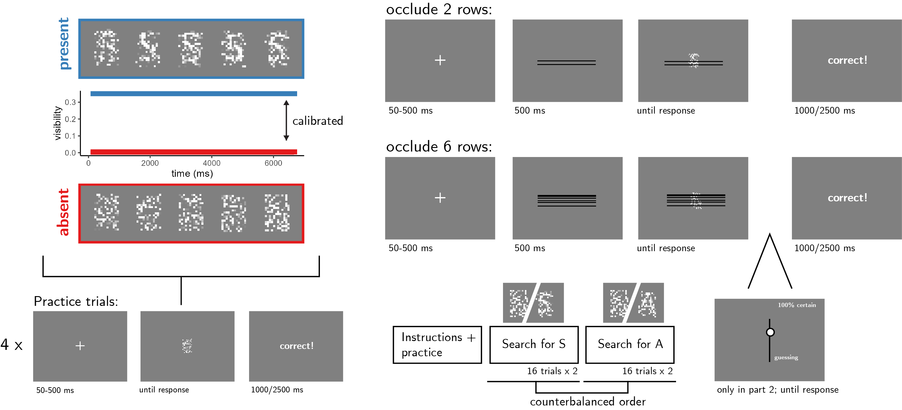

```{r setup, include = FALSE}
library("papaja")
library('pwr')
r_refs("r-references.bib")
knitr::opts_chunk$set(fig.pos = "!H", out.extra = "")
```

```{r analysis-preferences}
# Seed for random number generation
set.seed(42)
knitr::opts_chunk$set(cache.extra = knitr::rand_seed)
```

# Motivation

In previous two experiment, participants performed a letter detection task. As expected, decisions about letter absence were overall slower than decisions about letter presence. Furthermore, on different trials, the target letter (e.g., 'S') was either congruent or incongruent with a context word (for example, S is congruent with KI_S, but incongruent with FL_G). Subjects more readily detected the presence of a letter when the context was congruent, compared to incongruent with the target letter. However, we found no effect of context congruency on the time taken to infer the absence of a target. Specifically, subjects did not infer absence earlier in a congruent context although they could have safely done so without increasing their miss rate. 

In a third Experiment, we tested whether this finding was due to subjects not having metacognitive access into the effects of context on perception, or alternatively, due to a more general difficulty with adjusting a decision criterion between trials [@gorea2000failure]. On different trials, we occluded 5 or 15 percent of the stimulus pixels and measured decision times in target-absent and target-absent trials. While occluding more of the stimulus slowed down target-present responses, it had no effect on the timing of target-absent responses. Importantly, the reaction time effect in target-present trials was numerically reduced relative to Exp. 1 and 2 (around 90 ms, as opposed to 135 ms). Furthermore, it is possible that some subjects did not fully understand that the occluders were separate from the stimulus itself. In this Experiment, we make the occlusion manipulation more salient by occluding entire rows instead of single pixels. Furthermore, we will collect two more measures of metacognitive awareness into the effect of occlusion on perception: trial-wise confidence ratings, and a multiple-choice debrief question. 


# Methods
We report how we determined our sample size, all data exclusions (if any), all manipulations, and all measures in the study. Changes relative to Exp. 2 appear in **bold letters**.<!-- 21-word solution (Simmons, Nelson & Simonsohn, 2012; retrieved from http://ssrn.com/abstract=2160588) -->

## Participants

The research complies with all relevant ethical regulations, and was approved by the Research Ethics Committee of Birkbeck, University of London (study ID number 1812000). Participants will be recruited via Prolific, and will give informed consent prior to their participation. To be eligible to take part in this study, their Prolific approval rate will need to be 95% or higher, their reported first language English, and their age between 18 and 60. We will  collect data until we reach **210** included participants (after applying our pre-registered exclusion criteria). The entire experiment will take 10 minutes to complete. Participants will be paid £1.35 for their participation, equivalent to an hourly wage of £8.1.

## Procedure

Participants will detect the presence or absence of a target letter (S or A, in different blocks) in a patch of dynamic grayscale noise presented at 15 frames per second. In each frame, noise will be generated by randomly sampling grayscale values from a target image $I$. Specifically, for each pixel $S_{ij}$, we will display the grayscale value for the corresponding pixel in the original image $I_{ij}$ with some probability $p$, and the grayscale value of a randomly chosen pixel $I_{i'j'}$ with probability $1-p$. On target-absent trials, $p$ will be set to $0$, such that the grayscale values of all pixels will be randomly shuffled. On target-present trials, $p$ will be calibrated online to achieve performance levels of around 80%, following a 1-up-3-down procedure, starting at $v=0.2$ and following a multiplicative set size of $0.9$, which will move closer to 1 following each change direction in the calibration process, with a reset to $0.9$ after the second block, to allow separate staircasing for each letter. Responses will be delivered using the F and G keyboard keys, and response-mapping will be counterbalanced across subjects.

```{r design, echo=FALSE, fig.cap="Experimental design. Top left: target visibility as a function of frame number for in target present (blue) and target absent (red) trials. Bottom left: trial structure in practice trials. Top right: trial structure in the main blocks of the experiment, in trials where 5 or 10 percent of the pixels are occluded. Bottom right: overall experiment structure. ", out.width = '75%'}

```

After reading the instructions, participants will complete four practice trials. In case their accuracy in these four practice trials falls below 3/4, they will be reminded of task instructions and given additional practice trials, until they reach the desired accuracy level. Otherwise, they will continue to the main part of the experiment. **Here, their task will be exactly the same, but a fixed proportion of pixel rows (2 or 6 out of 18, on different trials within the same block; see Fig. \@ref(fig:design)) will be occluded by black pixels. Unlike Exp. 1 and 2, no other images or letters will appear on the screen.** 

The main part of the experiment will comprise four blocks of 16 trials. For approximately half of the participants, in blocks 1 and 2 the target letter will be S and in blocks 3 and 4 it will be A. The order of letters will be reversed for the other half. 

In the third and fourth blocks only, participants will use their mouse to rate their confidence on a vertical analog scale immediately after deciding whether the letter was present or absent. To move on to the third block, participants will need to respond correctly on at least 3 out of 4 trials, and to correctly answer a multiple-option comprehension question about the use of the confidence scale. 

The four blocks will be followed by a multiple-choice question: 

> Sometimes the black lines hid more of the display, and sometimes less. Did you feel this had any effect on how difficult it was to spot the letter?<br>
 a) Yes! It was harder when more of the display was hidden behind black lines.<br>
 b) Yes! It was harder when less of the display was hidden behind black lines.<br>
 c) No! The number of black lines had no effect on how difficult it was to spot the letter.

### Randomization

The order and timing of experimental events, as well as the luminance values of pixels within a trial and the position of the occluded rows, will be determined pseudo-randomly by the Mersenne Twister pseudorandom number generator, initialized in a way that ensures registration time-locking [@mazor2018novel]. 

## Data analysis

### Rejection criteria

Participants will be excluded if their accuracy falls below 50%. We will also exclude participants for having extremely fast or slow reaction times in one or more of the tasks (below 100 milliseconds or above 5 seconds in more than 25% of the trials). 

Trials with response time below 100 milliseconds or above 5 seconds will be excluded from the response-time analysis.

### Hypotheses and analysis plan

This study is designed to test the timing of decisions to terminate evidence accumulation in the absence of a target as a function of stimulus occlusion.

*Hypothesis 1 (PRESENCE/ABSENCE RESPONSE TIME)*: We will test the null hypothesis that response times are similar for target-absent and target-present responses, aiming to replicate the finding that decisions about the absence of a target are slower than decisions about its presence [@mazor2021metacognitive; @mazor2020distinct]. This will be tested using a paired t-test on the median individual level-response times. 

*Hypothesis 2 (OCCLUSION RT EFFECT IN PRESENCE)*: We will test the null hypothesis that target-present response times are similar when 2 or 6 pixel rows are occluded. This will be tested using a paired t-test on the median individual-level response times in correct trials only.

*Hypothesis 3 (OCCLUSION RT EFFECT IN ABSENCE)*: We will test the null hypothesis that target-absent response times are similar when 2 or 6 pixel rows are occluded. This will be tested using a paired t-test on the median individual-level response times in correct trials only.

*Hypothesis 4 (OCCLUSION RESPONSE INTERACTION ON RT)*: We will test the null hypothesis that the effect of occlusion on reaction time is similar in target-absent and target-present responses. This will be tested by performing a group-level t-test on the subject-level contrast $(median(RT_{P,2})-median(RT_{P,6}))-(median(RT_{A,2})-median(RT_{A,6}))$ Where $P$ and $A$ stand for present and absent, and 2 and 6 represent the number of occluded rows. Here too, analysis will be restricted to correct trials only.

*Hypothesis 5 (SENSITIVITY)*: We will test the null hypothesis that perceptual sensitivity (measured as $d'=z(H)-z(F)$) is equal as a function of the proportion of hidden pixels. To allow the extraction of d' for participants who committed no false-alarms or misses, we will add 0.5 to miss, hit, false-alarm and correct rejection counts [@snodgrass1988pragmatics].

*Hypothesis 6 (CRITERION)*: We will test the null hypothesis that decision criterion (measured as $c=-0.5(z(H)+z(F))$) is unaffected by the proportion of hidden pixels. To allow the extraction of a decision criterion for participants who committed no false-alarms or misses, we will add 0.5 to miss, hit, false-alarm and correct rejection counts [@snodgrass1988pragmatics].

*Hypothesis 7 (PRESENCE/ABSENCE CONFIDENCE)*: We will test the null hypothesis that confidence is similar in target-absent and target-present responses, aiming to replicate the finding that decisions about the absence of a target are accompanied by lower levels of subjective confidence than decisions about its presence [@mazor2021metacognitive; @mazor2020distinct]. This will be tested using a paired t-test on the mean individual-level confidence ratings from correct responses only. 

*Hypothesis 8 (OCCLUSION CONFIDENCE EFFECT IN PRESENCE)*: We will test the null hypothesis that target-present confidence ratings are similar when 2 or 6 pixel rows are occluded. This will be tested using a paired t-test on the mean individual-level confidence ratings in correct trials only.

*Hypothesis 9 (OCCLUSION CONFIDENCE EFFECT IN ABSENCE)*: We will test the null hypothesis that target-absent confidence ratings are similar when 2 or 6 pixel rows are occluded. This will be tested using a paired t-test on the mean individual-level confidence ratings in correct trials only.

*Hypothesis 10 (OCCLUSION RESPONSE INTERACTION ON CONFIDENCE)*: We will test the null hypothesis that the effect of occlusion on confidence is similar in target-absent and target-present responses. This will be tested by performing a group-level t-test on the subject-level contrast $(mean(CONF_{P,2})-mean(CONF_{P,6}))-(mean(CONF_{A,2})-mean(CONF_{A,6}))$ Where $P$ and $A$ stand for present and absent, and 2 and 6 represent the number of occluded rows. Here too, analysis will be restricted to correct trials only.

## Sample size justification

In Exp. 2, stansardized effect sizes for Hypotheses 2 (effect of context congruency on RT in target-present trials) and 4 (interaction between context congruency and target presence with respect to RT) were $0.38$ and $0.25$, respectively. Since our focus is on the corresponding effects of pixel occlusion, we decided to test enough participants to obtain sufficient statistical power to detect an effect of 0.25 s.d. With 210 participants, we will have a statistical power of 95% to detect effect sizes of $0.25$ standard deviations.


```{r power, echo=FALSE, fig.cap="Power curve for a two-tailed paired t-test with a true effect size of 0.25 standard devitations. With 210 participants, we will have 95% statistical power under such settings. ", out.width = '75%'}
Exp4.pwr <- pwr.t.test(n=210,d=0.25,type='paired');
plot(Exp4.pwr)
```

# References

\begingroup
\setlength{\parindent}{-0.5in}
\setlength{\leftskip}{0.5in}

<div id="refs" custom-style="Bibliography"></div>
\endgroup
