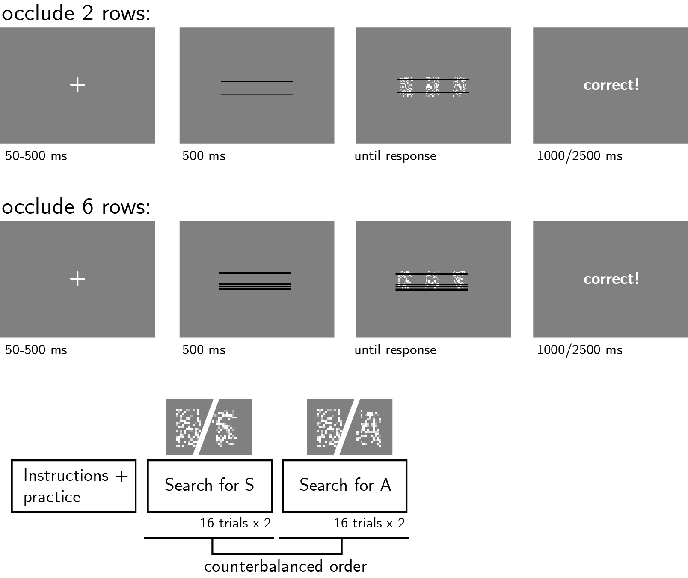

```{r setup, include = FALSE}
library("papaja")
library('pwr')
r_refs("r-references.bib")
knitr::opts_chunk$set(fig.pos = "!H", out.extra = "")
```

```{r analysis-preferences}
# Seed for random number generation
set.seed(42)
knitr::opts_chunk$set(cache.extra = knitr::rand_seed)
```

# Motivation

In two previous experiments, participants detected letters in partly occluded dynamic noisy stimuli. As expected, decisions about letter absence were overall slower than decisions about letter presence. Critically, while occluding more of the stimulus slowed down target-present responses, it had no effect on the timing of target-absent responses.
We hypothesize that this invariance of target-absent response times to the occlusion manipulation may be related to subjects' limited ability to envisage how letter visibility would have been affected by the partial occlusion, had the letter been present. To this end, in this experiment we flank the central stimulus with two additional target-present stimuli, which will be occluded in the same way as the central stimulus. We will test whether participants will be able to use these reference stimuli to make more efficient decisions about target absence as a function of occlusion level, slowing down when more of the stimulus is occluded.

# Methods
We report how we determined our sample size, all data exclusions (if any), all manipulations, and all measures in the study. Changes relative to Exp. 4 appear in **bold letters**.<!-- 21-word solution (Simmons, Nelson & Simonsohn, 2012; retrieved from http://ssrn.com/abstract=2160588) -->

## Participants

The research complies with all relevant ethical regulations, and was approved by the Research Ethics Committee of Birkbeck, University of London (study ID number 1812000). Participants will be recruited via Prolific, and will give informed consent prior to their participation. To be eligible to take part in this study, their Prolific approval rate will need to be 95% or higher, their reported first language English, and their age between 18 and 60. We will  collect data until we reach **250** included participants (after applying our pre-registered exclusion criteria). The entire experiment will take 12 minutes to complete. Participants will be paid £1.60 for their participation, equivalent to an hourly wage of £8.

## Procedure

Participants will detect the presence or absence of a target letter (S or A, in different blocks) in a patch of dynamic grayscale noise presented at 15 frames per second. In each frame, noise will be generated by randomly sampling grayscale values from a target image $I$. Specifically, for each pixel $S_{ij}$, we will display the grayscale value for the corresponding pixel in the original image $I_{ij}$ with some probability $p$, and the grayscale value of a randomly chosen pixel $I_{i'j'}$ with probability $1-p$. On target-absent trials, $p$ will be set to $0$, such that the grayscale values of all pixels will be randomly shuffled. On target-present trials, $p$ will be **set to $v=0.3$**. **Two similar stimuli will be presented on both sides of the central stimulus. In these reference stimuli, the target letter will be presented with $v=0.3$ regardless of the presence of a letter in the central stimulus.** Responses will be delivered using the F and G keyboard keys, and response-mapping will be counterbalanced across subjects.

```{r design, echo=FALSE, fig.cap="Experimental design. Participants will detect the presence or absence of a target letter (S or A, on different block), in a central patch of dynamic noise. The central patch will be flanked by two other patches in which the letter will always be present. On different trials, either 2 or 6 rows will be occluded from all three patches.", out.width = '75%'}

```

After reading the instructions, participants will complete four practice trials **and answer a comprehension question ("I should press F exactly when...", "The central noisy pattern does not contain the letter S" and not "None of the three noisy patterns contains the letter S", "Any of the three noisy patterns does not contain the letter S", or "All of the three noisy patterns contain the letter S")**. In case their accuracy in these four practice trials falls below 3/4 **and/or their response to the comprehension question was inaccurate**, they will be reminded of task instructions until they reach the desired accuracy level **and answer the comprehension question correctly**. Otherwise, they will continue to the main part of the experiment. Here, their task will be exactly the same, but a fixed proportion of pixel rows (2 or 6 out of 18, on different trials within the same block; see Fig. \@ref(fig:design)) will be occluded by black pixels. 

The main part of the experiment will comprise four blocks of 16 trials. For approximately half of the participants, in blocks 1 and 2 the target letter will be S and in blocks 3 and 4 it will be A. The order of letters will be reversed for the other half. 

### Randomization

The order and timing of experimental events, as well as the luminance values of pixels within a trial and the position of the occluded rows, will be determined pseudo-randomly by the Mersenne Twister pseudorandom number generator, initialized in a way that ensures registration time-locking [@mazor2018novel]. 

## Data analysis

### Rejection criteria

Participants will be excluded if their accuracy falls below 50%. We will also exclude participants for having extremely fast or slow reaction times in one or more of the tasks (below 100 milliseconds or above **7** seconds in more than 25% of the trials). 

Trials with response time below 100 milliseconds or above **7** seconds will be excluded from the response-time analysis.

### Hypotheses and analysis plan

This study is designed to test the timing of decisions to terminate evidence accumulation in the absence of a target as a function of stimulus occlusion.

*Hypothesis 1 (PRESENCE/ABSENCE RESPONSE TIME)*: We will test the null hypothesis that response times are similar for target-absent and target-present responses, aiming to replicate the finding that decisions about the absence of a target are slower than decisions about its presence [@mazor2021metacognitive; @mazor2020distinct]. This will be tested using a paired t-test on the median individual level-response times. 

*Hypothesis 2 (OCCLUSION RT EFFECT IN PRESENCE)*: We will test the null hypothesis that target-present response times are similar when 2 or 6 pixel rows are occluded. This will be tested using a paired t-test on the median individual-level response times in correct trials only.

*Hypothesis 3 (OCCLUSION RT EFFECT IN ABSENCE)*: We will test the null hypothesis that target-absent response times are similar when 2 or 6 pixel rows are occluded. This will be tested using a paired t-test on the median individual-level response times in correct trials only.

*Hypothesis 4 (OCCLUSION RESPONSE INTERACTION ON RT)*: We will test the null hypothesis that the effect of occlusion on reaction time is similar in target-absent and target-present responses. This will be tested by performing a group-level t-test on the subject-level contrast $(median(RT_{P,2})-median(RT_{P,6}))-(median(RT_{A,2})-median(RT_{A,6}))$ Where $P$ and $A$ stand for present and absent, and 2 and 6 represent the number of occluded rows. Here too, analysis will be restricted to correct trials only.

*Hypothesis 5 (SENSITIVITY)*: We will test the null hypothesis that perceptual sensitivity (measured as $d'=z(H)-z(F)$) is equal as a function of the proportion of hidden pixels. To allow the extraction of d' for participants who committed no false-alarms or misses, we will add 0.5 to miss, hit, false-alarm and correct rejection counts [@snodgrass1988pragmatics].

*Hypothesis 6 (CRITERION)*: We will test the null hypothesis that decision criterion (measured as $c=-0.5(z(H)+z(F))$) is unaffected by the proportion of hidden pixels. To allow the extraction of a decision criterion for participants who committed no false-alarms or misses, we will add 0.5 to miss, hit, false-alarm and correct rejection counts [@snodgrass1988pragmatics].

## Sample size justification

In Exp. 4, stansardized effect sizes for Hypotheses 2 (effect of context congruency on RT in target-present trials) and 4 (interaction between context congruency and target presence with respect to RT) were $0.24$ and $0.22$, respectively. We decided to test enough participants to obtain sufficient statistical power to detect an effect of 0.23 s.d. With 250 participants, we will have a statistical power of 95% to detect effect sizes of $0.23$ standard deviations.


```{r power, echo=FALSE, fig.cap="Power curve for a two-tailed paired t-test with a true effect size of 0.23 standard devitations. With 250 participants, we will have 95% statistical power under such settings. ", out.width = '75%'}
Exp4.pwr <- pwr.t.test(n=250,d=0.23,type='paired');
plot(Exp4.pwr)
```

# References

\begingroup
\setlength{\parindent}{-0.5in}
\setlength{\leftskip}{0.5in}

<div id="refs" custom-style="Bibliography"></div>
\endgroup
